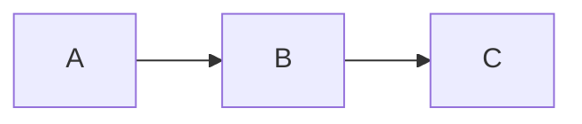
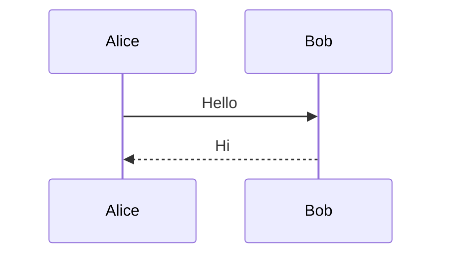
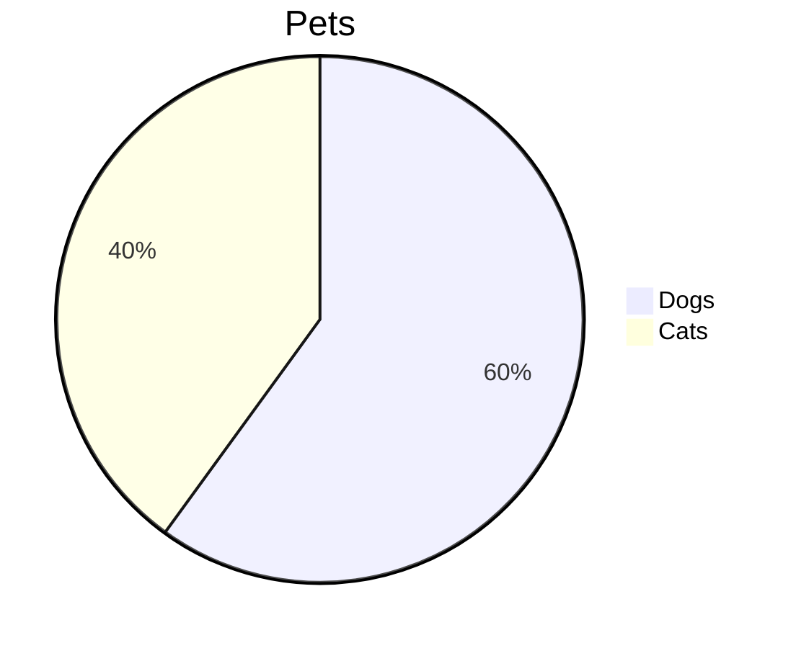
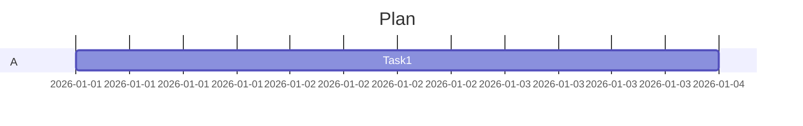
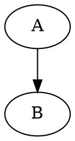
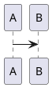

# Comprehensive GFM render-test — every feature + complex variants

Negative controls (markdown-kit-only) are at the bottom.

## 1 — Headings
# H1
## H2
### H3
#### H4
##### H5
###### H6

## 2 — Inline text
**bold** · *italic* · ***bold-italic*** · ~~strike~~ · `code` · <ins>ins</ins> · <mark>mark</mark> · H<sub>2</sub>O · x<sup>2</sup> · <kbd>⌘</kbd>+<kbd>S</kbd>

## 3 — Blockquote (nested)
> Level 1
>> Level 2
>>> Level 3

## 4 — Lists
- one
  - one.a
    - one.a.i
- two

1. first
   1. first.a
2. second

- [x] done
  - [ ] subtask
- [ ] todo

## 5 — Table: alignment + inline formatting in cells
| Left `:--` | Center `:-:` | Right `--:` |
|:--|:-:|--:|
| **bold** | `code` | 123.45 |
| [link](https://github.com) | :rocket: | 9.00 |

## 6 — Code blocks
```python
def f(x: int) -> int:
    return x + 1  # comment
```
```diff
- removed line
+ added line
```
```json
{"key": ["value", 1, true]}
```
```
no-language fence
```

## 7 — Alerts (all five)
> [!NOTE]
> Note.

> [!TIP]
> Tip.

> [!IMPORTANT]
> Important.

> [!WARNING]
> Warning.

> [!CAUTION]
> Caution.

> [!WARNING]
> Multi-line with a list:
> - first
> - second

## 8 — Mermaid (multiple diagram types)





## 9 — Math (KaTeX)
Inline: $a^2 + b^2 = c^2$. Block + complex:
$$\frac{1}{n}\sum_{i=1}^{n} x_i \quad \begin{pmatrix} a & b \\ c & d \end{pmatrix}$$

## 10 — Footnotes
First.[^a] Second.[^b]

[^a]: Footnote A.
[^b]: Footnote B with `code`.

## 11 — Collapsible
<details>
<summary>Closed by default</summary>

Content, with a nested one:

<details><summary>Nested</summary>

Deeper.

</details>

</details>

<details open>
<summary>Open by default</summary>

Visible immediately.

</details>

## 12 — HTML sanitization (what GitHub strips)
<div style="color:red;font-size:24px">styled div</div>
<span style="background:yellow">styled span</span>
<script>alert('xss')</script>
<style>body{display:none}</style>


## 13 — Links & auto-link traps
Autolink https://github.com · inline [link](https://github.com) · reference [ref][r1].
Traps: bare #1 · @octocat · SHA 9d19c911cafe1234.

[r1]: https://github.com

## 14 — Emoji & HR
:rocket: :+1: :tada:

---

# Negative controls — markdown-kit / non-GitHub (expect raw text)

## 15 — markdown-kit inline
==highlight== · ~subscript~ · ^superscript^

## 16 — Other diagram engines

```d2
A -> B
```

```vega-lite
{"mark": "bar"}
```

## 17 — Other markdown-kit syntax
:::note
custom container
:::

[toc]

{{variable}}

Term
: Definition (markdown definition list)
