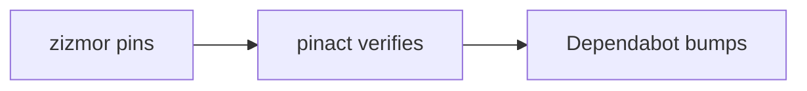
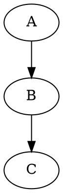
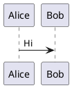

## GFM render-test — what survives GitHub's PR renderer

Candidates drawn from the `markdown-kit` corpus research. Empirical question per section: does GitHub's PR-body renderer **draw it**, or fall back to **raw text / a plain code block**?

### 1 — Table (GFM)
| Option | Cost | Verdict |
|---|---|---|
| A | low | keep |
| B | high | drop |

### 2 — Task list
- [x] done
- [ ] todo

### 3 — Alerts (GFM admonitions)
> [!NOTE]
> A note.

> [!WARNING]
> A warning.

> [!IMPORTANT]
> Important.

### 4 — Mermaid diagram


### 5 — Math (KaTeX)
Inline: $e = mc^2$. Block:
$$\int_0^1 x^2\,dx = \tfrac{1}{3}$$

### 6 — Syntax-highlighted code
```python
def f(x: int) -> int:
    return x + 1
```

### 7 — Footnote
A claim with a footnote.[^1]

[^1]: The footnote text.

### 8 — Collapsible details
<details><summary>Click to expand</summary>

Hidden content here.

</details>

### 9 — Inline HTML
<kbd>Cmd</kbd>+<kbd>S</kbd> · H<sub>2</sub>O · x<sup>2</sup>

### 10 — Emoji
:rocket: :warning: :white_check_mark:

### 11 — Strikethrough vs highlight
~~struck through~~ and ==highlighted==

---

#### Negative controls — markdown-kit features GitHub likely does NOT render

### 12 — Graphviz / DOT


### 13 — D2
```d2
A -> B -> C
```

### 14 — PlantUML


### 15 — Vega-Lite
```vega-lite
{"mark": "bar", "data": {"values": [{"x": 1}]}}
```

### 16 — Custom container (`:::`)
:::note
markdown-kit container syntax.
:::
