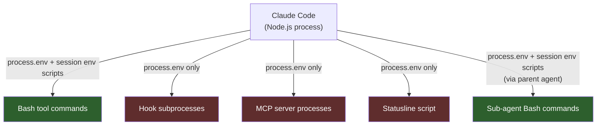
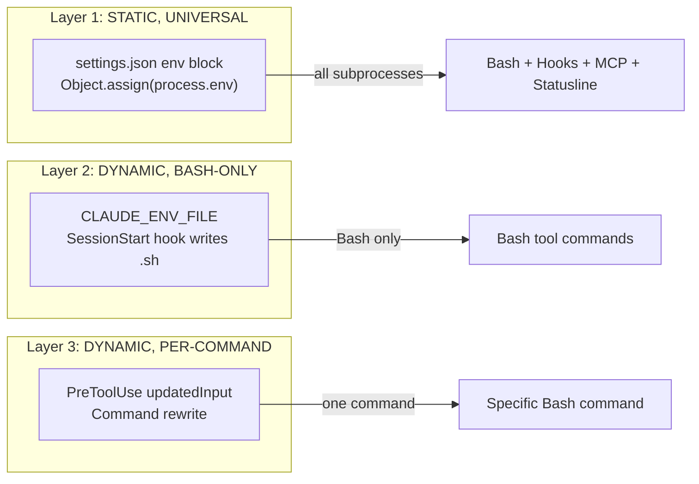

# Claude Code Environment Variable Architecture

## 1. Overview

Claude Code spawns five distinct subprocess types, each receiving a different environment. Understanding which variables reach which subprocess is critical for hooks, PATH management, and tooling integration. This document maps the environment model, the three-layer injection architecture, the project-settings allowlist, and analyzes every viable approach to per-project environment customization. All findings are empirically verified against Claude Code v2.1.92 via binary analysis (`npx tweakcc unpack`) and source code inspection.

## 2. The Environment Model



| Subprocess type | PATH source | Session env (CLAUDE_ENV_FILE) | settings.json env block | Notes |
|---|---|---|---|---|
| **Bash tool commands** | process.env + session env scripts | Yes -- inlined into `bash -c` command string | Yes (via process.env) | Richest environment |
| **Hook subprocesses** | process.env only | No | Yes (via process.env) | `subprocessEnv()` returns bare process.env |
| **MCP server processes** | process.env only | No | Yes (via process.env) | Spawned once at session start |
| **Statusline script** | process.env only | No | Yes (via process.env) | Short-lived, periodic |
| **Sub-agent Bash commands** | process.env + session env scripts | Yes (inherits parent session) | Yes (via process.env) | Same as Bash tool commands |

> [!IMPORTANT]
> Session env scripts (CLAUDE_ENV_FILE contents) are **only** consumed by the Bash provider (`bashProvider.ts`). Hook subprocesses, MCP servers, and the statusline script never see them. This is architectural and intentional.

### How Bash Tool Commands Get Their Environment

Source: `bashProvider.ts` lines 77, 170-173

The `buildExecCommand()` method constructs a compound bash command:

```
source <snapshot> || true && <sessionEnvScript> && shopt -u extglob && eval <user-command> && pwd -P >| <cwd-file>
```

The `sessionEnvScript` comes from `getSessionEnvironmentScript()` (`sessionEnvironment.ts`), which concatenates:
1. The file at `CLAUDE_ENV_FILE` (if set in `process.env` at startup)
2. All hook env files from `~/.claude/session-env/<session-id>/`

These scripts are **inlined into the command string** -- they are `eval`'d by bash, not set as env vars on the subprocess. This means `export PATH=".venv/bin:$PATH"` works because `$PATH` is expanded by the shell at runtime.

### How Hook Subprocesses Get Their Environment

Source: `hooks.ts` lines 747, 882-909

```typescript
const envVars: NodeJS.ProcessEnv = {
  ...subprocessEnv(),
  CLAUDE_PROJECT_DIR: toHookPath(projectDir),
}
```

`subprocessEnv()` (`subprocessEnv.ts`, line 79) returns `process.env` with optional proxy overlay. No session env scripts are sourced. Hooks receive:

1. **process.env** via `subprocessEnv()`
2. **CLAUDE_PROJECT_DIR** -- the stable project root
3. **CLAUDE_PLUGIN_ROOT** -- if from a plugin/skill
4. **CLAUDE_PLUGIN_DATA** -- if plugin has data directory
5. **CLAUDE_PLUGIN_OPTION_*** -- plugin option values
6. **CLAUDE_ENV_FILE** -- but **only for 4 hook types**: SessionStart, Setup, CwdChanged, FileChanged (lines 917-926)

> [!NOTE]
> Hooks receive `CLAUDE_ENV_FILE` as a path to write to, not as environment content to consume. The file contents are never sourced into the hook's environment.

## 3. Three-Layer Injection Model



### Layer 1: settings.json env block (STATIC, UNIVERSAL)

**Mechanism:** Applied at startup via `Object.assign(process.env, ...)`.

**Reaches:** Everything -- hooks, Bash, MCP servers, statusline.

**Code path (v2.1.92):**

```javascript
// applySafeConfigEnvironmentVariables() — early, filtered
Object.assign(process.env, filterSettingsEnv(getGlobalConfig().env))        // ~/.claude.json
Object.assign(process.env, filterSettingsEnv(getSettings_DEPRECATED()?.env)) // user settings

// Project-scoped settings — SAFE_ENV_VARS allowlist only
const settingsEnv = filterSettingsEnv(getSettings_DEPRECATED()?.env)
for (const [key, value] of Object.entries(settingsEnv)) {
  if (SAFE_ENV_VARS.has(key.toUpperCase())) {
    process.env[key] = value
  }
}

// applyConfigEnvironmentVariables() — late, unfiltered (after trust)
Object.assign(process.env, filterSettingsEnv(getGlobalConfig().env))
Object.assign(process.env, filterSettingsEnv(getSettings_DEPRECATED()?.env))
```

**Key constraints:**

| Settings scope | Allowlist restricted? | Notes |
|---|---|---|
| `~/.claude.json` env | No | Global config, user-controlled |
| `~/.claude/settings.json` env | No | User-scoped, trusted |
| `.claude/settings.json` env | **Yes -- SAFE_ENV_VARS only** | Project-scoped, untrusted |
| `.claude/settings.local.json` env | **Yes -- SAFE_ENV_VARS only** | Project-scoped, untrusted |

**No variable expansion.** `"PATH": "$HOME/.venv/bin"` sets PATH to the literal string `$HOME/.venv/bin`. There is no `expandEnv`, `interpolateEnv`, or any `$`-variable substitution in the pipeline. `Object.assign` performs a direct property copy.

**No relative path resolution.** `"PATH": ".venv/bin"` does not resolve relative to the project directory. Values are literal strings.

### Layer 2: CLAUDE_ENV_FILE / SessionStart hook (DYNAMIC, BASH-ONLY)

**Mechanism:** SessionStart hooks write shell scripts to `~/.claude/session-env/{sessionId}/`. The Bash provider concatenates and inlines these scripts into every `bash -c` command.

**Reaches:** Bash tool commands only. NOT hooks, MCP servers, or statusline.

**Supports shell variable expansion:** `$PATH` works because the script is `eval`'d in bash context.

**Current usage in claude-workspace:**
- `CLAUDE_CODE_SESSION_ID` -- session identifier
- `PATH` -- prepends `.venv/bin/` if present

**Flow:**
1. SessionStart hook receives `CLAUDE_ENV_FILE` pointing to `~/.claude/session-env/<sid>/sessionstart-hook-0.sh`
2. Hook writes `export PATH=".venv/bin:$PATH"` to that file
3. `invalidateSessionEnvCache()` is called after hook completes
4. Next Bash tool call: `getSessionEnvironmentScript()` reads all env files, concatenates them, inlines into the command string
5. Next PostToolUse hook: `subprocessEnv()` returns `process.env` -- no knowledge of env files

### Layer 3: PreToolUse hook updatedInput (DYNAMIC, PER-COMMAND)

**Mechanism:** A PreToolUse hook returns `updatedInput` with a modified command string. The Bash tool executes the rewritten command.

**Reaches:** The specific command being modified.

**Current usage:** `inject-agent-id.py` prefixes Bash commands with `export CLAUDE_CODE_AGENT_ID=<id>;`

**Key detail:** Uses passthrough mode (no `permissionDecision`) so normal permission rules still apply. The user sees the modified command in the approval prompt.

## 4. The SAFE_ENV_VARS Project Settings Allowlist

Project-scoped settings (`.claude/settings.json` and `.claude/settings.local.json`) can only set env vars whose uppercased name is in the `SAFE_ENV_VARS` set. Variables not in this set are **silently dropped**.

User-scoped settings (`~/.claude/settings.json`) have **no such restriction** -- they can set any env var including PATH.

> [!CAUTION]
> PATH is intentionally excluded from the allowlist. A committed `.claude/settings.json` with a malicious PATH could redirect to trojanized binaries in any cloned repo.

**Explicitly dangerous variables (NOT in the allowlist):**

| Category | Variables |
|---|---|
| Redirect to attacker server | `ANTHROPIC_BASE_URL`, `ANTHROPIC_BEDROCK_BASE_URL`, `ANTHROPIC_FOUNDRY_BASE_URL`, `ANTHROPIC_VERTEX_BASE_URL`, `HTTP_PROXY`, `HTTPS_PROXY`, `NO_PROXY` |
| Trust attacker server | `NODE_TLS_REJECT_UNAUTHORIZED`, `NODE_EXTRA_CA_CERTS` |
| Switch to attacker project | `ANTHROPIC_FOUNDRY_RESOURCE`, `ANTHROPIC_API_KEY`, `ANTHROPIC_AUTH_TOKEN`, `AWS_BEARER_TOKEN_BEDROCK` |
| Arbitrary code execution | `PATH`, `LD_PRELOAD`, `PYTHONPATH` |

<details>
<summary>Full SAFE_ENV_VARS allowlist (v2.1.92 binary extraction)</summary>

Source: `managedEnv.ts` -- `SAFE_ENV_VARS` constant, plus `VERTEX_REGION_CLAUDE_*` prefix matching.

**Model selection & provider config:**
```
ANTHROPIC_CUSTOM_HEADERS
ANTHROPIC_CUSTOM_MODEL_OPTION
ANTHROPIC_CUSTOM_MODEL_OPTION_DESCRIPTION
ANTHROPIC_CUSTOM_MODEL_OPTION_NAME
ANTHROPIC_DEFAULT_HAIKU_MODEL
ANTHROPIC_DEFAULT_HAIKU_MODEL_DESCRIPTION
ANTHROPIC_DEFAULT_HAIKU_MODEL_NAME
ANTHROPIC_DEFAULT_HAIKU_MODEL_SUPPORTED_CAPABILITIES
ANTHROPIC_DEFAULT_OPUS_MODEL
ANTHROPIC_DEFAULT_OPUS_MODEL_DESCRIPTION
ANTHROPIC_DEFAULT_OPUS_MODEL_NAME
ANTHROPIC_DEFAULT_OPUS_MODEL_SUPPORTED_CAPABILITIES
ANTHROPIC_DEFAULT_SONNET_MODEL
ANTHROPIC_DEFAULT_SONNET_MODEL_DESCRIPTION
ANTHROPIC_DEFAULT_SONNET_MODEL_NAME
ANTHROPIC_DEFAULT_SONNET_MODEL_SUPPORTED_CAPABILITIES
ANTHROPIC_FOUNDRY_API_KEY
ANTHROPIC_MODEL
ANTHROPIC_SMALL_FAST_MODEL
ANTHROPIC_SMALL_FAST_MODEL_AWS_REGION
CLAUDE_CODE_SUBAGENT_MODEL
CLAUDE_CODE_USE_BEDROCK
CLAUDE_CODE_USE_FOUNDRY
CLAUDE_CODE_USE_ANTHROPIC_AWS
CLAUDE_CODE_USE_VERTEX
```

**AWS/Cloud:**
```
AWS_DEFAULT_REGION
AWS_PROFILE
AWS_REGION
```

**Bash config:**
```
BASH_DEFAULT_TIMEOUT_MS
BASH_MAX_OUTPUT_LENGTH
BASH_MAX_TIMEOUT_MS
CLAUDE_BASH_MAINTAIN_PROJECT_WORKING_DIR
CLAUDE_BASH_NO_LOGIN
```

**Claude Code behavior:**
```
CLAUDE_CODE_API_KEY_HELPER_TTL_MS
CLAUDE_CODE_DISABLE_EXPERIMENTAL_BETAS
CLAUDE_CODE_DISABLE_NONESSENTIAL_TRAFFIC
CLAUDE_CODE_DISABLE_TERMINAL_TITLE
CLAUDE_CODE_ENABLE_TELEMETRY
CLAUDE_CODE_EXPERIMENTAL_AGENT_TEAMS
CLAUDE_CODE_IDE_SKIP_AUTO_INSTALL
CLAUDE_CODE_MAX_OUTPUT_TOKENS
CLAUDE_CODE_SKIP_BEDROCK_AUTH
CLAUDE_CODE_SKIP_FOUNDRY_AUTH
CLAUDE_CODE_SKIP_ANTHROPIC_AWS_AUTH
CLAUDE_CODE_SKIP_VERTEX_AUTH
```

**Feature flags & misc:**
```
DISABLE_AUTOUPDATER
DISABLE_BUG_COMMAND
DISABLE_COST_WARNINGS
DISABLE_ERROR_REPORTING
DISABLE_FEEDBACK_COMMAND
DISABLE_TELEMETRY
ENABLE_TOOL_SEARCH
USE_BUILTIN_RIPGREP
```

**MCP config:**
```
MAX_MCP_OUTPUT_TOKENS
MAX_THINKING_TOKENS
MCP_TIMEOUT
MCP_TOOL_TIMEOUT
```

**OTEL telemetry:**
```
OTEL_EXPORTER_OTLP_HEADERS
OTEL_EXPORTER_OTLP_LOGS_HEADERS
OTEL_EXPORTER_OTLP_LOGS_PROTOCOL
OTEL_EXPORTER_OTLP_METRICS_CLIENT_CERTIFICATE
OTEL_EXPORTER_OTLP_METRICS_CLIENT_KEY
OTEL_EXPORTER_OTLP_METRICS_HEADERS
OTEL_EXPORTER_OTLP_METRICS_PROTOCOL
OTEL_EXPORTER_OTLP_PROTOCOL
OTEL_EXPORTER_OTLP_TRACES_HEADERS
OTEL_LOG_TOOL_DETAILS
OTEL_LOG_USER_PROMPTS
OTEL_LOGS_EXPORT_INTERVAL
OTEL_LOGS_EXPORTER
OTEL_METRIC_EXPORT_INTERVAL
OTEL_METRICS_EXPORTER
OTEL_METRICS_INCLUDE_ACCOUNT_UUID
OTEL_METRICS_INCLUDE_SESSION_ID
OTEL_METRICS_INCLUDE_VERSION
OTEL_RESOURCE_ATTRIBUTES
```

**Vertex region overrides (prefix-matched):**
```
VERTEX_REGION_CLAUDE_3_5_HAIKU
VERTEX_REGION_CLAUDE_3_5_SONNET
VERTEX_REGION_CLAUDE_3_7_SONNET
VERTEX_REGION_CLAUDE_4_0_OPUS
VERTEX_REGION_CLAUDE_4_0_SONNET
VERTEX_REGION_CLAUDE_4_1_OPUS
VERTEX_REGION_CLAUDE_4_5_SONNET
VERTEX_REGION_CLAUDE_4_6_SONNET
VERTEX_REGION_CLAUDE_HAIKU_4_5
```

Note: `VERTEX_REGION_CLAUDE_*` entries use prefix matching (`PROVIDER_MANAGED_ENV_PREFIXES`) to scale with model releases without allowlist drift.

</details>

## 5. The Hot-Reload Escape Hatch

When settings files change on disk mid-session, Claude Code's config watcher triggers a reload function (minified as `IQ()` in v2.1.92):

```javascript
// IQ() — hot-reload path (v2.1.92 minified)
function IQ() {
  Object.assign(process.env, MbH(z_().env));  // Re-apply global config
  Object.assign(process.env, MbH(V8()?.env)); // Re-apply project settings — NO SAFE_ENV_VARS filter!
  qE8(); OE8(); dY6(); $dH();                 // Refresh caches, proxy, mTLS
}
```

> [!WARNING]
> The hot-reload path applies project settings **without the SAFE_ENV_VARS allowlist**. On startup (`applySafeConfigEnvironmentVariables`), project env is filtered. On hot-reload (`IQ`), it is not. This is likely a bug -- an inconsistency between the two code paths.

**Potential exploit:** A SessionStart hook writes PATH to `.claude/settings.local.json`, triggering the file watcher. `IQ()` applies the env block without allowlist filtering, making PATH available to all subprocesses.

**Why this is fragile:**
- Relies on undocumented behavior that may be fixed in any update
- Timing-dependent -- the file watcher must detect the change and fire before the next tool call
- If the settings file exists at startup, the env block is filtered on the first pass (hot-reload only bypasses on subsequent changes)
- The file watcher also flushes CA certificate, mTLS, and proxy caches (#43227), which can disrupt active connections

**What does hot-reload:**
- CLAUDE.md changes (picked up on next prompt)
- Settings file mtime (config reader `stat()`s and re-reads)
- Permission rules

**What does NOT hot-reload:**
- MCP server connections (created once at session start)
- Hook configurations
- Plugin definitions
- Rules/skills files

## 6. Options Analysis

### Option A: Shell wrapper function (.zshrc)

**Mechanism:** Source `.venv/bin/activate` before launching `claude`.

```bash
# ~/.zshrc — must NOT be named "claude" due to #35154
cc() {
  if [[ -f .venv/bin/activate ]]; then
    source .venv/bin/activate
  fi
  command claude "$@"
}
```

| Aspect | Detail |
|---|---|
| Reaches | Everything (process.env set before Claude starts) |
| Pros | Simplest, works everywhere, per-project via .venv detection |
| Cons | Requires shell function; doesn't help IDE launches; Claude Code shell integration overwrites `claude()` function (#35154) -- must use different name |
| Complexity | Low |
| Survives updates | Yes |

### Option B: SessionStart hook + CLAUDE_ENV_FILE (current implementation)

**Mechanism:** Hook writes PATH export to session env file.

| Aspect | Detail |
|---|---|
| Reaches | Bash tool commands only |
| Pros | Dynamic, per-session, supports `$PATH` expansion, already implemented |
| Cons | Hooks don't see it, MCP servers don't see it, statusline doesn't see it |
| Complexity | Medium (already built) |
| Survives updates | Yes (documented mechanism) |

### Option C: Binary patch -- add PATH to SAFE_ENV_VARS

**Mechanism:** Use `claude-binary-patcher` to add `"PATH"` to the `SAFE_ENV_VARS` Set in the minified JS.

| Aspect | Detail |
|---|---|
| Reaches | Everything (via process.env) |
| Pros | Enables per-project PATH in `.claude/settings.json`, works for worktrees |
| Cons | Security risk (malicious repos could set PATH), fragile across updates, must re-patch on every `claude` binary update |
| Complexity | High |
| Survives updates | No -- must re-patch after every update |

> [!CAUTION]
> PATH is excluded from the allowlist for a security reason: a committed `.claude/settings.json` could redirect PATH to include trojanized binaries. Patching it in removes this protection.

### Option D: Hot-reload exploit

**Mechanism:** SessionStart hook writes PATH to `.claude/settings.local.json` env block. File watcher detects change, `IQ()` applies without allowlist.

| Aspect | Detail |
|---|---|
| Reaches | Everything (via process.env) |
| Pros | Per-project, dynamic, no binary patch |
| Cons | Relies on undocumented behavior (IQ() skipping allowlist), timing-dependent, fragile, cache flush side effects |
| Complexity | Medium |
| Survives updates | Unknown -- may be fixed as a bug at any time |

### Option E: User-level settings.json env.PATH

**Mechanism:** Hardcode full PATH in `~/.claude/settings.json` (user-scope, no allowlist).

```json
{
  "env": {
    "PATH": "/Users/chris/claude-workspace/.venv/bin:/opt/homebrew/bin:/usr/local/bin:/usr/bin:/bin"
  }
}
```

| Aspect | Detail |
|---|---|
| Reaches | Everything |
| Pros | Reliable, well-understood, immediate |
| Cons | Global (not per-project), must hardcode full PATH, must update when tools change, no `$PATH` expansion |
| Complexity | Low |
| Survives updates | Yes |

### Option F: CLAUDE_CODE_SHELL_PREFIX

**Mechanism:** Env var that prepends a command to every Bash tool invocation.

```bash
export CLAUDE_CODE_SHELL_PREFIX="source .venv/bin/activate &&"
```

| Aspect | Detail |
|---|---|
| Reaches | Bash tool commands; hooks (when not in restricted context); MCP server spawning |
| Pros | Documented mechanism, per-command wrapping |
| Cons | Poorly documented, permission system interaction unclear (#46333, #20485), must be set before Claude starts (global) |
| Complexity | Medium |
| Survives updates | Likely (used internally) |

**Binary behavior (v2.1.92):** Operates at two levels:
- MCP server spawning: wraps the MCP server command
- Bash tool execution: prepends to the command string via `xd_()`
- Hook execution: applies when not in a restricted context

### Option G: Fix individual tools (uv run)

**Mechanism:** Each hook/tool uses absolute paths or `uv run` to avoid PATH dependency.

```json
{
  "hooks": {
    "PostToolUse": [{
      "matcher": "Write|Edit",
      "hooks": [{
        "type": "command",
        "command": "uv run ruff check --fix \"$CLAUDE_PROJECT_DIR\""
      }]
    }]
  }
}
```

| Aspect | Detail |
|---|---|
| Reaches | The specific tool |
| Pros | Targeted, no global changes, no security concerns |
| Cons | Doesn't scale, every hook needs modification, every new tool needs the same treatment |
| Complexity | Per-tool |
| Survives updates | Yes |

### Comparison Matrix

| Option | Solves PATH | Solves SESSION_ID | Bash | Hooks | MCP | Statusline | Per-project | Survives updates | Security | Complexity |
|---|:---:|:---:|:---:|:---:|:---:|:---:|---|---|---|---|
| A: Shell wrapper | ✅ | ❌ static | ✅ | ✅ | ✅ | ✅ | Via .venv detection | Yes | Safe | Low |
| B: CLAUDE_ENV_FILE | ✅ | ✅ | ✅ | ❌ | ❌ | ❌ | Yes | Yes | Safe | Medium |
| C: Binary patch | ✅ | ❌ static | ✅ | ✅ | ✅ | ✅ | Yes | No | Risky | High |
| D: Hot-reload | ✅ | ❌ static | ✅ | ✅ | ✅ | ✅ | Yes | Unknown | Risky | Medium |
| E: User settings | ✅ | ❌ static | ✅ | ✅ | ✅ | ✅ | No (global) | Yes | Safe | Low |
| F: SHELL_PREFIX | ✅ | ❌ | ✅ | ⚠️ | ⚠️ | ❌ | No (global) | Likely | Safe | Medium |
| G: uv run | N/A | N/A | ✅ | ✅ | N/A | N/A | Per-tool | Yes | Safe | Per-tool |

> [!NOTE]
> No single option solves both PATH and CLAUDE_CODE_SESSION_ID across all subprocess types. This is why the layered approach exists: Layer 1 (settings env or wrapper) handles PATH universally, Layer 2 (CLAUDE_ENV_FILE) handles dynamic per-session values for Bash commands.

## 7. Current Implementation

### hooks/inject-session-env.py (Layer 2)

SessionStart hook that writes to CLAUDE_ENV_FILE:

- **CLAUDE_CODE_SESSION_ID**: Replicates the ant-gated session ID injection from `Shell.ts:323-327` (DCE'd from public binary)
- **PATH**: Prepends `.venv/bin/` if the directory exists and isn't already on PATH

Writes to both `CLAUDE_ENV_FILE` path and `~/.claude/session-env/{sessionId}/` to handle the resume bug (REPL.tsx fires hooks before `switchSession()`).

### hooks/inject-agent-id.py (Layer 3)

PreToolUse hook that injects `CLAUDE_CODE_AGENT_ID` via `export` prefix on Bash commands from sub-agents. Uses `updatedInput` in passthrough mode.

### scripts/statusline.py

Detects venv provenance and displays it in the status line. Reads `process.env` directly (does NOT see session env from Layer 2).

### Empirical Findings

| Finding | Verified |
|---|---|
| Session env scripts only reach Bash tool commands | v2.1.92 |
| Hooks get bare `process.env` via `subprocessEnv()` | v2.1.92 |
| `Object.assign` does direct copy, no variable expansion | v2.1.92 |
| SAFE_ENV_VARS filters project-scoped settings only | v2.1.92 |
| Hot-reload (`IQ()`) bypasses SAFE_ENV_VARS filter | v2.1.92 |
| `CLAUDE_ENV_FILE` only given to SessionStart, Setup, CwdChanged, FileChanged hooks | v2.1.92 |
| Shell function `claude()` overwritten by shell integration on exit | #35154 |

## 8. Recommended Approach

1. **Keep the SessionStart hook (Option B)** for dynamic, per-session values: `CLAUDE_CODE_SESSION_ID` and PATH for Bash commands. This is the best available mechanism for Bash tool PATH customization.

2. **For hooks that need project tools**: Use `uv run` (Option G) as the pragmatic fix. Example: `uv run ruff` instead of bare `ruff`. This avoids PATH entirely.

3. **For full-stack PATH needs**: Use a shell wrapper (Option A) named something other than `claude` to avoid #35154. This is the simplest way to get PATH into process.env before Claude starts.

4. **Document the gap** as a known limitation with version stamp. Hooks, MCP servers, and statusline cannot access session env. This is architectural, not a bug.

5. **Consider filing a feature request** for one of:
   - PATH added to SAFE_ENV_VARS (with a trust prompt on first use per-project)
   - A general "project env unrestricted" mode behind a trust dialog
   - Session env scripts applied to hook subprocesses (not just Bash)

> [!TIP]
> The hot-reload exploit (Option D) is interesting as a proof-of-concept but should not be used in production. It relies on behavior that is inconsistent with the startup path and is likely to be fixed.

## 9. Related Issues

| Issue | Title | Status |
|---|---|---|
| [#8855](https://github.com/anthropics/claude-code/issues/8855) | Support persistent virtual environment activation | Open |
| [#24057](https://github.com/anthropics/claude-code/issues/24057) | Hot-reload settings (central feature request) | Open |
| [#35154](https://github.com/anthropics/claude-code/issues/35154) | Shell integration overwrites user-defined `claude()` function | Open |
| [#37729](https://github.com/anthropics/claude-code/issues/37729) | Environment Variables from SessionStart Hooks not cleared on /clear | Open |
| [#43210](https://github.com/anthropics/claude-code/issues/43210) | Desktop app ignores settings.json env block and shell profile PATH on macOS | Open |
| [#43227](https://github.com/anthropics/claude-code/issues/43227) | Settings file watcher flushes CA/mTLS/proxy caches on any change | Open |
| [#46333](https://github.com/anthropics/claude-code/issues/46333) | CLAUDE_CODE_SHELL_PREFIX permission interaction unclear | Open |
| [#46696](https://github.com/anthropics/claude-code/issues/46696) | Sub-agents should inherit CLAUDE_ENV_FILE env vars from parent session | Open |
| [#46954](https://github.com/anthropics/claude-code/issues/46954) | CLI hooks run with restricted PATH excluding /opt/homebrew/bin | Open |
| [#1238](https://github.com/anthropics/claude-code/issues/1238) | CLAUDE_CODE_SHELL_PREFIX original feature request | Closed |
| [#20485](https://github.com/anthropics/claude-code/issues/20485) | SHELL_PREFIX permission interaction docs | Closed |
| [#29068](https://github.com/anthropics/claude-code/issues/29068) | agent_id added to all hook events | Shipped v2.1.64 |
| [#35447](https://github.com/anthropics/claude-code/issues/35447) | Request for CLAUDE_AGENT_ID as native env var | Open |

## 10. Version History

| Date | Version | Event |
|---|---|---|
| 2026-04-12 | v2.1.92 | Full binary analysis: SAFE_ENV_VARS, IQ hot-reload, subprocess env model |
| 2026-04-12 | v2.1.92 | Source code analysis: `managedEnv.ts`, `bashProvider.ts`, `hooks.ts`, `sessionEnvironment.ts` |

**Binary analysis method:** `npx tweakcc unpack /tmp/claude-unpacked.js` + grep/Python extraction

**Source code reference:** `/Users/chris/claude-code-source-code/src/` (unpacked from binary)
