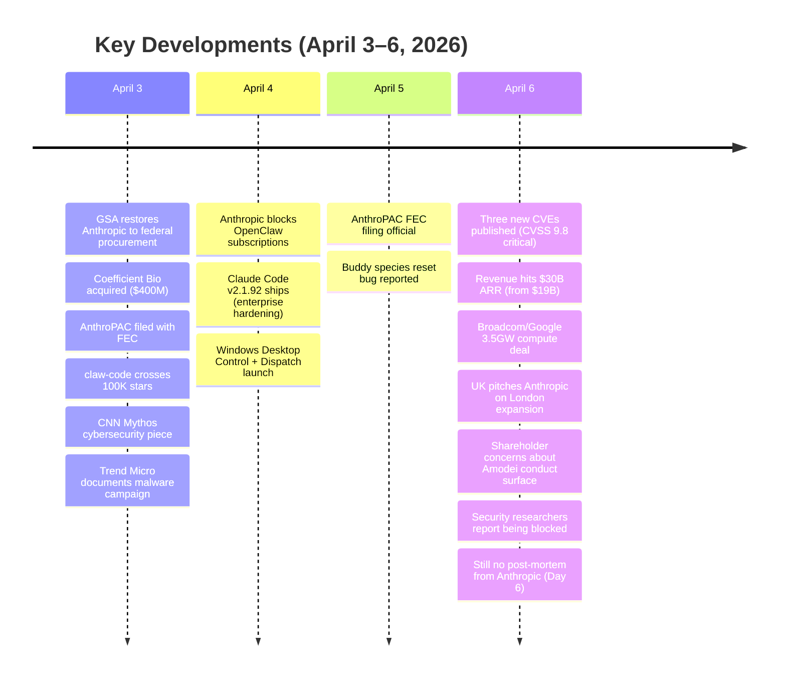
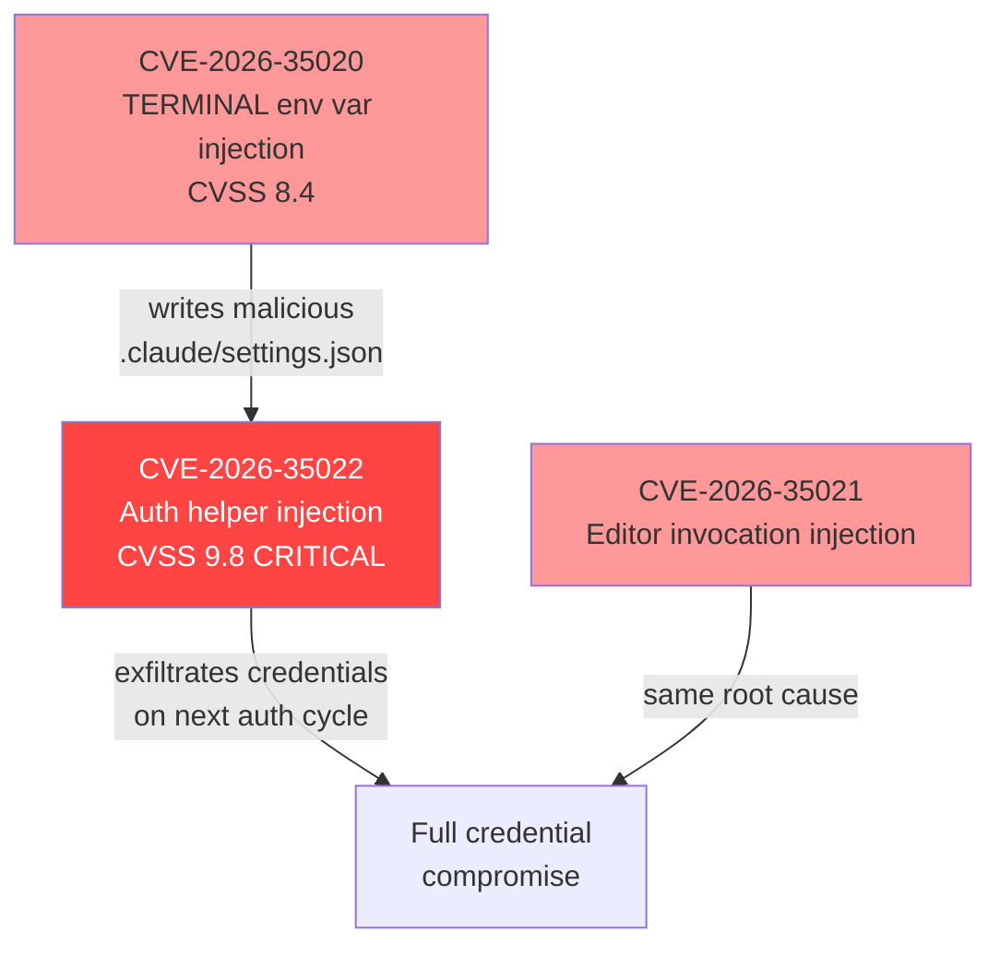
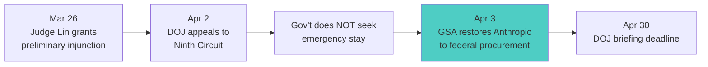

[toc]

## Where We Left Off

The Day 3 update (posted to #claude-code April 2) covered: the Gottheimer congressional letter, cch attestation broken in 30 lines of Python, YOLO classifier revealed as Sonnet side-query, speculation mode overlay filesystem, five compression tiers, Capybara v8's 29-30% false claims regression, context laundering attacks, the full 23 bash security checks, the copyright paradox (Thaler cert denied 29 days before Anthropic DMCA'd AI-written code), privacy nightmare (640+ telemetry events, DISABLE_TELEMETRY trap), community projects (claw-code 100K+, OpenClaude, free-code), competitor silence, Chinese playbook, and the trust data (29% trust, 2,500% defect prediction).

**This document covers what's NEW from April 3–6.**

---

## The Headlines Since Day 3

---

## Revenue Jumped to $30B

The single biggest development. [Bloomberg reported April 6](https://www.bloomberg.com/news/articles/2026-04-06/broadcom-confirms-deal-to-ship-google-tpu-chips-to-anthropic) that Anthropic's run rate surged from $19B to **$30B+** — a 58% increase in roughly one month. The $26B full-year guidance is now the floor, not the ceiling.

| Metric | Day 3 (Apr 2) | Day 6 (Apr 6) | Change |
|--------|---------------|---------------|--------|
| Revenue run rate | $19B | **$30B+** | +58% |
| $1M+/year customers | ~500 | **1,000+** | +100% |
| Secondary demand ratio | 51:1 | **81.2:1** | +59% |
| Polymarket $500B odds | 94% | 90-94% | Stable |

This came bundled with a **3.5 gigawatt Broadcom/Google compute deal** through 2031 — next-gen TPU capacity starting 2027. Broadcom stock rose 2.6-3.5% on the news. [Mizuho estimates](https://www.investing.com/news/stock-market-news/anthropic-adds-another-tailwind-for-broadcoms-soaring-ai-story-mizuho-4298992) Broadcom picks up $21B in AI revenue from Anthropic in 2026 alone.

### Anthropic Now Captures 73% of First-Time Enterprise AI Spend

[Mizuho TMT specialist Jordan Klein](https://ng.investing.com/news/stock-market-news/anthropic-dominates-ai-business-spend-with-73-share-mizuho-lists-stocks-to-watch-2399378): up from 50/50 just 10 weeks ago and 60/40 in OpenAI's favor in early December 2025. Called it "super bullish" for Amazon (primary inference host).

### The OpenAI Contrast Deepened

| | Anthropic | OpenAI |
|--|-----------|--------|
| Secondary implied valuation | ~$600B (+58% vs primary) | ~$765B (-10% vs primary) |
| Secondary demand | $2B lined up to buy | $600M can't find buyers |
| Revenue growth | ~10×/year | ~3.4×/year |
| Revenue per compute dollar | $2.10 | $1.60 |
| Internal friction | — | [CFO flags IPO timeline as "aggressive"](https://stocktwits.com/news-articles/markets/equity/open-ai-ipo-cfo-reportedly-flags-2026-timeline-as-aggressive-in-rift-with-ceo-sam-altman/cZJ4QUFRIoV) |

---

## Three New CVEs — Published April 6

This is the most significant security development since the leak itself.

All three share a single root cause: **unsanitized string interpolation into `shell=true` execution**. [Phoenix Security validated the chain](https://phoenix.security/claude-code-leak-to-vulnerability-three-cves-in-claude-code-cli-and-the-chain-that-connects-them/) on v2.1.91 with timestamped callback evidence. Four escalating PoC variants demonstrated for CVE-2026-35022: local file marker, credential-format evasion, single-message HTTP exfiltration, and multi-line file content exfiltration.

### Deny Rules Bypass (Adversa AI)

Separately, [Adversa AI discovered](https://adversa.ai/blog/claude-code-security-bypass-deny-rules-disabled/) that `bashPermissions.ts` caps per-subcommand analysis at 50 entries. Commands with >50 subcommands **silently skip ALL deny-rule enforcement**. Fixed in v2.1.90 with a single-character change: `"ask"` → `"deny"`. Origin: internal ticket CC-643 — complex commands froze the UI, so engineers capped analysis and fell back to "ask."

### Security Researchers Being Blocked

On April 6, [Piunikaweb reported](https://piunikaweb.com/2026/04/06/anthropic-claude-code-blocks-security-researchers-vulnerability-tasks/) that Claude Code **began blocking vulnerability research tasks** that had worked days earlier. The error: "triggered restrictions on violative cyber content." If any prior context is flagged, even simple follow-ups get rejected, forcing session restarts.

---

## Anthropic Blocks OpenClaw Subscriptions

The biggest community-facing move. On [April 4, TechCrunch reported](https://techcrunch.com/2026/04/04/anthropic-says-claude-code-subscribers-will-need-to-pay-extra-for-openclaw-support/) that third-party harnesses like OpenClaw now require **Extra Usage (pay-as-you-go)** instead of counting against subscription limits. Users face cost increases of **up to 50×**.

Community estimates: ~60% of active OpenClaw sessions ran on subscription credits. The OpenClaw creator (who joined OpenAI in February) called it "a betrayal of open-source developers." Boris Cherny: *"Subscriptions weren't built for the usage patterns of these third-party tools."*

[The Register covered it April 6](https://www.theregister.com/2026/04/06/anthropic_closes_door_on_subscription/). Reddit's r/ClaudeAI was divided — some called OpenClaw agents "wasteful, token-burning," others said Anthropic is "shifting towards builders more than regular users."

---

## Pentagon Lawsuit: Major Win

The government's **failure to seek an emergency stay** is the key signal. [GSA formally restored](https://www.gsa.gov/about-us/newsroom/news-releases/gsa-issues-statement-on-anthropic-preliminary-injunction-04032026) Anthropic to the Multiple Award Schedule, GSA Chat, and USAi.gov on April 3. Claude is back in federal procurement channels with no interruption during the appeal.

---

## Anthropic Still Silent — Day 6

**No post-mortem. No blog post. No incident report.** Six days after the leak, with three CVEs, a congressional inquiry, and a malware campaign exploiting it, the "safety-first" lab has produced no public technical analysis.

New statements were limited:
- [Benzinga April 6](https://www.benzinga.com/markets/tech/26/04/51653555/just-argue-with-dario-inside-anthropics-ai-culture-where-employees-publicly-challenge-ceo-on-slack): **Shareholders are alarmed by Amodei's conduct pattern** — the Pentagon-bashing memo, public volatility, and operational failures. One shareholder: *"extremely concerning"* — said Amodei *"cannot control his emotions."*
- Boris Cherny doubled down on "go faster": *"The counter-intuitive answer is to solve the problem by finding ways to go faster, rather than introducing more process."*
- Dario remained in Australia. At the [Canberra Futures Forum](https://www.capitalbrief.com/article/mr-amodei-goes-to-canberra-what-went-down-at-the-anthropic-ceos-big-event-2f1808e2-3a25-4730-80d5-089669c5c238/): *"The fundamental challenge remains — we know much less than we would like to, but the technology is moving faster than we'd like it."* No leak mention.

---

## Malware Campaigns Weaponized the Leak

Within 24 hours, threat actors pivoted. [Trend Micro documented](https://www.trendmicro.com/en_us/research/26/d/weaponizing-trust-claude-code-lures-and-github-release-payloads.html) fake "leaked Claude Code" GitHub repos distributing **Vidar stealer v18.7** and **GhostSocks proxy malware** through Rust-compiled droppers. GitHub account `idbzoomh` ranked high on Google results, luring victims with "unlocked enterprise features."

The [Axios supply chain attack](https://www.microsoft.com/en-us/security/blog/2026/04/01/mitigating-the-axios-npm-supply-chain-compromise/) was formally attributed by Microsoft to **Sapphire Sleet / BlueNoroff** (North Korean state actor). The macOS RAT was classified as NukeSped — exclusively attributed to the Lazarus Group.

---

## Cursor 3.0 Dropped

[Cursor 3.0 launched April 2](https://cursor.com/blog/cursor-3) — an agent-first workspace rebuild:

- **Agents Window** — standalone interface for parallel AI agents across local, SSH, and cloud
- **Design Mode** — select UI elements in-browser, describe changes in natural language
- **Cloud-Local Agent Handoff** — move agent sessions between cloud and local seamlessly
- **Self-Hosted Cloud Agents** — code stays in your network

Cursor at **$2B ARR** (doubled in 3 months), in talks for $50B valuation. Still [admitted their coding model is built on Moonshot AI's Kimi](https://techcrunch.com/2026/03/22/cursor-admits-its-new-coding-model-was-built-on-top-of-moonshot-ais-kimi/).

### Copilot Training Data Controversy

Starting **April 24**, GitHub will use Copilot Free/Pro/Pro+ user interaction data for AI model training by default. Opt-out available but [reportedly hard to find](https://www.infoq.com/news/2026/04/github-copilot-training-data/). Business and Enterprise tiers not affected. Developer backlash building.

---

## Legal Developments

### Bartz Settlement Approaching

Fairness hearing **April 23** at 12:00 PM PT, San Francisco Federal Courthouse. $1.5B fund — the largest copyright settlement in US history. The [FSF demands "user freedom"](https://www.fsf.org/blogs/licensing/2026-anthropic-settlement) rather than the ~$3,000/work payout — asking Anthropic to release training inputs, model weights, and source code.

### Reddit v. Anthropic Remanded

On [March 31, a federal judge sent the case back to California state court](https://news.bloomberglaw.com/litigation/reddit-gets-anthropic-ai-scraping-suit-sent-back-to-state-court). Reddit's contractual/privacy/trespass claims are not preempted by copyright law — opening a significant **non-copyright litigation pathway** for data scraping cases.

### AnthroPAC Formed

Anthropic [filed with the FEC on April 3](https://techcrunch.com/2026/04/03/anthropic-ramps-up-its-political-activities-with-a-new-pac/) to create an employee-funded bipartisan PAC. Separately committed **$20M to Public First Action**, a super PAC targeting pro-regulation candidates in the 2026 midterms.

---

## Community Projects: Rust Merges, Ecosystem Matures

### claw-code Hits Rust 0.1.0

The [Rust port merged to main](https://github.com/instructkr/claw-code). v0.1.0 features:
- Tool Manifest Framework with Serde-based type-safe dispatching to 20+ tools
- Async Tokio runtime handling 500 req/s
- Memory-safe session state, 40% fewer heap allocations vs Python GC
- API client supporting OAuth and HTTP/2 streaming

Still not at full parity with Claude Code. Python implementation remains alongside.

### CC Gateway v0.2.0

[CC Gateway](https://github.com/motiful/cc-gateway) (2.4K stars) released v0.2.0: billing header stripping, zero-login client setup, proxy support. The three-layer architecture normalizes all 40+ fingerprint dimensions, strips per-session hashes, and blocks direct Anthropic connections via Clash network rules.

### Plugin Ecosystem Explosion

The official Claude Code marketplace has **101 plugins** (33 Anthropic-built). The [awesome-claude-plugins tracker](https://github.com/quemsah/awesome-claude-plugins) indexes **10,913 repositories**. [SkillKit](https://github.com/rohitg00/awesome-claude-code-toolkit) offers 1,340+ agentic skills.

### Anthropic's Counter-Programming

Anthropic shipped rapidly during the crisis:

| Release | Date | Key Changes |
|---------|------|-------------|
| **v2.1.90** | Apr 1 | Deny-rules bypass fix, `NO_FLICKER=1`, `defer` hook decision |
| **v2.1.91** | Apr 2 | MCP result persistence (500K chars), plugin `bin/` executables |
| **v2.1.92** | Apr 4 | `forceRemoteSettingsRefresh` (enterprise fail-closed), per-model cost breakdowns, `/powerup` lessons |

The `forceRemoteSettingsRefresh` in v2.1.92 is clearly a post-leak security response — enterprise IT can guarantee compliance configurations load before any session begins.

---

## International: UK Pitches London, China Studies the Architecture

### UK Government Offers

On [April 6, the UK formally pitched Anthropic](https://winbuzzer.com/2026/04/06/uk-courts-anthropic-london-expansion-pentagon-feud-xcxwbn/) on London expansion: proposed £40M research lab and dual London Stock Exchange listing. Amodei visit scheduled for late May.

### China's 2.6 Million Views

[SCMP reported](https://www.scmp.com/tech/tech-trends/article/3348817/anthropics-ai-code-leak-ignites-frenzy-among-chinese-developers) a single discussion thread titled "Claude Code source code leak incident" accumulated **2.6 million views**. Beijing-based architect Zhang Ruiwang called the leaked code batches *"a treasure"* revealing *"all the key engineering decisions Anthropic made."*

### Zhipu GLM-5.1 Open-Source Timing

[GLM-5.1 open-source weights announced for April 6-7 release](https://aiproductivity.ai/news/zhipu-ai-glm-5-1-open-source-weights-april/) — putting a domestic foundation model in Chinese developers' hands right as they study Claude Code's architecture via the leak. A 744B-parameter model trained entirely on Huawei Ascend chips (zero NVIDIA GPUs).

---

## Anthropic's Counter-Moves

Beyond patching, Anthropic made aggressive product and business moves during the crisis:

| Move | Date | Detail |
|------|------|--------|
| **Coefficient Bio acquisition** | Apr 3 | [$400M all-stock deal](https://techcrunch.com/2026/04/03/anthropic-buys-biotech-startup-coefficient-bio-in-400m-deal-reports/) — first disclosed acquisition, push into Claude for Life Sciences |
| **Windows Desktop Control** | Apr 3-4 | [Claude Cowork/Code control Windows desktops](https://winbuzzer.com/2026/04/04/anthropic-claude-desktop-control-windows-cowork-dispatch-xcxwbn/) + "Dispatch" (assign tasks from phone) |
| **OpenClaw block** | Apr 4 | [Third-party harnesses require pay-as-you-go](https://techcrunch.com/2026/04/04/anthropic-says-claude-code-subscribers-will-need-to-pay-extra-for-openclaw-support/) |
| **AnthroPAC** | Apr 3 | [Employee PAC + $20M super PAC commitment](https://techcrunch.com/2026/04/03/anthropic-ramps-up-its-political-activities-with-a-new-pac/) |
| **Broadcom/Google deal** | Apr 6 | [3.5GW compute through 2031](https://www.cnbc.com/2026/04/06/broadcom-agrees-to-expanded-chip-deals-with-google-anthropic.html) |

---

## The Trust Picture: Updated

The [Scientific American deep-dive](https://www.scientificamerican.com/article/anthropic-leak-reveals-claude-code-tracking-user-frustration-and-raises-new/) published in this window was the most damaging post-leak analysis: *"tools designed to be useful and intimate are also quietly measuring the people who use them."*

[AMD's AI director publicly called Claude Code "dumber and lazier"](https://www.theregister.com/2026/04/06/anthropic_claude_code_dumber_lazier_amd_ai_director/) after recent updates. An [analysis of 6,852 sessions](https://alphaguruai.substack.com/p/whats-going-on-with-claude-code) found "laziness violations" went from zero before March 8 to 10/day by late March.

The DISABLE_TELEMETRY bug ([Issue #34178](https://github.com/anthropics/claude-code/issues/34178)) **remains open and unfixed** as of April 6. Privacy and paid features are still mutually exclusive.

### Market Position Holds Despite Trust Erosion

| Tool | Work Usage | ARR | Developer Satisfaction |
|------|-----------|-----|----------------------|
| GitHub Copilot | 29% | ~$2B+ | 9% "most loved" |
| Cursor | 18% | $2B | 19% "most loved" |
| Claude Code | 18% | $2.5B | **46% "most loved"** |

Developers use 2.3 tools on average. Most common stack: Cursor + Claude Code ($40/month). No mass exodus — the trust paradox holds.

---

## What's Coming

| Date | Event |
|------|-------|
| **April 23** | Bartz v. Anthropic $1.5B settlement fairness hearing |
| **April 24** | Copilot starts training on Free/Pro user data |
| **April 30** | DOJ Ninth Circuit brief deadline (Pentagon case) |
| **May 2026** | Buddy full public launch (evolution system?) |
| **August 2, 2026** | EU AI Act transparency provisions take effect |
| **October 2026** | Targeted IPO ($60B+ raise, $500-700B valuation) |

---

## Day 4-6 Sources

| Source | Coverage |
|--------|----------|
| [Bloomberg — $30B Run Rate + Broadcom Deal](https://www.bloomberg.com/news/articles/2026-04-06/broadcom-confirms-deal-to-ship-google-tpu-chips-to-anthropic) | Revenue milestone |
| [Phoenix Security — Three CVE Chain](https://phoenix.security/claude-code-leak-to-vulnerability-three-cves-in-claude-code-cli-and-the-chain-that-connects-them/) | April 6 CVEs |
| [TechCrunch — OpenClaw Subscription Block](https://techcrunch.com/2026/04/04/anthropic-says-claude-code-subscribers-will-need-to-pay-extra-for-openclaw-support/) | Pricing change |
| [Cursor 3.0 Blog](https://cursor.com/blog/cursor-3) | Competitor launch |
| [GSA Statement — Anthropic Restored](https://www.gsa.gov/about-us/newsroom/news-releases/gsa-issues-statement-on-anthropic-preliminary-injunction-04032026) | Federal procurement |
| [Scientific American — Frustration Tracking](https://www.scientificamerican.com/article/anthropic-leak-reveals-claude-code-tracking-user-frustration-and-raises-new/) | Privacy deep-dive |
| [Trend Micro — Malware Campaign](https://www.trendmicro.com/en_us/research/26/d/weaponizing-trust-claude-code-lures-and-github-release-payloads.html) | Vidar/GhostSocks |
| [Adversa AI — Deny Rules Bypass](https://adversa.ai/blog/claude-code-security-bypass-deny-rules-disabled/) | 50-subcommand limit |
| [TechCrunch — DMCA Takedown](https://techcrunch.com/2026/04/01/anthropic-took-down-thousands-of-github-repos-trying-to-yank-its-leaked-source-code-a-move-the-company-says-was-an-accident/) | DMCA saga |
| [TechCrunch — Coefficient Bio](https://techcrunch.com/2026/04/03/anthropic-buys-biotech-startup-coefficient-bio-in-400m-deal-reports/) | Acquisition |
| [TechCrunch — AnthroPAC](https://techcrunch.com/2026/04/03/anthropic-ramps-up-its-political-activities-with-a-new-pac/) | Political spending |
| [Benzinga — Shareholder Concerns](https://www.benzinga.com/markets/tech/26/04/51653555/just-argue-with-dario-inside-anthropics-ai-culture-where-employees-publicly-challenge-ceo-on-slack) | Amodei conduct |
| [Mizuho — 73% Enterprise Spend](https://ng.investing.com/news/stock-market-news/anthropic-dominates-ai-business-spend-with-73-share-mizuho-lists-stocks-to-watch-2399378) | Analyst coverage |
| [WinBuzzer — UK Pitches London](https://winbuzzer.com/2026/04/06/uk-courts-anthropic-london-expansion-pentagon-feud-xcxwbn/) | International |
| [SCMP — Chinese Developer Frenzy](https://www.scmp.com/tech/tech-trends/article/3348817/anthropics-ai-code-leak-ignites-frenzy-among-chinese-developers) | 2.6M views |
| [BetaKit — Changed the AI Race](https://betakit.com/claudes-source-code-leak-has-permanently-changed-the-ai-race/) | Structural analysis |
| [CNN — Mythos Cybersecurity](https://edition.cnn.com/2026/04/03/tech/anthropic-mythos-ai-cybersecurity) | National security |
| [CNBC — Gottheimer Segment](https://www.cnbc.com/video/2026/04/06/rep-gottheimer-sends-anthropic-ceo-letter-warning-of-potential-national-security-risks.html) | Congressional |
| [The Register — "Dumber and Lazier"](https://www.theregister.com/2026/04/06/anthropic_claude_code_dumber_lazier_amd_ai_director/) | Quality regression |