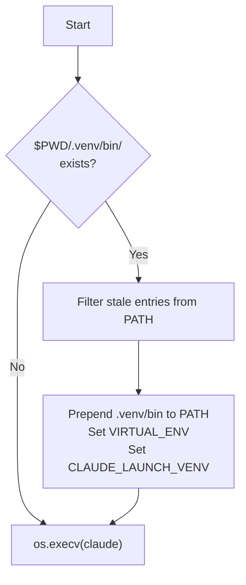

# Claude Launcher Plan

A transparent proxy for the `claude` binary that activates the project venv and cleans inherited PATH before exec'ing Claude Code, so `process.env.PATH` has `.venv/bin` from birth -- flowing to hooks, MCP servers, statusline, and Bash tool commands equally.

## 1. Problem Statement

Claude Code spawns five subprocess types (Bash tools, hooks, MCP servers, statusline, sub-agent Bash), but only Bash tool commands receive session env scripts via `CLAUDE_ENV_FILE`. The other four get bare `process.env`. The current `inject-session-env.py` hook (Layer 2) prepends `.venv/bin` to PATH for Bash commands, but hooks, MCP servers, and the statusline never see it.

The env architecture document (`docs/claude-code-env-architecture.md`) identifies Option A -- a shell wrapper -- as the simplest solution that reaches all subprocess types. This plan specifies that wrapper as a proper CLI tool integrated into the claude-workspace ecosystem.

## 2. TL;DR: Environment Variables

One table. Everything the wrapper sets and why.

| Variable | Set by | Value | When | Why needed |
|---|---|---|---|---|
| `PATH` | claude-launch (prepend + filter) | `.venv/bin:$CLEANED_PATH` | Only when `$PWD/.venv/bin/` exists | Tools resolve to project venv; stale entries removed |
| `VIRTUAL_ENV` | claude-launch | `/abs/path/to/.venv` | Only when `$PWD/.venv/bin/` exists | Standard venv protocol; Python tooling, pip, and statusline all check this |
| `CLAUDE_LAUNCH_VENV` | claude-launch | `/abs/path/to/.venv` | Only when `$PWD/.venv/bin/` exists | Statusline provenance: distinguishes wrapper-activated from manual `source activate` |

> [!NOTE]
> If there is no `.venv/` directory in CWD, the wrapper sets nothing. PATH is left untouched. The wrapper simply execs claude with the inherited environment as-is.

**Why each variable exists:**

- **PATH**: The entire point of the wrapper. Prepend the correct `.venv/bin`, remove stale `.venv/bin` entries from other projects and IDE-injected paths. Earlier entries shadow later ones, but stale entries are actively harmful -- they can cause `pip install` to target the wrong venv or `python` to resolve to the wrong interpreter.

- **VIRTUAL_ENV**: Standard venv protocol. Tools like `pip`, `pipx`, `uv`, and Python itself check `VIRTUAL_ENV` to determine the active environment. Without it, `pip install` targets the system Python. This is what `source .venv/bin/activate` sets.

- **CLAUDE_LAUNCH_VENV**: Provenance signal. The statusline's `_detect_venv_provenance()` distinguishes four sources: jediterm, manual, hook, gap. Without this variable, a wrapper-activated venv looks like "manual" (VIRTUAL_ENV set, no JEDITERM_SOURCE). This variable enables a fifth source -- "launcher" -- so the statusline shows that the wrapper did the activation, not the user.

**What does NOT get set:**

- `PS1` -- not relevant for non-interactive subprocess use
- `PYTHONPATH` -- venv activation via PATH is sufficient
- `CONDA_*` -- out of scope

### Relationship to inject-session-env.py

The wrapper handles PATH for `process.env` (reaching all subprocess types). The hook handles `CLAUDE_CODE_SESSION_ID` for Bash commands (session-scoped, dynamic). Each layer does one thing.

**Change required:** Remove the PATH injection from `inject-session-env.py`. The hook should write only `CLAUDE_CODE_SESSION_ID` to `CLAUDE_ENV_FILE`. PATH is the wrapper's responsibility. No fallbacks, no redundancy.

## 3. Naming

### Constraints

- Must follow the `claude-*` prefix pattern used by all other scripts
- Must not collide with any Claude Code subcommand or flag
- The user explicitly rejected `claude-go` and `cc`
- Cannot be named `claude` (shell integration overwrites the `claude()` function per [#35154](https://github.com/anthropics/claude-code/issues/35154))

### Conflict Check

Claude Code v2.1.92 subcommands: `agents`, `auth`, `auto-mode`, `doctor`, `install`, `mcp`, `plugin`, `plugins`, `setup-token`, `update`, `upgrade`. None conflict with `launch` or `exec`.

Claude Code flags: `--resume`, `--continue`, `--print`, `--model`, `--worktree`, etc. No `--launch` or `--exec` flags exist.

### Recommendation

**`claude-launch`** -- clear intent, follows the `claude-login`/`claude-diagnostics` naming pattern, no conflicts.

## 4. Core Behavior

### 4.1 Transparent Proxy

Every argument passes through to the real `claude` binary identically. The wrapper adds nothing to the argument list and removes nothing from it.

```bash
claude-launch --resume abc123 --model opus
# Equivalent to:
# PATH=".venv/bin:$CLEANED_PATH" VIRTUAL_ENV=".venv" claude --resume abc123 --model opus
```

### 4.2 Process Replacement via execv

The wrapper uses `os.execv()` to replace itself with the claude process. This means:

- No parent zombie process
- No signal forwarding needed
- The terminal talks directly to Claude Code
- Exit codes pass through naturally (the wrapper process no longer exists)
- Claude Code's shell integration targets `claude`, not `claude-launch`, so no conflict

```python
os.execv(claude_path, [claude_path, *sys.argv[1:]])
```

### 4.3 Venv Detection

The project directory is simply `$PWD` -- the current working directory when `claude-launch` is invoked. No git detection. No repo root resolution. The user chose to `cd` here and launch; that is the project.



**Why CWD, not git root:**

- The Claude Code project is whatever directory you launch from. It could be a subdirectory, a worktree, a non-git directory.
- `git rev-parse --show-toplevel` is wrong: a user might `cd ~/projects/myapp/backend && claude-launch` and expect `.venv` to be found in `backend/`, not in `myapp/`.
- Worktree awareness is an orthogonal concern. If we ever need to know the "main tree," that's separate from venv detection.

### 4.4 PATH Cleanup

When launching from an IDE or reusing a terminal tab, the inherited PATH contains entries that are wrong or misleading:

| Inherited entry | Problem | Example |
|-----------------|---------|---------|
| Main project's `.venv/bin` | Wrong venv in a worktree | PyCharm auto-activates the main project's venv via JEDITERM |
| `/Applications/PyCharm.app/Contents/MacOS` | IDE internals leak | Irrelevant for Claude's subprocess tree |
| Old/stale `.venv/bin` from a different project | Wrong tools on PATH | Terminal tab reused across projects |
| VS Code Python extension paths | IDE internals | Extension host paths for Pylance/debugger |

**The wrapper filters PATH at launch:**

1. Remove all `.venv/bin` entries that don't match `$PWD/.venv/bin` (stale entries from other projects, JEDITERM injection)
2. Remove IDE-specific paths (`PyCharm.app`, `VSCode.app` internals)
3. Prepend the correct `$PWD/.venv/bin`

This is simple string filtering on `os.environ['PATH'].split(':')`. The correct `.venv/bin` being first is necessary but not sufficient -- stale entries can cause `pip install` to target the wrong venv, or `python -c "import sys; print(sys.prefix)"` to report a different environment.

```python
def clean_path(cwd: Path, original_path: str) -> str:
    """Remove stale .venv/bin entries and IDE paths from PATH."""
    correct_venv = str(cwd / '.venv' / 'bin')
    entries = original_path.split(':')
    filtered = [
        e for e in entries
        if not _is_stale_venv(e, correct_venv) and not _is_ide_path(e)
    ]
    return ':'.join([correct_venv, *filtered])
```

### 4.5 Binary Resolution

`which claude` gives you the binary. If the resolved path is the same file as `claude-launch` itself, that is a configuration error -- fail fast with an error message telling the user to fix their PATH.

```python
def resolve_claude_binary() -> str:
    """Find the real claude binary. Fail fast if it's us."""
    result = shutil.which('claude')
    if result is None:
        print('error: claude not found on PATH', file=sys.stderr)
        sys.exit(1)
    if os.path.realpath(result) == os.path.realpath(sys.argv[0]):
        print('error: "which claude" resolved to claude-launch itself.', file=sys.stderr)
        print('Fix your PATH so claude-launch and claude are different binaries.', file=sys.stderr)
        sys.exit(1)
    return result
```

No hardcoded paths. No fallback chain. No `CLAUDE_BINARY` env var. Just `which claude`, and if it's us, crash.

### 4.6 Edge Cases

| Scenario | Behavior |
|----------|----------|
| No `.venv` directory | Skip activation, exec claude with unmodified env (except PATH cleanup still runs) |
| No claude binary found | Print error to stderr, exit 1 |
| `which claude` resolves to us | Print error to stderr, exit 1 (configuration error) |
| `.venv/bin` already on PATH | Clean stale entries, ensure correct one is first |
| User passes `--help` | Passes through to claude -- wrapper is invisible |
| User passes `--version` | Passes through to claude |
| Ctrl+C during claude | Handled by claude directly (wrapper replaced by execv) |
| Launched from PyCharm with wrong `.venv/bin` | Stale entry removed, correct one prepended |

## 5. Extension Subcommand: `ext`

### 5.1 Design Principle

ALL non-passthrough functionality lives under `claude-launch ext <cmd>`. This prevents ANY possibility of shadowing future Claude subcommands. The wrapper intercepts exactly one word: `ext`. Everything else passes through to claude.

```bash
claude-launch ext install      # Install to ~/.local/bin with completions
claude-launch ext uninstall    # Remove from ~/.local/bin
claude-launch ext completion   # Shell completion setup

claude-launch --resume abc123  # Passes through to claude
claude-launch auth login       # Passes through to claude
claude-launch doctor           # Passes through to claude
```

### 5.2 Interception Logic

```python
if len(sys.argv) > 1 and sys.argv[1] == 'ext':
    run_ext_app(sys.argv[2:])
else:
    activate_venv_and_exec()
```

One word. One check. Everything else goes to claude.

### 5.3 Current `ext` Subcommands

| Subcommand | Purpose |
|------------|---------|
| `ext install` | Create launcher in `~/.local/bin/` and install shell completions |
| `ext uninstall` | Remove launcher and completions |
| `ext completion` | Print shell completion script to stdout |

### 5.4 Future Extensions (Not in v0.1)

| Subcommand | Purpose |
|------------|---------|
| `ext sessions` | Cross-project session browser |
| `ext cwd <path>` | Launch claude with a different working directory |
| `ext profile <name>` | Switch login + model + settings in one step |
| `ext clean` | Clean old sessions, debug logs, file-history |

## 6. Tab Completion

### 6.1 Architecture

Three layers of completion:

1. **Claude's own completions** -- all flags, subcommands, and their arguments
2. **Wrapper-specific subcommands** -- the `ext` namespace
3. **Enhanced completions** -- session ID completion for `--resume`, model aliases for `--model`

### 6.2 Claude Completions: Binary-Derived Artifact

Claude Code does not ship built-in shell completions ([#7738](https://github.com/anthropics/claude-code/issues/7738), [#40503](https://github.com/anthropics/claude-code/issues/40503)).

**Strategy:** The completions are derived from binary analysis of the installed Claude binary. This is done by the developer (using the LLM + binary analysis workflow documented in CLAUDE.md) and committed as a versioned artifact. There is no runtime extraction script.

**Workflow:**

1. Developer runs binary analysis: `claude --help`, `strings $(which claude)`, `npx tweakcc unpack`
2. Developer + LLM curate the results: filter bundled-tool flags (git, bun, npm, jq), identify hidden flags, map value completions
3. Results committed as a Python data file, version-stamped against the Claude binary version
4. When Claude updates, developer re-runs the analysis

**Why the LLM is needed:** The binary bundles ~1,125 `--flag` entries from git, bun, npm, and jq. Mechanically filtering these requires understanding which flags belong to Claude vs. bundled tools. The LLM + developer review produces a curated, correct result. A script cannot reliably distinguish `--model` (Claude's) from `--model` (npm's).

**What the artifact contains:**

```python
# completions/claude_v2_1_92.py
# Analyzed: Claude Code v2.1.92
# Date: 2026-04-12
# Method: --help output + strings binary analysis + tweakcc unpack

SUBCOMMANDS = ['agents', 'auth', 'auto-mode', 'doctor', 'install',
               'mcp', 'plugin', 'plugins', 'setup-token', 'update', 'upgrade']

FLAGS_WITH_VALUES = {
    '--model': ['sonnet', 'opus', 'haiku'],
    '--effort': ['low', 'medium', 'high', 'max'],
    '--input-format': ['text', 'stream-json'],
    '--output-format': ['text', 'json', 'stream-json'],
    '--permission-mode': ['acceptEdits', 'auto', 'bypassPermissions',
                          'default', 'dontAsk', 'plan'],
}

FLAGS_BOOLEAN = [
    '--bare', '--brief', '--chrome', '--continue', '--dangerously-skip-permissions',
    '--disable-slash-commands', '--fork-session', '--ide', '--include-hook-events',
    '--include-partial-messages', '--no-chrome', '--no-session-persistence',
    '--print', '--replay-user-messages', '--verbose', '--version',
]

FLAGS_FILE_PATH = ['--debug-file', '--mcp-config', '--settings', '--plugin-dir']

# Hidden flags (not in --help, found via binary analysis)
FLAGS_HIDDEN = [
    '--advisor', '--agent-color', '--agent-id', '--agent-name',
    '--agent-type', '--debug-to-stderr',
]
```

**Smart completions the LLM enables:**

- `--resume` needs session ID completion (from `~/.claude/projects/` live data)
- `--model` needs model alias completion (sonnet, opus, haiku, full model IDs)
- `--mcp-config` needs file path completion
- `--permission-mode` needs value completion from a known set

A static extraction script cannot know these relationships. The developer + LLM workflow produces completions that understand argument semantics.

### 6.3 Session ID Completion for --resume

When the user types `claude-launch --resume <TAB>`, the completer shows recent sessions with context:

```
$ claude-launch --resume <TAB>
0ee8e857  2h ago   claude-workspace  "Designing the launcher plan"
a1b2c3d4  5h ago   claude-workspace  "Fix document-search scoring"
f7e8d9c0  1d ago   my-project        "Add OAuth flow"
```

**Data source:** `~/.claude/projects/` — Claude Code's own session data. Each project directory contains JSONL session files. No coupling to `~/.claude-workspace/sessions.json` (which is a hook artifact that may not exist on a fresh install). Anyone with Claude Code installed has `~/.claude/projects/`.

### 6.4 Installation

Uses the existing `cc_lib.cli` infrastructure:

```bash
claude-launch ext install    # Creates ~/.local/bin/claude-launch + completion script
# zsh: ~/.zsh/completions/_claude-launch
# bash: ~/.local/share/bash-completion/completions/claude-launch
```

## 7. File Structure

### 7.1 Pattern Decision: PEP 723 Inline Script

The wrapper uses the PEP 723 inline script pattern (like `claude-login.py`, `claude-diagnostics.py`).

| Factor | Inline Script | pyproject.toml Package |
|--------|---------------|----------------------|
| Startup overhead | ~100ms (uv resolves from cache) | ~50ms (pre-installed) |
| Updates | `git pull` -- instant, editable | `uv tool upgrade` -- network call |
| Fits pattern | Matches all other scripts | Would be the only standalone-script-as-package |

The 50ms difference is irrelevant -- the wrapper immediately `execv`'s into claude, which takes 500ms+ to initialize.

### 7.2 File Location

```
scripts/
    claude-launch.py     # The wrapper script (PEP 723 inline deps)
```

Single file, no subdirectory. Follows the pattern of all existing scripts.

### 7.3 Script Skeleton

```python
#!/usr/bin/env -S uv run --no-project --script
# /// script
# requires-python = ">=3.13"
# dependencies = [
#   "cc_lib",
#   "typer>=0.9.0",
# ]
#
# [tool.uv.sources]
# cc_lib = { path = "../cc-lib/", editable = true }
# ///

"""Claude Code launcher with venv activation and PATH cleanup.

Transparent proxy that activates the project's .venv and cleans
stale PATH entries before exec'ing the claude binary. All subprocess
types (hooks, MCP servers, statusline, Bash tools) inherit the
activated environment.

Usage:
    claude-launch                     # Launch claude with venv activated
    claude-launch --resume abc123     # All claude flags pass through
    claude-launch ext install         # Install to PATH with completions
"""
```

### 7.4 Internal Structure

```python
# Functions (top-down ordering per CLAUDE.md):

def main() -> None:
    """Entry point: detect ext command or activate venv + exec."""

def activate_and_exec() -> NoReturn:
    """Detect venv in CWD. If found, clean PATH + set env. Resolve binary, exec."""

def detect_venv(cwd: Path) -> Path | None:
    """Check $PWD/.venv/bin/ exists. Returns path or None."""

def clean_path(cwd: Path, original_path: str) -> str:
    """Remove stale .venv/bin entries and IDE paths from PATH."""

def resolve_claude_binary() -> str:
    """which claude, fail fast if it's us."""

# Typer app for ext subcommands:
ext_app = create_app(help='Claude launcher management commands.')

@ext_app.command()
def install(...):
    """Install launcher + completions to PATH."""

@ext_app.command()
def uninstall(...):
    """Remove launcher and completions."""

add_install_command(ext_app, script_path=__file__)
```

## 8. Relationship to Existing Tools

```
claude-launch           NEW -- transparent proxy with venv activation + PATH cleanup
claude-login            UNCHANGED -- login management (separate concern)
claude-diagnostics      UNCHANGED -- installation diagnostics
claude-version-manager  UNCHANGED -- version pinning
claude-binary-patcher   UNCHANGED -- binary modification
claude-session-patcher  UNCHANGED -- session repair
statusline.py           UPDATED  -- reads CLAUDE_LAUNCH_VENV for "launcher" provenance
inject-session-env.py   UPDATED  -- PATH injection REMOVED; only CLAUDE_CODE_SESSION_ID remains
```

### inject-session-env.py Changes

The hook currently writes both `CLAUDE_CODE_SESSION_ID` and `PATH` to `CLAUDE_ENV_FILE`. With the wrapper handling PATH in `process.env`, the hook should write only `CLAUDE_CODE_SESSION_ID`.

**Before:**
```python
lines = [f'export CLAUDE_CODE_SESSION_ID={hook_data.session_id}']
venv_bin = str(Path(hook_data.cwd) / '.venv' / 'bin')
if Path(venv_bin).is_dir() and venv_bin not in os.environ.get('PATH', '').split(':'):
    lines.append(f'export PATH="{venv_bin}:$PATH"')
```

**After:**
```python
lines = [f'export CLAUDE_CODE_SESSION_ID={hook_data.session_id}']
```

Each layer does one thing. The wrapper handles PATH. The hook handles session identity.

## 9. Testing Plan

### 9.1 Argument Pass-Through

```bash
# Every claude flag must pass through unchanged
claude-launch --help                    # Should show claude's help
claude-launch --version                 # Should show claude's version
claude-launch -p "echo hello"           # Should print response
claude-launch --resume abc123           # Should resume session
claude-launch --model opus -p "test"    # Multi-flag
claude-launch auth status               # Subcommand pass-through
claude-launch mcp list                  # Nested subcommand
```

**Verification:** Compare output of `claude-launch <args>` with `claude <args>` for each case.

### 9.2 Venv Activation

```bash
# Test in a project with .venv/
cd ~/claude-workspace
claude-launch -p 'import os; print(os.environ.get("PATH", "").split(":")[0])'
# Should show .../claude-workspace/.venv/bin

# Test in a project without .venv/
cd /tmp
claude-launch -p 'import os; print(os.environ.get("VIRTUAL_ENV", "not set"))'
# Should print "not set"

# Test provenance var
claude-launch -p 'import os; print(os.environ.get("CLAUDE_LAUNCH_VENV", "not set"))'
# Should print the venv path
```

### 9.3 PATH Cleanup

```bash
# Simulate stale PyCharm PATH
export PATH="/other/project/.venv/bin:/Applications/PyCharm.app/Contents/MacOS:$PATH"
cd ~/claude-workspace
claude-launch -p 'import os; print(os.environ["PATH"])'
# Should NOT contain /other/project/.venv/bin
# Should NOT contain PyCharm.app
# Should contain ~/claude-workspace/.venv/bin as first entry
```

### 9.4 Binary Resolution

```bash
# Normal case
claude-launch --version    # Should show claude's version

# Error case: simulate claude-launch aliased as claude
# (would require PATH manipulation to test)
# Expected: "error: 'which claude' resolved to claude-launch itself."
```

### 9.5 Tab Completion

```bash
# After install:
claude-launch ext <TAB>         # Should show install, uninstall, completion
claude-launch --<TAB>           # Should show --resume, --model, --print, etc.
claude-launch --resume <TAB>    # Should show recent session IDs
claude-launch --model <TAB>     # Should show sonnet, opus, haiku
```

### 9.6 Environment Targets

| Environment | Test |
|-------------|------|
| iTerm2 (zsh) | Primary -- standard terminal |
| PyCharm terminal | Verify stale JEDITERM `.venv/bin` is removed; correct one prepended |
| PyCharm + worktree | Verify worktree's `.venv/bin` replaces main project's |
| VS Code terminal | Verify no conflict with VS Code's Python extension |
| tmux session | Verify completion works in tmux |

### 9.7 Exit Code Pass-Through

```bash
claude-launch -p "echo ok"; echo $?      # Should be 0
claude-launch --bad-flag; echo $?         # Should be non-zero (claude's error)
```

Since `os.execv` replaces the process, exit codes are inherently passed through.

## 10. Implementation Phases

### Phase 1: Transparent Proxy + PATH Cleanup

- [ ] Script skeleton with PEP 723 inline deps
- [ ] Venv detection in `$PWD` (no git)
- [ ] PATH cleanup (remove stale `.venv/bin` entries, IDE paths)
- [ ] Venv activation (PATH prepend + VIRTUAL_ENV + CLAUDE_LAUNCH_VENV)
- [ ] Binary resolution (`which claude`, fail fast if it's us)
- [ ] `os.execv` pass-through
- [ ] `ext` subcommand routing
- [ ] `ext install` / `ext uninstall` / `ext completion` via `cc_lib.cli`
- [ ] Remove PATH injection from `inject-session-env.py`
- [ ] Manual testing in iTerm2 and PyCharm

### Phase 2: Tab Completion

- [ ] Commit binary-derived completion artifact for v2.1.92
- [ ] Session ID completion for `--resume` from `~/.claude/projects/` live data
- [ ] Model alias completion for `--model`
- [ ] Zsh and bash completion script generation

### Phase 3: Statusline Integration

- [ ] Statusline reads `CLAUDE_LAUNCH_VENV` for "launcher" provenance source
- [ ] Displays wrapper provenance indicator (fifth source alongside jediterm, manual, hook, gap)

## 11. Open Questions

1. **Should the wrapper support conda environments?** Not in v0.1. Conda activation is complex (requires `conda activate`, not just PATH manipulation). Can be added later if needed.

2. **Should the wrapper detect `.venv` vs `venv` vs other venv directory names?** Start with `.venv` only (project convention). Add `venv` as a fallback if users request it.

## 12. Appendix: Claude Code CLI Interface (v2.1.92)

Reference snapshot from binary analysis. The completion artifact is the source of truth, not this appendix.

### Analysis Method

```bash
claude --help 2>&1                                    # Authoritative public surface
strings $(which claude) | grep -E "^--[a-z][-a-z]+"   # ~1,125 entries (includes bundled tools)
npx tweakcc unpack /tmp/claude-unpacked.js             # Full JS source for deep analysis
```

The binary bundles git, bun, npm, and jq. Their flags appear in the strings table. The LLM + developer workflow filters these during analysis.

### Top-Level Subcommands

```
agents          List configured agents
auth            Manage authentication (login, logout, status)
auto-mode       Inspect auto mode classifier (config, critique, defaults)
doctor          Check auto-updater health
install         Install native build (stable, latest)
mcp             Configure MCP servers (add, remove, list, serve, ...)
plugin/plugins  Manage plugins (install, uninstall, list, marketplace, ...)
setup-token     Set up long-lived auth token
update/upgrade  Check for updates and install if available
```

### Key Flags with Values

| Flag | Values |
|------|--------|
| `--effort` | `low`, `medium`, `high`, `max` |
| `--input-format` | `text`, `stream-json` |
| `--model` | `sonnet`, `opus`, `haiku`, full model IDs |
| `--output-format` | `text`, `json`, `stream-json` |
| `--permission-mode` | `acceptEdits`, `auto`, `bypassPermissions`, `default`, `dontAsk`, `plan` |

### Boolean Flags

`--bare`, `--brief`, `--chrome`, `--continue`, `--dangerously-skip-permissions`, `--disable-slash-commands`, `--fork-session`, `--ide`, `--include-hook-events`, `--include-partial-messages`, `--no-chrome`, `--no-session-persistence`, `--print`, `--replay-user-messages`, `--verbose`, `--version`

### Flags That Accept File Paths

`--debug-file`, `--mcp-config`, `--settings`, `--plugin-dir`

### Hidden Flags (Binary Analysis)

Found in binary strings but not in `--help` output. These are internal/experimental:

| Flag | Type | Notes |
|------|------|-------|
| `--advisor` | Value (model) | Internal advisor model configuration |
| `--agent-color` | Value (color) | Agent display color in multi-agent |
| `--agent-id` | Value (id) | Agent identifier for sub-agents |
| `--agent-name` | Value (name) | Agent display name |
| `--agent-type` | Value (type) | Agent classification |
| `--debug-to-stderr` | Boolean | Redirect debug output to stderr |

## 13. Version History

| Date | Event |
|------|-------|
| 2026-04-12 | Initial plan drafted from env architecture analysis |
| 2026-04-12 | Major overhaul: CWD-based venv detection, PATH cleanup as MVP, `ext` namespace, binary-derived completions artifact, simplified binary resolution, single-responsibility for inject-session-env.py |
