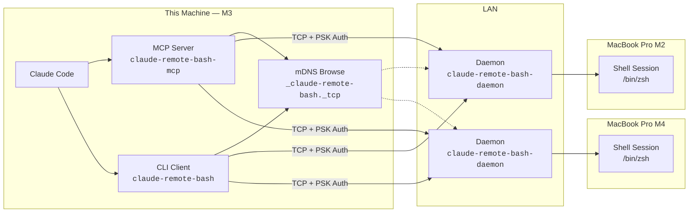
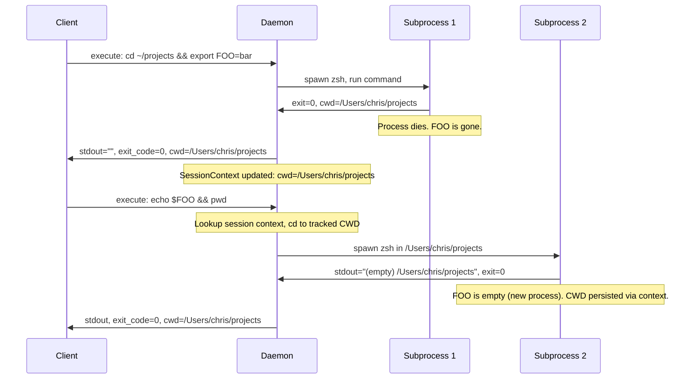
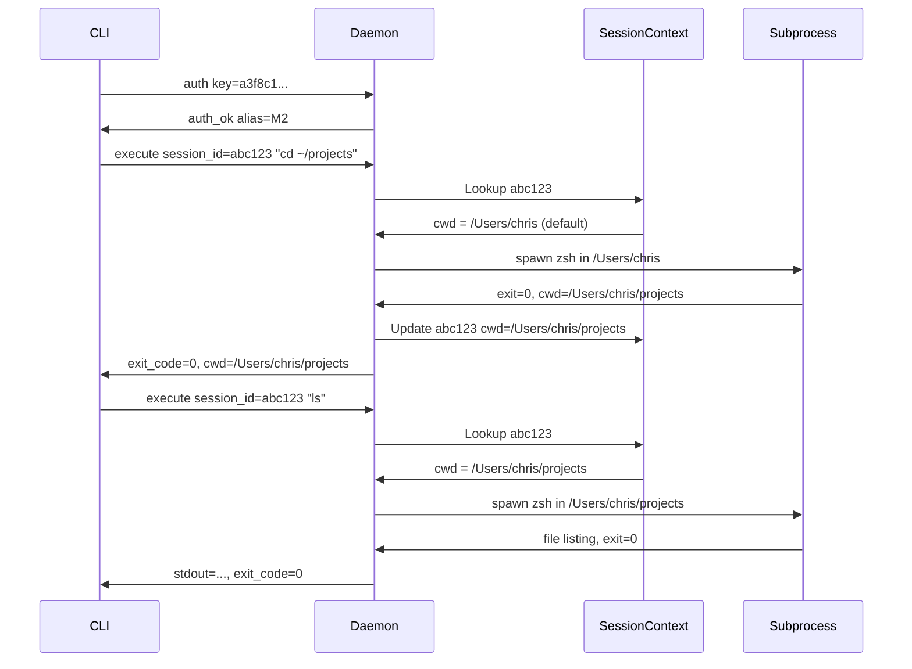
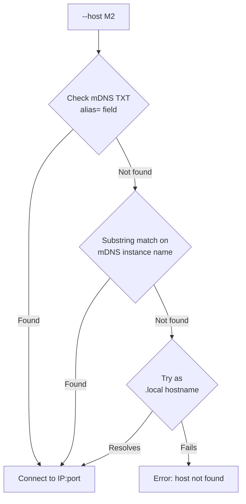
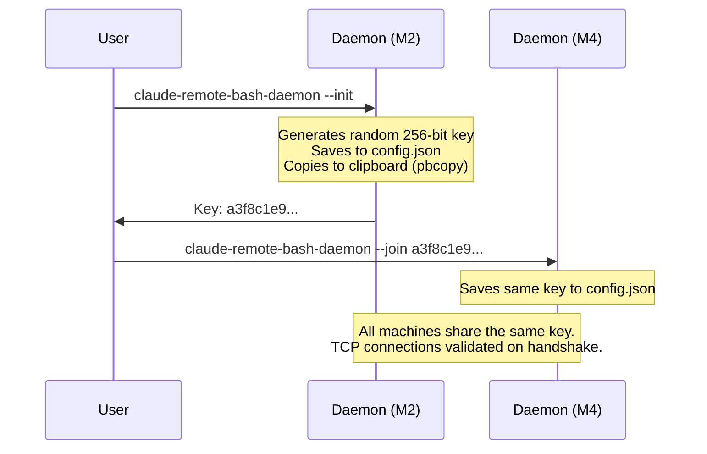

# claude-remote-bash — Architecture & Implementation Plan

> Cross-machine shell execution for Claude Code via mDNS-discovered daemons

---

## Overview

**claude-remote-bash** extends Claude Code's reach beyond the local machine. A lightweight daemon runs on each target machine, registers itself via mDNS on the home LAN, and accepts authenticated shell commands over TCP. A local MCP server discovers daemons and exposes tools; a CLI client enables readable Bash-tool integration with Claude Code's existing permission system.



---

## Naming Convention

| Component | Name | Entry Point |
|---|---|---|
| Package directory | `mcp/claude-remote-bash/` | — |
| Python package | `claude_remote_bash` | — |
| pyproject name | `claude-remote-bash` | — |
| **CLI** | `claude-remote-bash` | `claude_remote_bash.cli.main:main` |
| **MCP server** | `claude-remote-bash-mcp` | `claude_remote_bash.mcp.main:main` |
| **Daemon** | `claude-remote-bash-daemon` | `claude_remote_bash.daemon:main` |
| MCP registration | `claude-remote-bash` | `claude mcp add claude-remote-bash -- claude-remote-bash-mcp` |
| mDNS service type | `_claude-remote-bash._tcp` | — |
| Config directory | `~/.claude-workspace/claude-remote-bash/` | — |
| launchd label | `com.claude-workspace.claude-remote-bash` | — |

> [!NOTE]
> **Entry point pattern**: `<name>` (CLI), `<name>-mcp` (MCP server), `<name>-daemon` (daemon). The role is suffixed, not prefixed. The file structure mirrors this: `cli/main.py`, `mcp/main.py`, `daemon.py`.

---

## mDNS / DNS-SD / Zeroconf Feature Analysis

The daemon uses **mDNS** (RFC 6762) for name resolution and **DNS-SD** (RFC 6763) for service discovery. The Python `zeroconf` library implements both.

### Protocol Feature Coverage

| Feature | mDNS (RFC 6762) | DNS-SD (RFC 6763) | `zeroconf` lib | Used by us | Notes |
|---|:---:|:---:|:---:|:---:|---|
| Multicast name resolution (`.local`) | ✅ Spec | — | ✅ | ✅ | Core mechanism — how `M2.local` resolves to an IP |
| Conflict detection & resolution | ✅ Spec | — | ✅ | ✅ | Auto-appends `(2)` if duplicate instance name |
| Continuous querying | ✅ Spec | — | ✅ | MCP only | MCP server uses continuous browse; CLI does one-shot |
| Known-answer suppression | ✅ Spec | — | ✅ | Automatic | Library handles internally, reduces network traffic |
| Cache with TTL management | ✅ Spec | — | ✅ | Automatic | Library maintains DNS cache per TTL |
| IPv4 support | ✅ Spec | — | ✅ | ✅ | Home LAN, IPv4 sufficient |
| IPv6 support | ✅ Spec | — | ✅ | ❌ | Not needed for MVP |
| Unicast response (QU queries) | ✅ Spec | — | ✅ | ❌ | Multicast sufficient for home LAN |
| Service type enumeration | — | ✅ Spec | ✅ | ❌ | We browse specific types, not all types |
| Service instance browsing (PTR) | — | ✅ Spec | ✅ | ✅ | "Who offers `_claude-remote-bash._tcp`?" |
| Service instance resolution (SRV) | — | ✅ Spec | ✅ | ✅ | "What IP:port is M2's daemon?" |
| TXT record key-value metadata | — | ✅ Spec | ✅ | ✅ | alias, os, user, shell, version |
| Service subtypes | — | ✅ Spec | ✅ | ❌ | No sub-categories needed |
| Multi-interface support | ✅ Spec | — | ✅ | Automatic | Library binds all active interfaces |
| Long-lived queries | — | ✅ Spec | ✅ | MCP only | Continuous discovery with state change callbacks |

### `zeroconf` Library API Surface

| API | Role | Our Usage |
|---|---|---|
| `AsyncZeroconf()` | Event loop + multicast socket manager | Both daemon and client create one |
| `AsyncServiceInfo(type_, name, port, properties, server)` | Describes a service to register | Daemon registers with alias/os/user TXT records |
| `azc.async_register_service(info)` | Announces service on network | Daemon startup |
| `azc.async_unregister_service(info)` | Removes service from network | Daemon shutdown |
| `AsyncServiceBrowser(zc, type_, handlers)` | Continuous service discovery | MCP server uses for live host list |
| `info.async_request(zc, timeout)` | Resolves a specific service | CLI resolves discovered service to IP:port |
| `info.parsed_addresses()` | Extracts resolved IPv4/IPv6 addresses | Both CLI and MCP server |
| `info.port` | Advertised port number | Both CLI and MCP server |
| `info.properties` | TXT record dict (`bytes` keys/values) | Host alias resolution |
| `ServiceStateChange.Added/Removed/Updated` | Discovery event types | MCP server reacts to host changes |

### mDNS vs Static Configuration

| Aspect | mDNS (our approach) | Static hosts file |
|---|---|---|
| **Setup** | Zero config — daemon announces, client discovers | Manual — edit config on every client |
| **IP changes** | Automatic — mDNS tracks DHCP reassignment | Broken — must update config |
| **New machines** | Auto-discovered | Must add to config |
| **Offline machines** | Disappear from discovery | Remain in config, fail on connect |
| **Port** | Dynamic, advertised via SRV record | Must be known/fixed |
| **Metadata** | TXT records (alias, os, etc.) | Must be duplicated in config |
| **Dependency** | `zeroconf` Python package | None |
| **Network** | Requires multicast (standard on home LAN) | Works everywhere |

---

## What the Daemon Mirrors from Claude Code

The daemon is the remote equivalent of Claude Code's shell execution layer. This table audits every feature of the local Bash tool and decides what belongs in the daemon.

### Feature Audit

Features fall into three categories: **daemon-side** (must be on the remote), **delegated** (the calling tool chain already handles it), and **not applicable**.

#### Daemon-Side — The daemon must handle these

| Feature | Claude Code (Local) | Daemon (Remote) | Why daemon? |
|---|---|---|---|
| **CWD tracking** | `pwd -P > /tmp/cwd` after each command | `SessionContext` per `session_id` | CWD is remote state — only the daemon knows the actual CWD after a command |
| **Shell profile** | Snapshot of `.zshrc` replayed per command | `zsh -l` (login shell) sources profile | The remote user's shell config lives on the remote machine |
| **Timeout + orphan kill** | `tree-kill(pid, SIGKILL)` on process tree | `os.killpg(pgid, SIGKILL)` on process group | If the TCP connection drops (CLI killed by Bash tool timeout), the remote subprocess is orphaned. Daemon must clean it up. |

#### Delegated to Claude Code — The Bash tool already handles these

| Feature | Claude Code (Local) | Why delegated? |
|---|---|---|
| **Output limits** | 30KB default, overflow to file | Our CLI's stdout IS the Bash tool's stdout. Claude Code truncates it. No need to re-implement. |
| **Auto-background** | Long-running commands moved to background | The Bash tool backgrounds our CLI process. The daemon doesn't need to know. |
| **Return code interpretation** | Semantic exit code analysis | Our CLI exits with the remote command's exit code. Claude Code interprets it. |
| **Permission system** | Allowlist pattern matching | `Bash(claude-remote-bash:*)` patterns. Already discussed. |

> [!IMPORTANT]
> **Delegation principle**: When the CLI runs inside Claude Code's Bash tool, it inherits the Bash tool's capabilities for free. The daemon should not re-implement features the calling tool chain already provides. This keeps the daemon thin — a remote subprocess executor with session context, nothing more.

#### Not Applicable

| Feature | Why not? |
|---|---|
| **Session env vars / scripts** | Claude Code internal mechanism (hooks, `/env` command). Not our concern. |
| **Shell reset** | No project concept on the daemon. Remote commands are machine-scoped. |
| **Git tracking** | Claude Code telemetry. Not relevant to remote execution. |
| **Sandbox** | Claude Code security layer. Not applicable to remote. |

#### Future (YAGNI)

| Feature | When it might matter |
|---|---|
| **Session env vars on daemon** | If cross-command env persistence becomes a demonstrated need. Slots into `SessionContext`. |
| **Daemon-side output limits** | If large outputs over TCP become a performance issue. Optimization, not correctness. |
| **Persistent shell sessions** | If interactive/REPL use cases emerge. Opt-in `--persistent` mode. |

### Session Context — The Concept

The daemon tracks a **session context** per Claude Code session. This is the minimal state that makes stateless-per-command execution feel continuous — without a persistent shell.

| What it is | What it is NOT |
|---|---|
| CWD tracking (like Claude Code's `pwd -P` mechanism) | A persistent shell subprocess |
| A lightweight struct keyed by `CLAUDE_CODE_SESSION_ID` | A full environment replay system |
| Extensible to session env vars if needed later | A snapshot/replay mechanism |
| Automatically created, TTL-expired | Something that requires explicit setup |

The session context lives on the daemon (remote side) because:
1. The daemon is long-lived — survives across CLI invocations
2. Commands execute there — CWD capture is accurate
3. Both CLI and MCP paths connect to the same daemon — shared state
4. No local file I/O, locking, or stale state concerns

---

## Persistence Model — Stateless Per-Command (Matching Claude Code)

Claude Code's local Bash tool uses **stateless per-command execution** — each call spawns a new process, runs the command, and exits. The only state tracked across calls is the **working directory**. Our daemon adopts the same model.

### How It Works (Local and Remote)



### Why Stateless Is Right

| Concern | Persistent Shell | Stateless Per-Command (our choice) |
|---|---|---|
| **Sub-agents** | ❌ Multiple agents fight over shared stdin/stdout | ✅ Each agent spawns independently — zero coordination |
| **Concurrent execution** | ❌ Requires named sessions + locking | ✅ Naturally parallel |
| **Timeout handling** | ⚠️ Must SIGINT carefully to preserve shell | ✅ Kill process tree, no side effects |
| **State pollution** | ❌ Bad `export PATH=""` breaks all future commands | ✅ Next command starts clean |
| **Recovery** | ❌ Must detect dead shells, recreate sessions | ✅ Nothing to recover — every command is fresh |
| **Daemon complexity** | High — session manager, health checks, idle timeouts | Low — spawn, wait, return |
| **CWD persistence** | ✅ Natural | ✅ Tracked client-side (same as Claude Code) |
| **Env var persistence** | ✅ Natural | ❌ Lost — chain with `&&` when needed |
| **Matches local Bash** | ❌ Behaves differently from Claude Code's Bash tool | ✅ Same model — no surprise differences |

> [!IMPORTANT]
> **The sub-agent scenario is decisive.** Claude Code spawns sub-agents via the Agent tool. If three agents simultaneously call `claude-remote-bash --host M2 'command'`, stateless execution handles this naturally — three independent subprocesses. A persistent shell would need three named sessions, coordination logic, and cleanup.

### What Persists Across Commands

| State | Persists? | How |
|---|---|---|
| **Working directory** | ✅ Yes | Client tracks CWD from each result, sends it with next command |
| **Environment from `.zshrc`** | ✅ Yes | Each command runs `zsh -l` (login shell), which sources the profile |
| **Environment from `export` in commands** | ❌ No | Same as Claude Code local — chain with `&&` when needed |
| **Shell functions from commands** | ❌ No | Same as Claude Code local |
| **Aliases from commands** | ❌ No | Same as Claude Code local |

### CWD Tracking

The CLI and MCP server each maintain a per-host CWD map:

```python
# Client-side state (in CLI or MCP server)
host_cwds: dict[str, str] = {}  # {"M2": "/Users/chris/projects", "M4": "/Users/chris"}
```

Each command result includes `cwd` (captured via `pwd -P` after the command). The client stores it and sends it with the next command. This exactly mirrors how Claude Code tracks CWD locally via temp files.

### Future: Persistent Sessions (YAGNI)

If a demonstrated need arises for genuine persistent shells (interactive debugging, long-running REPL sessions), this can be added as an opt-in mode:

```bash
# Future — not MVP
claude-remote-bash --host M2 --persistent --session debug 'python3'
```

The stateless default and the persistent mode would coexist. The daemon would support both — subprocess-per-command (default) and long-lived shell processes (opt-in). But per YAGNI, this is not built until needed.

---

## Scoping — Machine-Level by Default

With stateless per-command execution, the scoping question simplifies. There are no persistent sessions to scope. Each command is independent.

**CWD tracking** is the only state that persists, and it's managed client-side:

| Client | CWD State | Scope |
|---|---|---|
| CLI process | In-memory dict per host | Dies when CLI process exits (per-command for Claude's Bash tool) |
| MCP server | In-memory dict per host | Lives for the MCP server's lifetime (per Claude Code session) |

This means:
- Different Claude Code sessions have independent CWD tracking (via separate MCP server instances)
- The daemon is completely stateless — no scoping decisions needed on the remote side
- Sub-agents within the same session share CWD tracking via the shared MCP server (but each command is isolated)

### Primary Use Cases Are Machine-Level

- "What MCP servers are configured on M2?"
- "Install this tool on M4"
- "Check the Python version on the NAS"

These are **machine-level operations**, not project operations. The remote machine may not even have the same project structure. Stateless execution with CWD tracking fits this perfectly.

---

## Remote MCP Server Proxying — Future Direction

> [!NOTE]
> This section is a cursory analysis of a future capability, not part of the MVP.

The user asked: could you use the Python interpreter remotely?

The Python interpreter MCP server manages persistent interpreter subprocesses. Its client connects via Unix socket to the local MCP server. The interpreters and the shared state live inside the long-running server process.

**Current state**: The MCP server is scoped to the Claude Code process that launched it. The interpreters exist only within that server's lifetime.

**To make this work remotely**, you'd need one of:

| Approach | How | Complexity | Benefit |
|---|---|---|---|
| **Run commands via remote-bash** | `claude-remote-bash --host M2 'python3 -c "print(1+1)"'` | None — works today | No persistent Python state |
| **Run MCP server on each machine, proxy locally** | Each machine runs `mcp-python-interpreter-server`. A local proxy MCP server routes tool calls to the right machine. | High — MCP-over-network protocol | Full remote MCP tool access with persistence |
| **Run interpreters inside the daemon** | Daemon manages Python subprocesses alongside shell sessions | Medium — extend daemon protocol | Python persistence without separate MCP server |

The `m2m-mcp-server-ssh-client` project in the ecosystem does approach #2 — it proxies remote MCP servers over SSH to appear local. This is the most general solution but adds significant complexity.

For MVP, approach #1 (remote-bash) is sufficient. The daemon gives you a persistent shell, which can run Python. If persistent Python state across commands matters, open a named session and use the shell's Python REPL.

---

## Three Components — Detailed Design

### 1. Daemon — `claude-remote-bash-daemon`

The daemon runs on each **target machine** (the machines you want to reach). It is the foundation — everything else connects to it.

| Responsibility | Implementation |
|---|---|
| **mDNS registration** | `zeroconf.AsyncZeroconf` — registers `_claude-remote-bash._tcp` with TXT metadata |
| **TCP server** | `asyncio.start_server()` — accepts authenticated connections |
| **Shell sessions** | `asyncio.create_subprocess_exec()` — persistent shell per named session |
| **Authentication** | Pre-shared key (PSK) verified on connection handshake |
| **Config reading** | Reads local `~/.claude.json`, `~/.claude/settings.json` on request |
| **File operations** | Read/write local files on request |

#### mDNS Advertisement

```python
AsyncServiceInfo(
    type_="_claude-remote-bash._tcp.local.",
    name=f"{hostname}._claude-remote-bash._tcp.local.",
    port=<dynamic>,  # OS-assigned, advertised via mDNS
    properties={
        "alias": "M2",          # Short name (--name flag)
        "os": "darwin",
        "user": "chris",
        "shell": "/bin/zsh",
        "version": "0.1.0",
        "claude": "true",       # Claude Code installed?
    },
    server=f"{hostname}.local.",
)
```

#### Stateless Execution + Session Context

Each command spawns an independent subprocess — no persistent shell. The daemon maintains a **session context** per `CLAUDE_CODE_SESSION_ID` to track CWD across commands, mirroring Claude Code's local behavior.



> [!IMPORTANT]
> Each command is fully isolated — sub-agents execute in parallel without coordination. The daemon tracks **session context** (CWD) per `CLAUDE_CODE_SESSION_ID`, which the CLI reads from the environment (injected by the `inject-session-env.py` hook).

#### Session Context

The daemon maintains a minimal per-session state — just enough to make stateless execution feel continuous:

```python
@dataclass
class SessionContext:
    """Tracked state per Claude Code session on this daemon."""
    cwd: str                    # Working directory (updated after each command)
    last_active: datetime       # For TTL-based expiry
    command_count: int = 0      # Diagnostic
```

```python
# Daemon state
session_contexts: dict[str, SessionContext] = {}  # keyed by CLAUDE_CODE_SESSION_ID
```

- **Auto-creates** on first command from a new session ID (CWD defaults to `$HOME`)
- **Updates** CWD after each command via `pwd -P` in the marker
- **Expires** after configurable TTL (default: 24 hours) to prevent unbounded growth
- **Extensible** — session env vars, command history, etc. can be added later without architectural changes

---

### 2. MCP Server — `claude-remote-bash-mcp`

Runs on the **local machine** alongside Claude Code. Provides structured tool access for Claude.

| Tool | Parameters | Description |
|---|---|---|
| `execute` | `host`, `command`, `timeout?` | Run a command on a remote host |
| `discover` | — | Browse mDNS for available machines |
| `read_file` | `host`, `path` | Read a file on a remote host |
| `read_config` | `host` | Read Claude Code config from a remote host |

Follows existing patterns:
- FastMCP with `lifespan()` + `register_tools(state)` closure pattern
- `ServerState` dataclass with `session_id`, `project_dir`, `claude_pid`
- `ClosedModel` for all Pydantic models
- Logging via Python `logging` module to stderr (captured automatically by Claude Code in `~/.claude/debug/{session_id}.txt` — no custom log paths needed)

---

### 3. CLI Client — `claude-remote-bash`

The **primary interface** for Claude Code integration. Built with `typer` via `cc_lib.cli.create_app`.

#### Usage Patterns

```bash
# Execute a command on a remote host
claude-remote-bash --host M2 'ls -la ~/.claude'

# Multiline via heredoc (how Claude uses it)
claude-remote-bash --host M2 <<'BASH'
cd ~/projects
cat .env
echo "CWD: $(pwd)"
BASH

# Discover machines
claude-remote-bash discover

# Read remote Claude Code config
claude-remote-bash config --host M2
```

#### How Claude Uses It

Claude calls the CLI through the Bash tool:

```
┌─────────────────────────────────────────────────────────┐
│  Allow Bash:                                            │
│                                                         │
│  claude-remote-bash --host M2 <<'BASH'                  │
│  cat ~/.claude.json | jq '.mcpServers | keys'           │
│  BASH                                                   │
│                                                         │
│  [Yes]  [No]  [Always Allow]                            │
└─────────────────────────────────────────────────────────┘
```

> [!TIP]
> The approval prompt shows **clean, readable, multi-line text** — not escaped JSON. This is the key advantage of the CLI approach over pure MCP tool access.

---

## Permission Integration

The CLI naturally participates in Claude Code's existing Bash permission system via literal prefix matching:

| Permission Pattern | Effect |
|---|---|
| `Bash(claude-remote-bash:*)` | Allow **all** remote commands on **all** hosts |
| `Bash(claude-remote-bash --host M2:*)` | Allow **any** command on **M2 only** |
| `Bash(claude-remote-bash --host M4:*)` | Allow **any** command on **M4 only** |
| `Bash(claude-remote-bash discover:*)` | Allow **discovery** only |
| `Bash(claude-remote-bash config:*)` | Allow **config reading** only |

Add to `.claude/settings.json`:

```json
{
  "permissions": {
    "allow": [
      "Bash(claude-remote-bash --host M2:*)",
      "Bash(claude-remote-bash discover:*)"
    ]
  }
}
```

> [!NOTE]
> No custom permission code is needed. The CLI's naming gives us per-host and per-command granularity using Claude Code's existing infrastructure.

---

## Host Alias Resolution

When `--host M2` is specified, the CLI resolves it through a chain:



The alias is set when starting the daemon:

```bash
# On the M2 machine:
claude-remote-bash-daemon --name M2

# On the M4 machine:
claude-remote-bash-daemon --name M4
```

The `--name` persists in `~/.claude-workspace/claude-remote-bash/config.json` so subsequent starts reuse it.

---

## Protocol Specification

Length-prefixed JSON over TCP with a flags byte for future extensibility.

```
┌──────────────┬──────────────┬──────────────────────────────┐
│ 4 bytes      │ 1 byte       │ N bytes                      │
│ uint32 BE    │ flags        │ JSON UTF-8 payload           │
│ (length = N) │              │                              │
└──────────────┴──────────────┴──────────────────────────────┘
```

**Flags byte** (MVP: always `0x00`):

| Bit | Meaning | MVP |
|:---:|---|:---:|
| 0 | Compressed payload | Reserved |
| 1-2 | Compression algorithm (00=none, 01=zstd, 10=lz4) | Reserved |
| 3-7 | Reserved | — |

> [!NOTE]
> **Why not compress now?** On gigabit LAN, a 30KB payload transfers in ~0.24ms — faster than any compressor can run. Compression becomes net-positive above ~500KB, which is rare for shell output (Claude Code's default limit is 30KB). The flags byte costs 1 byte per message and lets us add compression without a protocol version bump if we later need it (VPN, Wi-Fi congestion, NAS over slower link).

### Message Types

#### Authentication

```json
// Client → Daemon
{"type": "auth", "key": "a3f8c1e9...hex..."}

// Daemon → Client (success)
{"type": "auth_ok", "alias": "M2", "hostname": "Chriss-MacBook-Pro-M2.local", 
 "os": "darwin", "user": "chris", "shell": "/bin/zsh", "version": "0.1.0"}

// Daemon → Client (failure)
{"type": "auth_fail", "reason": "invalid key"}
```

#### Command Execution

```json
// Client → Daemon
{"type": "execute", "id": "req_001", "session_id": "abc123-def456",
 "command": "ls -la", "timeout": 120.0}

// Daemon → Client
{"type": "result", "id": "req_001", "stdout": "total 42\ndrwxr-xr-x...",
 "exit_code": 0, "cwd": "/Users/chris/projects", "truncated": false}
```

> [!NOTE]
> The `session_id` comes from `CLAUDE_CODE_SESSION_ID` (injected by the `inject-session-env.py` hook). The daemon looks up the session context to get the tracked CWD, runs the command with that CWD, captures the new CWD via `pwd -P`, and updates the session context. No CWD field in the request — the daemon owns it.

#### File & Config Operations

```json
// Read file
{"type": "read_file", "path": "~/.claude.json"}
{"type": "file_content", "path": "/Users/chris/.claude.json",
 "content": "{...}", "size": 1234}

// Read Claude Code config
{"type": "read_config"}
{"type": "config", "claude_json": {...}, "settings_json": {...},
 "mcp_servers": [...]}
```

---

## Authentication — Pre-Shared Key



**Config file** (`~/.claude-workspace/claude-remote-bash/config.json`):

```json
{
  "name": "M2",
  "auth_key": "a3f8c1e9b4d7...64-char-hex...",
  "shell": "/bin/zsh",
  "session_timeout_minutes": 30
}
```

> [!CAUTION]
> The PSK is stored in plaintext on disk. Appropriate for a home LAN with trusted machines. Not suitable for untrusted networks — use SSH or mTLS for that. File permissions should be `0600`.

---

## File Layout

```
mcp/claude-remote-bash/
├── pyproject.toml                    # Package definition
├── claude_remote_bash/
│   ├── __init__.py
│   ├── daemon.py                     # Daemon entry point (TCP server + mDNS + dispatch)
│   ├── executor.py                   # Stateless command execution (spawn, capture, return)
│   ├── context.py                    # SessionContext dataclass + context store with TTL
│   ├── service.py                    # Client-side domain logic: connect, resolve hosts
│   ├── models.py                     # Pydantic ClosedModel subclasses
│   ├── discovery.py                  # mDNS registration + browsing via zeroconf
│   ├── protocol.py                   # Message types + read/write helpers
│   ├── auth.py                       # PSK generation, verification, config I/O
│   ├── mcp/
│   │   ├── __init__.py
│   │   └── main.py                   # FastMCP server (local, alongside Claude Code)
│   └── cli/
│       ├── __init__.py
│       └── main.py                   # typer app via cc_lib.cli.create_app
└── tests/
    └── ...
```

**pyproject.toml** (key sections):

```toml
[project]
name = "claude-remote-bash"
version = "0.1.0"
requires-python = ">=3.13"
dependencies = [
    "cc-lib @ git+https://github.com/chrisguillory/claude-workspace.git#subdirectory=cc-lib",
    "fastmcp>=2.13.0",
    "typer>=0.20.0",
    "zeroconf>=0.140.0",
]

[project.scripts]
claude-remote-bash = "claude_remote_bash.cli.main:main"
claude-remote-bash-daemon = "claude_remote_bash.daemon:main"
claude-remote-bash-mcp = "claude_remote_bash.mcp.main:main"
```

> [!NOTE]
> Persistent state lives in `~/.claude-workspace/claude-remote-bash/` (config, auth key). Logs go to stderr, which Claude Code captures in `~/.claude/debug/{session_id}.txt` automatically. We don't write to any Claude-owned directories.

---

## Implementation Phases

### Phase 1 — Daemon Core

> Build the daemon. Get mDNS registration + persistent shell + protocol working.

| Task | Details |
|---|---|
| Protocol module | `read_message()` / `write_message()` with length-prefixed JSON |
| Executor | `asyncio.create_subprocess_exec()` — stateless per-command with marker-based exit code + CWD capture |
| Session context | `SessionContext` dataclass + store keyed by `CLAUDE_CODE_SESSION_ID` with TTL expiry |
| Orphan cleanup | Kill remote subprocess when TCP connection drops (daemon-side timeout) |
| Auth module | PSK generation (`--init`), joining (`--join`), verification, `0600` file perms |
| mDNS registration | `AsyncZeroconf` with TXT records (alias, os, user, shell, version) |
| TCP server | `asyncio.start_server()` on dynamic port, auth handshake + command dispatch |
| Config file | `~/.claude-workspace/claude-remote-bash/config.json` with filelock |
| Daemon entry point | `claude-remote-bash-daemon` with `--name`, `--init`, `--join` flags |

**Validation**: Start daemon on M2, connect via Python script from M3, execute commands with CWD tracking.

### Phase 2 — CLI Client

> Build the CLI. Enable Claude Code integration via Bash tool.

| Task | Details |
|---|---|
| Host resolution | mDNS browse → alias match → instance match → .local fallback |
| Execute command | `claude-remote-bash --host M2 'command'` and heredoc stdin, with client-side CWD tracking |
| Discover command | `claude-remote-bash discover` → table of machines |
| Config command | `claude-remote-bash config --host M2` |
| typer app | `cc_lib.cli.create_app` with shell completion |

**Validation**: Claude Code uses `Bash(claude-remote-bash --host M2 'ls')` successfully.

### Phase 3 — MCP Server

> Build the MCP server for structured tool access.

| Task | Details |
|---|---|
| Lifespan | mDNS continuous browse on startup, maintain live host cache |
| Tools | `execute`, `discover`, `read_file`, `read_config` |
| Tool docstrings | Guide Claude on when to use MCP vs CLI |
| Registration | `claude mcp add claude-remote-bash -- claude-remote-bash-mcp` |
| CWD tracking | MCP server maintains per-host CWD map in server state |

### Phase 4 — Polish

| Task | Details |
|---|---|
| launchd installer | `claude-remote-bash-daemon --install` generates + loads plist |
| Connection pooling | Reuse TCP connections across commands |
| Error handling | Actionable errors at boundaries (connection refused, auth failed, host not found) |
| Version bump | 0.1.0 → 0.2.0 on feature completion |

---

## Key Design Decisions

| Decision | Choice | Rationale |
|---|---|---|
| **Shell** | System default (zsh on macOS) | Matches Claude Code's Bash tool behavior — named "Bash" but uses `$SHELL` |
| **Port** | Dynamic (OS-assigned) | Zero config, no conflicts. mDNS advertises the actual port |
| **Execution model** | Stateless per-command + session context | Matches Claude Code's local Bash. Sub-agent safe. CWD tracked daemon-side. |
| **Delegation** | Bash tool handles output limits, backgrounding, return codes | Daemon stays thin — only implements what must be remote |
| **Primary interface** | CLI via Bash tool | Clean approval prompts, existing permission system, heredoc support |
| **Transport** | TCP + length-prefixed JSON | Simple, reliable, no HTTP overhead. Matches python-interpreter's driver pattern |
| **Discovery** | mDNS (`_claude-remote-bash._tcp`) | Zero-config LAN discovery, native macOS support |
| **Auth** | Pre-shared key | Appropriate for trusted home LAN. Config file with `0600` perms |
| **Target scope** | macOS only (MVP) | Same OS, same Python, same shell across all 3 MacBooks |
| **Entry point pattern** | `<name>`, `<name>-mcp`, `<name>-daemon` | Role suffixed. CLI and MCP mirror: `cli/main.py`, `mcp/main.py` |

---

## Open Questions

| Question | Context | Initial Thinking |
|---|---|---|
| **Should `--init` auto-copy the key to clipboard?** | For easy `--join` on the next machine | Yes — `pbcopy` on macOS |
| **Max output size per command?** | Large outputs could overwhelm the protocol | Match Claude Code's 30KB default, configurable |
| **Binary output handling?** | Commands that output binary data | Base64-encode in JSON, add `encoding` field to result |
| **Should `discover` show Claude Code version?** | Useful for config management across machines | Yes — daemon can read `claude --version` and advertise in TXT |
| **Should persistent sessions be a future opt-in?** | Interactive debugging, REPL sessions | Yes — `--persistent` flag, YAGNI for now |

---

## Dependencies

| Package | Purpose |
|---|---|
| `zeroconf` | mDNS registration and discovery |
| `fastmcp` | MCP server framework |
| `typer` | CLI framework |
| `cc-lib` | Shared utilities, base models, CLI helpers |
| `filelock` | Cross-process config file safety |

No new heavy dependencies. `zeroconf` is the only addition not already used in the workspace.
