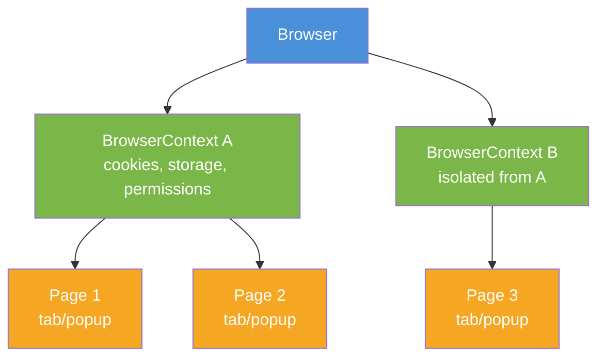
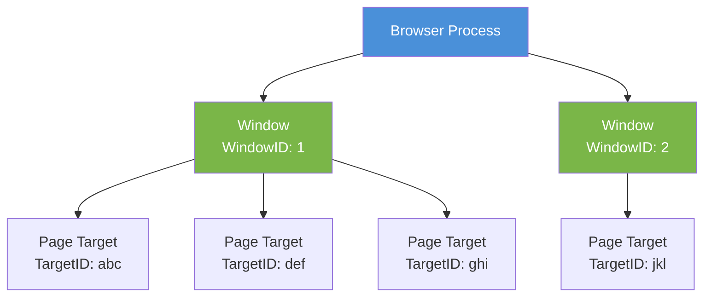
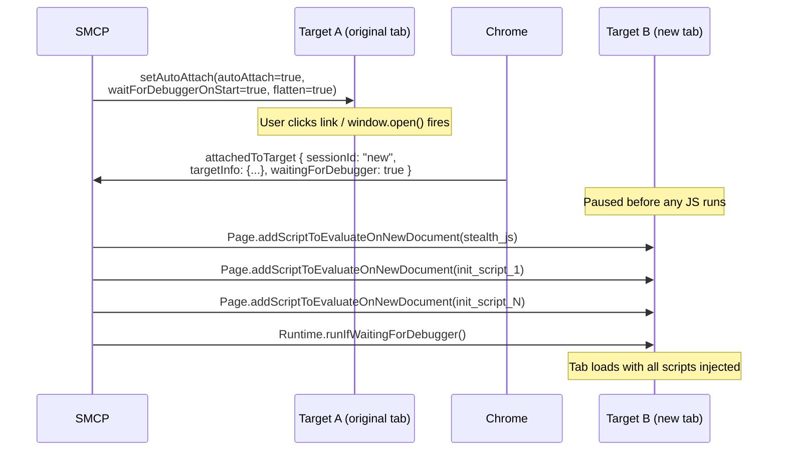
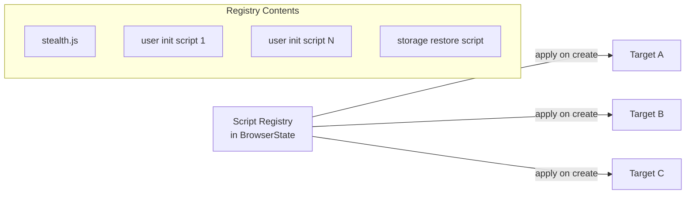

# Browser Tab & Window Management: Architecture Research

> **Core insight:** SMCP is built on Selenium's single-active-context model -- one window handle receives commands at a time, one CDP session routes through the default target. But real-world automation hits `target="_blank"` links, `window.open()` popups, and multi-step flows that span tabs. The gap is not Selenium itself (it tracks handles), but the *state architecture* layered on top of it: init scripts that do not propagate, sessionStorage caches keyed by origin instead of by tab, and CDP commands routed through an implicit "current" target. Bridging single-context to multi-tab means solving propagation, isolation, and identity -- without abandoning the Selenium foundation that provides real-browser control, window geometry, and OS-level interaction.

---

## Table of Contents

- [Part I: The Problem](#part-i-the-problem)
  - [1.1 SMCP's Single-Tab Model](#11-smcps-single-tab-model)
  - [1.2 Where It Breaks](#12-where-it-breaks)
  - [1.3 State Architecture Audit](#13-state-architecture-audit)
- [Part II: The Ecosystem](#part-ii-the-ecosystem)
  - [2.1 Playwright -- The Gold Standard](#21-playwright----the-gold-standard)
  - [2.2 Puppeteer -- CDP-Native](#22-puppeteer----cdp-native)
  - [2.3 Claude-in-Chrome -- MCP Reference Implementation](#23-claude-in-chrome----mcp-reference-implementation)
  - [2.4 Chrome Extension APIs -- Tab Groups and Beyond](#24-chrome-extension-apis----tab-groups-and-beyond)
  - [2.5 Selenium 4 -- Our Foundation](#25-selenium-4----our-foundation)
  - [2.6 WebDriver BiDi -- The Future Standard](#26-webdriver-bidi----the-future-standard)
  - [2.7 Landscape Gap Analysis](#27-landscape-gap-analysis)
- [Part III: The Platform](#part-iii-the-platform)
  - [3.1 CDP Target Domain](#31-cdp-target-domain)
  - [3.2 CDP Browser Domain](#32-cdp-browser-domain)
  - [3.3 CDP Browser Contexts](#33-cdp-browser-contexts)
  - [3.4 Init Script Propagation](#34-init-script-propagation)
  - [3.5 Window Handles vs Target IDs](#35-window-handles-vs-target-ids)
  - [3.6 macOS-Native APIs](#36-macos-native-apis)
- [Part IV: Technical Deep Dives](#part-iv-technical-deep-dives)
  - [4.1 The sessionStorage Correctness Problem](#41-the-sessionstorage-correctness-problem)
  - [4.2 Init Script Registry Pattern](#42-init-script-registry-pattern)
  - [4.3 Target Lifecycle Management](#43-target-lifecycle-management)
  - [4.4 Storage Capture in Multi-Tab](#44-storage-capture-in-multi-tab)
  - [4.5 Stealth Script Propagation](#45-stealth-script-propagation)
  - [4.6 Event Handling in MCP's Request/Response Model](#46-event-handling-in-mcps-requestresponse-model)
- [Part V: Design Space](#part-v-design-space)
  - [5.1 Minimum Viable Multi-Tab](#51-minimum-viable-multi-tab)
  - [5.2 CDP-Enhanced Hybrid](#52-cdp-enhanced-hybrid)
  - [5.3 CDP-Native Architecture](#53-cdp-native-architecture)
  - [5.4 Browser Context Isolation](#54-browser-context-isolation)
  - [5.5 The Explicit Tab ID Question](#55-the-explicit-tab-id-question)
  - [5.6 Feature-to-CDP Mapping](#56-feature-to-cdp-mapping)
- [Part VI: Open Questions](#part-vi-open-questions)
- [Appendix A: API Landscape Matrix](#appendix-a-api-landscape-matrix)
- [Appendix B: Performance Benchmarks](#appendix-b-performance-benchmarks)
- [Appendix C: Chrome Tab Groups API Reference](#appendix-c-chrome-tab-groups-api-reference)
- [References](#references)

---

## Part I: The Problem

### 1.1 SMCP's Single-Tab Model

SMCP (Selenium MCP) operates on a single WebDriver instance controlling a single browser tab. The architecture assumes that `driver.current_url`, `driver.title`, and all CDP commands refer to *the* active page. There is no concept of multiple concurrent tabs under automation.

This is by design. The SMCP README explains the single-browser rationale: one Chromium instance avoids process-level conflicts with the user's personal Chrome, keeps resource consumption predictable, and simplifies the mental model for both Claude and the user. The `browser` parameter defaults to `"chromium"` specifically so that Selenium-controlled automation and the user's personal Chrome are literally different OS applications with separate PIDs, windows, and tab state.

The single-tab model works well for linear workflows: navigate to a page, interact with it, capture data, navigate to the next page. It breaks when the web itself breaks linearity.

### 1.2 Where It Breaks

Three scenarios expose the single-tab assumption:

**The E-Trade scenario.** A user asks Claude to check their brokerage account. Claude navigates to E-Trade, logs in, and clicks a link to view a specific account statement. The link has `target="_blank"` -- the statement opens in a new tab. Selenium's current window handle still points at the original page. CDP commands still route to the original target. The statement page exists but is invisible to SMCP.

**The `window.open()` popup.** A site opens a payment processor, OAuth consent screen, or document viewer in a popup window. The popup is a separate browsing context with its own URL, title, and DOM. SMCP has no mechanism to detect it appeared, switch to it, interact with it, and switch back.

**The multi-reference workflow.** Claude needs to compare information across two pages -- API documentation on one tab, the target application on another. Today, this requires sequential navigation: load page A, extract data, navigate to page B, extract data, navigate back to page A. Each navigation loses page state (scroll position, form inputs, JavaScript runtime state). Tabs would let both pages stay live simultaneously.

In all three cases, the tabs *exist* in the browser. Selenium tracks their window handles. The gap is that SMCP's state layer -- init scripts, storage caches, CDP session routing -- is not wired for multiplicity.

### 1.3 State Architecture Audit

An audit of SMCP's internal state reveals which components are already tab-agnostic and which encode single-tab assumptions.

#### Already Tab-Agnostic

| Component | Why It Works |
|-----------|-------------|
| `BrowserState.proxy_config` | Proxy is browser-level; all traffic routes through mitmproxy regardless of tab |
| `BrowserState.temp_dir`, `screenshot_dir` | Filesystem paths with no tab association |
| `BrowserState.capture_counter` | Global counter for screenshot filenames |
| `BrowserService.get_browser()` | Browser instance management, orthogonal to tabs |
| `BrowserService.close_browser()` | Tears down entire browser; all tabs close together |
| `response_body_capture_enabled` | HAR capture uses browser-level performance logging |
| `local_storage_cache` | Keyed by origin; localStorage is per-origin and shared across tabs by browser spec |
| `indexed_db_cache` | Same as localStorage -- per-origin, shared across tabs |

#### Needs to Become Tab-Aware

| Component | Current Assumption | What Breaks |
|-----------|-------------------|-------------|
| `session_storage_cache` | Keyed by origin only | sessionStorage is per-tab, per-origin. Two tabs at the same origin have independent copies. The cache silently drops one tab's data. See [Section 4.1](#41-the-sessionstorage-correctness-problem) |
| `OriginTracker` | Flat `set[str]` of all visited origins | Origins are correct but unattributed. No way to know which tab visited which origin. Functional for "capture everything" but insufficient for per-tab operations |
| `pending_profile_state` / `restored_origins` | Global singleton | Only one pending restore at a time. Multi-tab might want different profile states in different tabs |
| Init scripts (`Page.addScriptToEvaluateOnNewDocument`) | Registered on default target | Only applies to the first tab. New tabs get no stealth, no API interceptors, no storage restoration. See [Section 4.2](#42-init-script-registry-pattern) |
| `_capture_current_origin_storage()` | Uses `driver.current_url` (implicit current tab) | Cannot target a specific tab. Captures whatever tab happens to be focused |

The **sessionStorage bug** and the **init script propagation gap** are the two correctness issues. Everything else is an API design question about how to expose multi-tab to tool callers.

---

## Part II: The Ecosystem

### 2.1 Playwright -- The Gold Standard

Playwright introduces a two-level hierarchy that is the gold standard for multi-tab automation:



**Key properties:**
- A **BrowserContext** is an isolated session equivalent to an incognito profile. Contexts share no cookies, localStorage, or sessionStorage
- A **Page** is a single tab or popup within a context. All pages in a context share storage
- All pages are **independently addressable** -- no switching required. `pageB.click(...)` works while pageA is doing something else
- New tabs are detected via **events** (`context.on('page')`), not polling
- Init scripts registered at the context level **automatically propagate** to all future pages in that context via `context.addInitScript()`
- `context.storageState()` serializes cookies, localStorage, and IndexedDB for the entire context

**How `addInitScript` works internally:** Playwright calls `Page.addScriptToEvaluateOnNewDocument` on each target's CDP session. When a new page is created within the context, Playwright's internal event handler automatically registers all context-level scripts on the new target before releasing it. This is the same `setAutoAttach` + `waitForDebuggerOnStart` pattern described in [Section 3.4](#34-init-script-propagation).

**`storageState` design:** Playwright's storage state is a JSON blob containing cookies, localStorage origins, and their key-value pairs. It can be saved to disk and restored in a new context. Notably, sessionStorage is *not* included in `storageState()` because sessionStorage is per-tab and does not survive context creation. This is a deliberate design choice, not an omission.

Playwright's model maps cleanly to CDP's internal architecture because Playwright *is* a CDP client (on Chromium). BrowserContexts map to CDP browser contexts; Pages map to CDP targets.

### 2.2 Puppeteer -- CDP-Native

Puppeteer is CDP-native. Each Page wraps a CDP target, and the mapping is transparent:

- `browser.pages()` returns all open pages (targets of type "page")
- `page.target()` returns the underlying CDP target
- `target.createCDPSession()` establishes a protocol session via `Target.attachToTarget`
- New targets are detected via `browser.on('targetcreated')` events

**Init script gap:** Unlike Playwright, Puppeteer's `page.evaluateOnNewDocument()` does *not* automatically propagate to new pages opened via `window.open()` or `target="_blank"`. Each new page requires re-registration. This is the same gap SMCP faces.

**`createCDPSession` loop bug:** Puppeteer issue #8787 documents a subtle bug: calling `target.createCDPSession()` inside a `targetcreated` event handler can create an infinite loop. When `createCDPSession` calls `Target.attachToTarget`, Chrome may fire additional `targetcreated` events for related targets (iframes, workers), which trigger the handler again. The fix is to filter by target type before attaching or use `setAutoAttach` with a target filter instead of manual attachment in event handlers.

**BrowserContext support:** Puppeteer supports incognito contexts via `browser.createBrowserContext()`, providing cookie/storage isolation. The API surface is less comprehensive than Playwright's but covers the core isolation use case.

**Architecture note:** Puppeteer prefers native CDP commands over JavaScript injection. For operations like `page.click()`, Puppeteer routes through `Input.dispatchMouseEvent` rather than injecting JS into the page context. This reduces abstraction layers and avoids context switches but can be brittle with complex UI interactions (Lightpanda analysis).

### 2.3 Claude-in-Chrome -- MCP Reference Implementation

Claude-in-Chrome (CiC) is the reference implementation for multi-tab MCP browser automation. It runs as a Chrome extension with direct access to Chrome's Tab and TabGroup APIs.

**The tab group model.** CiC creates a named, color-coded Chrome tab group as its isolation boundary. All operations are scoped to tabs within that group. The user's personal tabs remain untouched.

```
User's Chrome Window
+-- [Personal tabs -- untouched by CiC]
|   +-- Gmail
|   +-- YouTube
+-- [MCP Tab Group -- CiC's workspace]
    +-- Tab 1503493187 - "Target Site"
    +-- Tab 1503493202 - "API Docs"
```

**Explicit tabId scoping.** Every CiC tool (except `update_plan` and `switch_browser`) requires an explicit `tabId` parameter. The extension validates that the tabId belongs to the MCP tab group before executing any operation. This eliminates "which tab am I on?" ambiguity and prevents prompt injection attacks from redirecting operations to personal tabs.

**What CiC gets right:**
- Tab group isolation reuses a Chrome-native concept with built-in visual feedback
- Explicit tabId on every operation eliminates hidden cursor desync
- Domain-level approval (`update_plan`) separates security concerns from tab management
- Minimal lifecycle is appropriate for MCP's request/response protocol

**What CiC gets wrong:**
- No tab close operation -- tabs accumulate through a session
- tabId required on read-only tools (like `shortcuts_list`) creates verbosity without security benefit
- No tab state change detection -- if the user manually navigates a CiC tab, Claude's model drifts
- Session-scoped tab IDs do not survive Chrome restart or extension reload

**Relevance to SMCP:** CiC's isolation model (tab groups within shared Chrome) does not apply to SMCP, which uses process-level isolation (separate Chromium instance). But CiC's explicit-tabId-on-every-tool pattern and its domain-level security model are architecturally instructive. CiC's use of the Chrome Extension tab group API is documented in [Section 2.4](#24-chrome-extension-apis----tab-groups-and-beyond). See [Section 5.5](#55-the-explicit-tab-id-question) for the tradeoff analysis.

### 2.4 Chrome Extension APIs -- Tab Groups and Beyond

CiC's tab group isolation is built on the Chrome Extension APIs: `chrome.tabs` for grouping/ungrouping tabs and `chrome.tabGroups` for managing group properties. These APIs provide capabilities that no other automation protocol -- including CDP -- can access.

#### chrome.tabs Grouping Methods (Chrome 88+)

| Method | Parameters | Returns | Purpose |
|--------|-----------|---------|---------|
| `chrome.tabs.group(options)` | `tabIds` (number or number[]), optional `groupId` (add to existing group), optional `createProperties.windowId` | `Promise<number>` (group ID) | Add tabs to an existing group or create a new group |
| `chrome.tabs.ungroup(tabIds)` | `tabIds` (number or number[]) | `Promise<void>` | Remove tabs from their groups. Empty groups are auto-deleted |

When `groupId` is omitted from `chrome.tabs.group()`, a new group is created. When provided, tabs are added to the existing group. The `createProperties` object allows specifying which window the new group should be created in.

#### chrome.tabGroups Namespace (Chrome 89+)

| Method | Parameters | Returns | Purpose |
|--------|-----------|---------|---------|
| `get(groupId)` | `groupId` (number) | `Promise<TabGroup>` | Retrieve details of a specific group |
| `query(queryInfo)` | Filter by `collapsed`, `color`, `title`, `windowId` | `Promise<TabGroup[]>` | Find groups matching criteria |
| `update(groupId, props)` | `collapsed`, `color`, `title` | `Promise<TabGroup>` | Modify group properties |
| `move(groupId, props)` | `index` (-1 for end), optional `windowId` | `Promise<TabGroup>` | Reposition group within/across windows |

#### TabGroup Properties

| Property | Type | Description |
|----------|------|-------------|
| `id` | number | Unique within browser session. Session-scoped -- does not survive Chrome restart |
| `collapsed` | boolean | Whether group's tabs are hidden (collapsed in tab strip) |
| `color` | Color enum | One of: `grey`, `blue`, `red`, `yellow`, `green`, `pink`, `purple`, `cyan`, `orange` |
| `title` | string (optional) | Display name shown on the group chip |
| `windowId` | number | ID of the window containing the group |

#### Events

| Event | Fires When |
|-------|-----------|
| `onCreated` | A new group is created |
| `onMoved` | A group is repositioned within a window |
| `onRemoved` | A group is closed (user action or auto-close when zero tabs remain) |
| `onUpdated` | Group properties change (title, color, collapsed state) |

All events pass a `TabGroup` object to the callback.

#### Permissions

The `"tabGroups"` permission must be declared in `manifest.json`. The `"tabs"` permission is additionally needed for `chrome.tabs.group()` and `chrome.tabs.ungroup()`.

#### The CDP Blindness Problem

CDP has **zero awareness of tab groups**. Tab groups are a UI-layer feature managed entirely by Chrome's internal tab strip implementation. The CDP Target domain sees individual page targets but has no concept of grouping. There is no CDP method to:

- Query which group a target belongs to
- Create, modify, or remove tab groups
- Receive events when groups change

This means any automation framework that communicates solely via CDP (Selenium, Playwright, Puppeteer) cannot interact with tab groups. Only Chrome extensions with the `tabGroups` permission can access this functionality. CiC exploits this exclusive access for its isolation model.

#### Limitations

- **Session-scoped IDs:** Group IDs are ephemeral and do not persist across Chrome restarts or extension reloads
- **No programmatic pinning:** The extension API cannot pin tabs. Pinning is unrelated to tab groups
- **Cross-profile isolation:** Extensions in one Chrome profile cannot access tab groups in another profile
- **Normal windows only:** `move()` can only target normal windows, not popup or app windows

### 2.5 Selenium 4 -- Our Foundation

Selenium treats every top-level browsing context (tab or window) as an opaque handle string. There is no API-level distinction between tabs and windows -- both are just handles.

**The single-active-context constraint.** The W3C WebDriver spec routes all commands through two session-level pointers: the current top-level browsing context (set by `switch_to.window()`) and the current browsing context within it (set by `switch_to.frame()`). Only one window can receive commands at any given time. Interacting with tab B while on tab A requires an explicit switch.

**Handle ordering.** The W3C spec provides no ordering guarantee for `driver.window_handles`. ChromeDriver tends to return handles in creation order, but this is an implementation detail. The spec explicitly rejected a proposal to guarantee ordering (w3c/webdriver#386). Reliable new-tab detection requires set-difference before and after an action.

**CDP session attachment.** Switching windows via `switch_to.window()` does *not* automatically re-attach the CDP session to the new target. CDP commands after a window switch still route to the previous target until a new session is established via `Target.attachToTarget`. This is a critical subtlety for any multi-tab implementation built on Selenium.

**`switch_to.py` internals.** The `_w3c_window` method attempts to switch to a window by handle. If the handle is not found via the WebDriver protocol, it falls back to matching by `window.name` -- a legacy behavior from the JSON Wire Protocol era. This fallback is rarely relevant but can cause confusion in debugging.

**Frame management.** `switch_to.frame()` performs a two-step lookup: first by element ID, then by element name. This ID-then-NAME fallback mirrors the window handle fallback pattern and is similarly a legacy artifact.

**Window geometry primitive.** All window size and position methods (`set_window_size`, `set_window_position`, `maximize_window`, `minimize_window`, `fullscreen_window`) funnel through a single WebDriver command: `SET_WINDOW_RECT`. This command accepts `x`, `y`, `width`, and `height` in a single payload. Individual methods are convenience wrappers.

**The `_check_if_window_handle_is_current` deprecation.** Selenium's internal code includes a deprecation warning when checking if the current window handle is still valid. This surfaces in multi-tab scenarios where closing a tab invalidates the handle stored in `driver.current_window_handle`. The warning signals that future Selenium versions may change how stale handles are reported.

### 2.6 WebDriver BiDi -- The Future Standard

WebDriver BiDi is a W3C living standard that brings CDP-like bidirectional capabilities to the cross-browser WebDriver protocol. Where classic WebDriver uses HTTP request/response (one command at a time), BiDi uses WebSockets for real-time, two-way communication between automation scripts and the browser.

**The core promise.** BiDi merges two worlds: the reliability and cross-browser compatibility of the W3C WebDriver protocol with the real-time event capabilities of CDP. A single WebSocket connection replaces both the HTTP-based WebDriver commands and the separate CDP connection that Selenium 4 currently requires for advanced features.

#### Module Architecture

BiDi organizes capabilities into modules. Each module defines commands (client-to-server) and events (server-to-client):

| Module | Key Commands | Key Events | Status |
|--------|-------------|------------|--------|
| **browsingContext** | `create`, `close`, `activate`, `navigate`, `reload`, `getTree`, `captureScreenshot`, `print`, `setViewport`, `handleUserPrompt`, `locateNodes`, `traverseHistory` | `contextCreated`, `contextDestroyed`, `navigationStarted`, `load`, `domContentLoaded`, `userPromptOpened` | Stable in Chrome/Firefox |
| **script** | `evaluate`, `callFunction`, `addPreloadScript`, `removePreloadScript`, `getRealms`, `disown` | `message` (console), `realmCreated`, `realmDestroyed` | Stable |
| **network** | `addIntercept`, `removeIntercept`, `continueRequest`, `continueResponse`, `failRequest`, `provideResponse`, `continueWithAuth`, `setCacheBehavior` | `beforeRequestSent`, `responseStarted`, `responseCompleted`, `fetchError`, `authRequired` | Stable |
| **session** | `new`, `end`, `status`, `subscribe`, `unsubscribe` | -- | Stable |
| **storage** | `getCookies`, `setCookie`, `deleteCookies` | -- | Stable |
| **browser** | `close`, `createUserContext`, `getUserContexts`, `removeUserContext`, `getClientWindows`, `setClientWindowState` | -- | Stable |
| **input** | `performActions`, `releaseActions`, `setFiles` | -- | Stable |
| **log** | -- | `entryAdded` | Stable |
| **emulation** | `setGeolocationOverride` | -- | Experimental |
| **webExtension** | `install`, `uninstall` | -- | Experimental |

#### Event Subscription Model

BiDi's subscription model is granular -- clients can subscribe to events at different scopes:

- **Global:** Receive events from all browsing contexts (equivalent to CDP's `setDiscoverTargets`)
- **Per-context:** Subscribe to events from a single tab/window by specifying a `browsingContext` ID
- **Per-user-context:** Subscribe to events from all tabs within a specific user context (incognito-like session)

This granularity eliminates the all-or-nothing problem. SMCP could subscribe to `browsingContext.contextCreated` globally for tab tracking while subscribing to `network.beforeRequestSent` only on the active tab.

```
session.subscribe({
    events: ["browsingContext.contextCreated"],  // global
})

session.subscribe({
    events: ["network.responseCompleted"],
    contexts: ["context-id-123"],  // only from this tab
})
```

#### `addPreloadScript` -- Init Script Propagation Solved

The `script.addPreloadScript` command is BiDi's answer to the init script propagation problem. Unlike CDP's `Page.addScriptToEvaluateOnNewDocument` (which is per-target), BiDi's preload scripts can be scoped to a user context, meaning they automatically apply to all new tabs created within that context. This is the cross-browser equivalent of Playwright's `context.addInitScript()`.

#### Browser Support

| Browser | BiDi Support | Notes |
|---------|-------------|-------|
| **Chrome/Chromium** | Strong | Most modules implemented. Available via `--webSocketUrl` flag |
| **Firefox** | Strong | Early adopter. Gecko-native implementation (not CDP translation) |
| **Safari/WebKit** | In progress | WebKit PRs adding `script` and `browsingContext` commands (WebKit #43495) |

Selenium 4 includes low-level BiDi support. Selenium 5 (planned) will expose high-level BiDi APIs as the primary interface. Puppeteer has supported Firefox via BiDi since v23 and made it the default in v24. Playwright's BiDi support remains experimental -- Playwright's team has invested heavily in their own CDP implementation and views BiDi adoption cautiously.

#### Relevance to SMCP

BiDi's `browsingContext.create/close/activate` commands directly map to the multi-tab operations SMCP needs. When BiDi matures:

- `browsingContext.create` replaces `Target.createTarget` for opening new tabs
- `browsingContext.activate` replaces `Target.activateTarget` for focusing tabs
- `browsingContext.close` replaces `Target.closeTarget` for closing tabs
- `script.addPreloadScript` replaces the manual `setAutoAttach` + `waitForDebuggerOnStart` + `Page.addScriptToEvaluateOnNewDocument` dance for init script propagation
- Event subscriptions replace `setDiscoverTargets` + `setAutoAttach` for tab lifecycle tracking

The practical timeline is unclear. BiDi is not yet feature-complete for SMCP's needs -- advanced DOM access, full network interception parity with CDP, and stealth script injection timing guarantees are still evolving. For near-term multi-tab work, CDP remains the correct choice. BiDi should be monitored as a medium-term migration target that would bring cross-browser support as a bonus.

### 2.7 Landscape Gap Analysis

#### Architecture Models

| Aspect | Selenium 4 | Playwright | Puppeteer | CiC | WebDriver BiDi | SMCP (current) |
|--------|-----------|-----------|----------|-----|---------------|---------------|
| **Tab model** | Opaque handle strings | First-class Page objects | First-class Page objects | Chrome tab IDs (extension API) | BrowsingContext IDs | Single implicit tab |
| **Active context** | One at a time (switch) | All pages independent | All pages independent | Explicit tabId per call | All contexts addressable | Implicit single tab |
| **Isolation unit** | Session (one per driver) | BrowserContext | BrowserContext | Tab group in Chrome | UserContext | Browser process |
| **Protocol** | W3C WebDriver (HTTP) | CDP / BiDi (WebSocket) | CDP (WebSocket) | Chrome Extension API | BiDi (WebSocket) | WebDriver + CDP hybrid |
| **Tab detection** | Polling + set diff | Event-driven | Event-driven | Extension API events | Event-driven (subscribe) | None (single tab) |
| **Init script propagation** | Per-target, manual | Per-context, automatic | Per-page, manual | Extension content scripts | Per-context via `addPreloadScript` | Per-target, not propagated |

#### Switching and Concurrency

| Operation | Selenium 4 | Playwright | Puppeteer | CiC | WebDriver BiDi |
|-----------|-----------|-----------|----------|-----|---------------|
| Interact with tab B while on A | Must `switch_to.window(B)` | Direct: `pageB.click()` | Direct: `pageB.click()` | Direct via tabId | Direct via contextId |
| Concurrent tab interaction | Impossible | Native async | Native async | Sequential per tool call | Native async |
| Post-close behavior | Must switch to valid handle | Other pages unaffected | Other pages unaffected | Tab removed from group | Other contexts unaffected |
| Event-driven tab discovery | No (polling) | Yes (`context.on('page')`) | Yes (`browser.on('targetcreated')`) | Yes (extension events) | Yes (`contextCreated` event) |

#### Storage and Isolation

| Aspect | Selenium 4 | Playwright | Puppeteer | CiC | WebDriver BiDi |
|--------|-----------|-----------|----------|-----|---------------|
| Cookie scope | Entire session | Per-context | Per-context | Chrome profile (all tabs) | Per-UserContext |
| Session persistence | Manual cookie mgmt | `storageState()` | Manual via CDP | None | `storage.getCookies()` |
| Test isolation | Manual | Automatic (new context) | Manual (new context) | Tab group scoping | Automatic (new UserContext) |

The key observation: Playwright and Puppeteer solve multi-tab at the framework level. BiDi will solve it at the protocol level with cross-browser support. Selenium provides the *primitives* (handles, CDP access) but leaves orchestration to the caller. SMCP must build the orchestration layer that Playwright provides for free -- or wait for BiDi maturity and adopt it when ready.

---

## Part III: The Platform

### 3.1 CDP Target Domain

The Target domain is the control plane for everything Chrome considers a debuggable entity. Understanding it is prerequisite to any multi-tab design.

#### TargetInfo

The fundamental descriptor returned by `getTargets`, `targetCreated` events, and `attachedToTarget` events:

| Field | Type | Description |
|-------|------|-------------|
| `targetId` | TargetID | Stable identifier for the target across browser lifetime |
| `type` | string | `"page"`, `"iframe"`, `"worker"`, `"service_worker"`, `"browser"`, `"tab"`, `"other"` |
| `title` | string | Document title or worker name |
| `url` | string | Current URL |
| `attached` | boolean | Whether any client has an active session |
| `openerId` | TargetID? | Target that opened this one (`window.open`, link click) |
| `browserContextId` | BrowserContextID? | Which browser context this target belongs to |

The `openerId` field creates a tree of opener relationships -- when a page calls `window.open()`, the new target's `openerId` points back to the opener. This is how you track which tab spawned which.

#### Key Methods

| Method | Purpose | Critical Parameters |
|--------|---------|-------------------|
| `getTargets` | Snapshot of all known targets | `filter` (default excludes `"browser"` and `"tab"` types) |
| `createTarget` | Create a new page/tab/window | `url`, `newWindow`, `browserContextId`, `background` |
| `closeTarget` | Close a tab | `targetId`. No `beforeunload` fired. **Deprecation note:** prefer `Page.close` on an attached session for targets you have a session to |
| `activateTarget` | Bring tab to front (visual only) | `targetId`. Does NOT change CDP routing |
| `attachToTarget` | Establish CDP session to a target | `targetId`, `flatten` (use `true`) |
| `detachFromTarget` | Tear down a CDP session | `sessionId`. Target continues to exist |
| `setAutoAttach` | Auto-attach to new related targets | `autoAttach`, `waitForDebuggerOnStart`, `flatten`, `filter` |
| `setDiscoverTargets` | Enable target lifecycle events | `discover`, `filter` |
| `exposeDevToolsProtocol` | Inject `window.cdp` into page | `targetId`. Allows in-page JavaScript to issue CDP commands directly |
| `autoAttachRelated` | Auto-attach to targets related to a specific target | Different from `setAutoAttach` which applies to all new children of the current session |

**Critical distinction:** `activateTarget` is a *visual* operation (brings tab to front). It does NOT change which CDP session receives commands. CDP commands are always routed by `sessionId`, regardless of which tab is visually active.

**Flat vs nested sessions:** `attachToTarget` supports two modes. Flat mode (`flatten: true`) includes a `sessionId` field in every CDP command, routing it directly. Nested mode wraps commands inside `Target.sendMessageToTarget`. Flat mode is the future -- the Chromium team plans to deprecate nested mode. All new code should use `flatten: true`.

**TargetFilter:** The `filter` parameter on `getTargets` and `setDiscoverTargets` controls which target types are returned/discovered. The default filter excludes `"browser"` and `"tab"` type targets, which represent the browser process itself and the Chrome tab strip UI. To see all targets including these, pass an explicit empty filter or a filter that includes those types. Most automation only needs `"page"` targets.

#### Events

| Event | Payload | Description |
|-------|---------|-------------|
| `targetCreated` | `targetInfo` | New target appeared |
| `targetInfoChanged` | `targetInfo` | Title, URL, or metadata changed |
| `targetDestroyed` | `targetId` | Target gone |
| `targetCrashed` | `targetId`, `status`, `errorCode` | Target process crashed |
| `attachedToTarget` | `sessionId`, `targetInfo`, `waitingForDebugger` | Session established |
| `detachedFromTarget` | `sessionId` | Session torn down |

Discovery (`setDiscoverTargets`) *observes* targets by firing events. Auto-attach (`setAutoAttach`) *connects* to them by creating sessions. Multi-tab implementations typically want both -- discovery for awareness, auto-attach for control.

#### Selenium Python CDP Bindings

Selenium v141 includes auto-generated CDP bindings (`selenium/webdriver/common/devtools/v141/target.py`). These wrap CDP commands as Python functions with type annotations. Notable patterns:

- **Generator pattern:** CDP commands are implemented as Python generators that `yield` the command dict and receive the response. The `execute_cdp_cmd` method drives these generators
- **Type wrappers:** CDP types like `TargetID`, `SessionID`, and `BrowserContextID` are wrapped in Python dataclasses with `__repr__` for debugging
- **Event types:** CDP events are represented as frozen dataclasses with a `from_json` classmethod for deserialization

### 3.2 CDP Browser Domain

The Browser domain operates at the OS window level -- the container for tabs.



**Key methods:**
- `Browser.getWindowForTarget(targetId)` -- maps a CDP target to its OS window. Returns `windowId` + `bounds`. Multiple targets share one window
- `Browser.getWindowBounds(windowId)` -- query window position/size
- `Browser.setWindowBounds(windowId, bounds)` -- set position/size
- `Browser.close()` -- closes the entire browser process

**Bounds type fields:**

| Field | Type | Description |
|-------|------|-------------|
| `left` | integer | X coordinate of the window (pixels from left edge of screen) |
| `top` | integer | Y coordinate of the window (pixels from top edge of screen) |
| `width` | integer | Window width in pixels |
| `height` | integer | Window height in pixels |
| `windowState` | string | One of `normal`, `minimized`, `maximized`, `fullscreen` |

**Constraint:** You cannot set position or size while the window is maximized or fullscreen. Call `setWindowBounds` with `windowState: "normal"` first, then set the desired dimensions in a second call. Attempting to set bounds while maximized results in an error.

**WindowID vs TargetID:** WindowID is an integer (e.g., `1`, `2`), representing an OS-level window. TargetID is a string (GUID-like), representing a debuggable entity within Chrome. Multiple TargetIDs share one WindowID. The mapping is many-to-one: many targets per window.

**Windows vs targets:** Users think in terms of "tabs" and "windows." CDP thinks in terms of "targets" (per-document) and "windows" (OS-level containers). The MCP layer must bridge this conceptual gap -- mapping user intent to the right combination of CDP calls.

### 3.3 CDP Browser Contexts

Browser contexts provide incognito-like isolation within a single browser process.

**What gets isolated per context:**

| Resource | Isolated? | Notes |
|----------|----------|-------|
| Cookies | Yes | Completely separate cookie jar |
| localStorage | Yes | Separate per-origin storage |
| sessionStorage | Yes | Separate per-origin storage |
| IndexedDB | Yes | Separate databases |
| Cache | Yes | Separate HTTP and resource caches |
| Service workers | Yes | Separate registration and lifecycle |
| Permissions | Yes | Separate permission grants |
| Proxy | Yes | Can configure per-context proxy via `proxyServer` parameter |

**Not isolated:** Browser extensions, Chrome flags, DevTools settings.

**Lifecycle:** `createBrowserContext` creates a context. `createTarget(browserContextId: ...)` creates a tab within it. `disposeBrowserContext` destroys the context and closes all tabs in it (without firing `beforeunload`). The default browser context has no explicit ID and is not returned by `getBrowserContexts`.

**Relevance:** Browser contexts enable parallel authenticated sessions (log into the same site with different accounts), clean-room testing (fresh context per test), and per-context proxy routing -- all without multiple browser processes. See [Section 5.4](#54-browser-context-isolation).

### 3.4 Init Script Propagation

`Page.addScriptToEvaluateOnNewDocument` is per-target, not global. This is the single most important fact for multi-tab design. The script runs in every frame navigation *within that target*, but does NOT propagate to new tabs opened via `window.open()`, `target="_blank"`, or `Target.createTarget`.

The propagation pattern requires `setAutoAttach`:



This is how Playwright implements `context.addInitScript()` internally. The `waitForDebuggerOnStart: true` parameter is critical -- without it, the new tab loads before scripts can be injected, and the stealth bypass window is missed.

**Recursive auto-attach:** For complete coverage, `setAutoAttach` should be called recursively on auto-attached targets to catch their children (iframes within new tabs, workers spawned by new tabs).

### 3.5 Window Handles vs Target IDs

Selenium window handles and CDP target IDs are different identifier systems with no direct mapping API.

| Identifier | Format | Example | Source |
|-----------|--------|---------|--------|
| CDP TargetID | Opaque string (GUID-like) | `"4C3B28A9-..."` | Chrome DevTools Protocol |
| CDP SessionID | Opaque string | `"F7E2D3C1-..."` | Created on attach |
| Selenium Window Handle | `"CDwindow-"` + 32 hex chars | `"CDwindow-CDE9BEF9..."` | ChromeDriver WebDriver protocol |
| CDP WindowID | Integer | `1` | Browser domain |

ChromeDriver internally maps between these, but the mapping is not exposed. Correlation requires matching by observable properties (URL, title) or using `execute_cdp_cmd("Target.getTargetInfo", {})` while switched to a specific handle to get the CDP target ID for the active context.

**The reliable approach:** Switch Selenium to the desired window handle via `switch_to.window(handle)`, then call `execute_cdp_cmd("Target.getTargetInfo", {})` on the current session. This returns the `targetId` for whichever target ChromeDriver has routed to for that handle. This is the most reliable way to correlate handles to target IDs because it uses ChromeDriver's internal mapping rather than fragile URL/title matching.

**ChromeDriver internals:** ChromeDriver maintains WebView + DevToolsClient pairs with 32-digit hex IDs. Each WebView corresponds to a top-level browsing context (tab). The `CDwindow-` prefix on handle strings is ChromeDriver-specific and not part of the W3C spec.

**Practical approach:** Do not maintain a handle-to-target map proactively. Instead, switch Selenium to the desired handle first, then use CDP commands -- they route to the correct target automatically. For monitoring multiple tabs simultaneously, use `setAutoAttach` and manage CDP sessions directly rather than relying on Selenium's handle switching.

### 3.6 macOS-Native APIs

macOS provides three tiers of browser integration, each with different granularity:

#### AppleScript

Chrome exposes a scripting dictionary with application > window > tab hierarchy. Key capabilities:

| Operation | Supported | Notes |
|-----------|----------|-------|
| Enumerate tabs (URL, title) | Yes | Already used by SMCP for sessionStorage extraction |
| Create/close tabs | Yes | `make new tab`, `close tab N` |
| Activate specific tab | Yes | `set active tab index of front window to N` |
| Execute JavaScript in tab | Yes | `execute javascript "..."` on a specific tab reference |
| Tab reordering | No | Chrome's scripting dictionary does not expose tab move/index write |
| Tab groups | No | Predates Chrome's tab grouping feature |
| Profile filtering | No | `tell application "Google Chrome"` targets all profiles |

**Background tab suspension.** Chrome aggressively throttles suspended background tabs. AppleScript `execute javascript` on a suspended tab hangs indefinitely. SMCP mitigates this with subprocess timeouts (`AppleScriptTabTimeoutError`).

#### Accessibility API (AXUIElement)

The macOS Accessibility API exposes Chrome's UI hierarchy for programmatic inspection and interaction. It requires the Accessibility permission grant.

**AXUIElement hierarchy for Chrome:**

```
AXApplication (Google Chrome)
  +-- AXWindow (browser window)
      +-- AXToolbar
      |   +-- AXTextField (address bar)
      +-- AXGroup (tab strip)
      |   +-- AXRadioButton (individual tab - title, selected state)
      |   +-- AXRadioButton (another tab)
      +-- AXGroup (content area)
          +-- AXWebArea (page content)
```

Each tab in the tab strip is represented as an `AXRadioButton` with its title accessible as an attribute. The selected tab has `AXValue = 1`. Tab titles can be read without activating tabs, avoiding the background suspension problem that plagues AppleScript.

**Practical value:** Limited for SMCP. The Accessibility API is slower and more fragile than AppleScript for the same operations. Its main advantage -- reading tab titles without activation -- is a niche use case. The API is more useful for testing Chrome's own UI than for web automation.

#### CGWindowList and NSWorkspace

The `CGWindowListCopyWindowInfo` API provides OS-level window metadata for all applications:

| Field | Description |
|-------|-------------|
| `kCGWindowOwnerPID` | Process ID of the owning application |
| `kCGWindowOwnerName` | Application name (e.g., "Google Chrome", "Chromium") |
| `kCGWindowNumber` | Unique window number (integer) |
| `kCGWindowBounds` | Window rectangle: `{X, Y, Width, Height}` |
| `kCGWindowLayer` | Window layer in the stacking order |
| `kCGWindowName` | Window title (requires Screen Recording permission in macOS 10.15+) |
| `kCGWindowIsOnscreen` | Whether the window is currently visible |

**Python access via pyobjc:**

```python
from Quartz import CGWindowListCopyWindowInfo, kCGWindowListOptionOnScreenOnly, kCGNullWindowID

windows = CGWindowListCopyWindowInfo(kCGWindowListOptionOnScreenOnly, kCGNullWindowID)
chrome_windows = [w for w in windows if w.get("kCGWindowOwnerName") == "Chromium"]
```

**NSWorkspace** provides application-level management: listing running applications, activating/hiding apps, and observing launch/termination notifications. Useful for ensuring the Chromium process is in the expected state before SMCP operations.

#### Chrome vs Chromium Bundle ID Separation

| Browser | Bundle ID | AppleScript Target |
|---------|-----------|-------------------|
| Chrome | `com.google.Chrome` | `tell application "Google Chrome"` |
| Chromium | `org.chromium.Chromium` | `tell application "Chromium"` |

These are separate OS applications with independent processes, windows, and AppleScript targets. SMCP exploits this separation: Selenium controls Chromium via WebDriver while AppleScript targets Chrome for personal browser operations. No process-level conflicts.

---

## Part IV: Technical Deep Dives

### 4.1 The sessionStorage Correctness Problem

This is the most architecturally significant issue for multi-tab support. It is not a design preference -- it is a data correctness bug that exists in the current single-tab code's data model and would become actively harmful in multi-tab.

**Browser semantics:**
- `localStorage` is per-origin, shared across all tabs at that origin
- `sessionStorage` is per-origin AND **per-tab** -- each tab has its own independent copy
- Opening a link in a new tab copies the opener's sessionStorage, then the two copies diverge

**Current SMCP model:** `session_storage_cache: dict[str, list[dict]]` keyed by origin alone.

**Failure scenario:**
1. Tab A at `github.com` has sessionStorage containing a CSRF token `abc123`
2. Tab B at `github.com` has sessionStorage containing a different CSRF token `xyz789`
3. `_capture_current_origin_storage` runs on whichever tab is active
4. The cache stores one token; the other is silently lost
5. `save_profile_state()` exports incomplete sessionStorage

**Correct model:** The cache key must include a tab identifier: `(origin, target_id)` or `(origin, window_handle)`. For export, a merge strategy combines all tabs' entries for the same origin (last value wins per key), since the Playwright-compatible ProfileState format does not support per-tab sessionStorage.

The merge strategy is likely the most practical default -- sessionStorage keys rarely conflict across tabs at the same origin, and when they do, any value is reasonable since the exported state will be restored into a single tab.

### 4.2 Init Script Registry Pattern

SMCP currently registers init scripts on the default CDP target during browser startup. These scripts do not propagate to new tabs. A multi-tab implementation must maintain a registry and apply it to each new target.

**The registry pattern:**



The registry stores:
- **Stealth scripts** -- bot detection bypass (`navigator.webdriver` patches, etc.)
- **User init scripts** -- API interceptors, environment patches passed via `navigate(init_scripts=[...])`
- **Storage restoration scripts** -- scripts that restore localStorage/sessionStorage from cached state

When a new target is created (detected via `setAutoAttach` + `attachedToTarget` event), the registry iterates all scripts and calls `Page.addScriptToEvaluateOnNewDocument` on the new target's session before calling `Runtime.runIfWaitingForDebugger` to let it proceed.

**Timing is critical.** The `waitForDebuggerOnStart: true` flag pauses the new target before any JavaScript runs. All scripts must be registered during this pause window. Once `runIfWaitingForDebugger` is called, the page loads and any unregistered scripts miss the window.

### 4.3 Target Lifecycle Management

Multi-tab requires tracking target creation, metadata changes, and destruction.

**Creation sources:**
- `Target.createTarget` -- explicitly opened by SMCP
- `window.open()` -- JavaScript on a page opens a popup
- `target="_blank"` link click -- user-triggered or script-triggered
- Browser extensions or DevTools

**What to track per target:**

| Field | Source | Purpose |
|-------|--------|---------|
| Target ID | `attachedToTarget` event | Unique identifier |
| Session ID | `attachedToTarget` event | CDP command routing |
| URL | `targetInfo.url` + `targetInfoChanged` | Display and correlation |
| Title | `targetInfo.title` + `targetInfoChanged` | Display and correlation |
| Opener ID | `targetInfo.openerId` | Parent-child relationships |
| Window handle | Correlation with `driver.window_handles` | Selenium command routing |
| Scripts injected | Registry tracking | Avoid double-injection |

**Cleanup on target destruction:** When a `targetDestroyed` event fires, remove the target from tracking structures, clean up its sessionStorage cache entries, and detach its CDP session if still active. The `openerId` on child targets becomes stale but children continue to exist.

### 4.4 Storage Capture in Multi-Tab

Storage capture in multi-tab must handle three different scoping rules:

| Storage Type | Browser Scope | Capture Strategy |
|-------------|---------------|-----------------|
| Cookies | Per-origin, shared across all tabs | Single CDP call per origin. Tab-agnostic. No change needed |
| localStorage | Per-origin, shared across all tabs | Single CDP call per origin. Tab-agnostic. No change needed |
| sessionStorage | Per-origin, **per-tab** | Must capture per-tab. Requires switching to each tab or using CDP sessions to query each target |
| IndexedDB | Per-origin, shared across all tabs | Single CDP call per origin. Tab-agnostic. No change needed |

**Per-tab sessionStorage capture via CDP:** With a CDP session attached to each target, sessionStorage can be captured without Selenium window switching. `DOMStorage.getDOMStorageItems` accepts a `storageId` parameter that specifies origin and `isLocalStorage`. By sending this command through a specific target's session, it returns that target's sessionStorage.

This is more efficient than Selenium's approach (switch to tab, execute JavaScript, switch back) because it avoids the window-switch cost and does not require the tab to be the active context.

### 4.5 Stealth Script Propagation

Stealth scripts patch browser APIs (`navigator.webdriver`, `navigator.plugins`, etc.) to avoid bot detection. If a new tab opens without stealth scripts, the page sees `navigator.webdriver === true` and bot detection services (Cloudflare, Akamai, etc.) flag the session.

Stealth propagation is a specific case of the init script registry pattern ([Section 4.2](#42-init-script-registry-pattern)) but with a stronger correctness requirement: stealth scripts MUST run before any page JavaScript. A missed stealth injection on one tab can compromise the entire browser session if the detection service shares state across tabs (e.g., via cookies or server-side fingerprinting).

The `setAutoAttach` + `waitForDebuggerOnStart` pattern provides the guarantee: the new target is paused before any JavaScript runs, stealth scripts are injected, and only then is the target released.

### 4.6 Event Handling in MCP's Request/Response Model

MCP operates on a request/response model. The server cannot push events to Claude unprompted. This creates a fundamental tension with CDP's event-driven target lifecycle.

**The core problem:** CDP fires events asynchronously -- `targetCreated` when a new tab opens, `targetDestroyed` when one closes, `targetInfoChanged` when a URL or title updates. These events arrive over a WebSocket at any time. But MCP tools are synchronous request/response: Claude calls a tool, the tool returns a result. There is no mechanism for the server to notify Claude that something changed between tool calls.

**Three approaches:**

| Approach | Mechanism | Latency | Complexity |
|----------|----------|---------|------------|
| **Polling** | Check `window_handles` on every tool call | Action-dependent (only detects after next tool call) | Low |
| **Event accumulation** | CDP events update internal state; tools query state | Zero (state always current) | Medium |
| **Event-driven with deferred processing** | CDP events queue changes; process queue on next tool call | One tool call (deferred) | Medium-high |

**Event accumulation is the natural fit.** CDP events (`targetCreated`, `targetDestroyed`, `targetInfoChanged`) update an internal target registry continuously in the background. When a tool like `list_tabs` or `get_aria_snapshot` is called, it reads from the registry. The registry is always current, even if no tool has been called recently.

**Implementation requirements:**

1. **Background asyncio task.** A separate coroutine must consume CDP WebSocket events alongside MCP request handling. In SMCP's FastMCP architecture, this means spawning a task in the lifespan context that reads from the CDP WebSocket and updates shared state.

2. **Thread safety for shared state.** The target registry, script registry, and session storage cache are written to by the CDP event consumer (background task) and read by MCP tool handlers (request task). If both run on the same asyncio event loop, no locking is needed -- Python's GIL and asyncio's cooperative scheduling prevent concurrent access within a single thread. If they run on different threads (e.g., Selenium's synchronous CDP access on one thread, MCP's async handlers on another), explicit locking is required.

3. **Event accumulation with tool-call surfacing.** Tools can check the registry for changes since the last call and include a summary. For example, `get_aria_snapshot` could prepend a note if new tabs appeared since the last tool invocation. This gives Claude awareness of tab changes without requiring a push mechanism.

4. **Graceful degradation.** If the CDP event consumer fails or disconnects, tools should fall back to polling (`driver.window_handles`) rather than failing entirely. The event-driven path is an optimization, not a hard dependency.

**What this enables vs polling:**

| Capability | Polling | Event Accumulation |
|-----------|---------|-------------------|
| Detect tab opened by `window.open()` | Only on next tool call | Instantly in registry |
| Detect tab URL change | Only on next tool call | Instantly via `targetInfoChanged` |
| Inject init scripts before page load | Impossible (page already loaded) | Via `waitForDebuggerOnStart` pause window |
| Detect tab crash | Never (handle just disappears) | `targetCrashed` event with error code |
| Track opener relationships | Not available via handles | `openerId` in `targetCreated` |

The init script injection use case alone justifies the event-driven approach. Polling cannot catch a new tab before it loads, which means stealth scripts are missed and bot detection can fire.

---

## Part V: Design Space

### 5.1 Minimum Viable Multi-Tab

The simplest useful multi-tab implementation handles the three scenarios from [Section 1.2](#12-where-it-breaks) without restructuring the entire architecture.

**Scope:** Detect new tabs when they appear. Switch to them. Inject init scripts. Switch back. Let existing tools work on the active tab.

**What changes:**
1. After every `click()` action, compare `window_handles` before and after. If new handles appear, switch to each, inject init scripts, capture metadata, switch back
2. Add a `list_tabs` tool that returns all known handles with URL and title
3. Add a `switch_tab` tool that switches the active context and re-attaches the CDP session
4. Key sessionStorage cache by `(origin, handle)` instead of just origin

**What stays the same:** All existing tools continue to operate on "the current tab." No tabId parameter added. The mental model is "there is a current tab, and you can switch between tabs."

**Tradeoffs:** This is Selenium's native model exposed. It inherits Selenium's limitations -- no concurrent interaction, polling-based detection, window-switch cost. But it is the smallest change that addresses real user pain.

### 5.2 CDP-Enhanced Hybrid

An intermediate approach that adds CDP event handling to the minimum viable design.

**What changes beyond 5.1:**
1. Enable `setAutoAttach` with `waitForDebuggerOnStart: true` on the default target
2. When `attachedToTarget` fires, inject init scripts from the registry before releasing the target
3. Maintain a target registry updated by CDP events (background asyncio task)
4. `list_tabs` reads from the registry instead of polling `window_handles`

**What this enables:**
- Init script propagation before page load (the stealth correctness guarantee)
- Instant tab detection without polling
- Target metadata (URL, title) always current via `targetInfoChanged`
- Opener relationship tracking

**What stays the same:** Selenium handles still used for DOM interaction. The "current tab" model persists. No concurrent tab interaction.

**Tradeoffs:** More complex than 5.1 but solves the correctness problems (init scripts, stealth). The CDP event consumer adds a background task but no new threading model if kept on the same asyncio loop.

### 5.3 CDP-Native Architecture

A deeper integration uses CDP directly for tab management, bypassing Selenium's window handle abstraction where possible.

**What changes:**
1. Enable `setDiscoverTargets` and `setAutoAttach` at browser startup
2. Maintain a target registry updated by CDP events
3. Use CDP flat sessions for per-tab commands (init scripts, storage capture, network interception)
4. Use Selenium handles only for DOM interaction (element finding, clicking, typing) where the WebDriver protocol is required

**What this enables:**
- Instant tab detection via events instead of polling
- Init script propagation before page load (via `waitForDebuggerOnStart`)
- Per-tab CDP sessions without window switching
- Target metadata (URL, title) updated in real-time via `targetInfoChanged`

**Tradeoffs:** More complex state management. Two identifier systems (handles and target IDs) must coexist. CDP event handling in MCP's request/response model requires careful design (see [Section 4.6](#46-event-handling-in-mcps-requestresponse-model)).

### 5.4 Browser Context Isolation

CDP browser contexts enable parallel authenticated sessions within a single browser process.

**Use cases:**
- Log into the same site with different accounts in different tabs
- Test with a clean storage state without restarting the browser
- Route different tabs through different proxy servers (per-context `proxyServer`)
- `disposeOnDetach: true` ensures automatic cleanup on disconnect

**Architectural fit:** Browser contexts map to Playwright's BrowserContext concept. Each context gets its own cookie jar, localStorage, and sessionStorage. Tabs in different contexts can coexist in the same OS window.

**Gotchas:**
- The default browser context has no explicit ID and is not returned by `getBrowserContexts`
- `disposeBrowserContext` does not fire `beforeunload` on contained pages
- There have been reported bugs with localStorage bleed-through in some Chrome versions

### 5.5 The Explicit Tab ID Question

CiC requires an explicit tabId on every tool call. Selenium's model uses an implicit "current tab." The design space for SMCP includes a hybrid.

| Approach | Pros | Cons |
|----------|------|------|
| **Implicit current tab** (Selenium native) | Zero API change. All existing tools work. Simple mental model for single-tab workflows | Ambiguous in multi-tab. Hidden state desync risk. Cannot reference a non-active tab |
| **Explicit tab ID on every tool** (CiC pattern) | No ambiguity. Supports true concurrent tab interaction | Verbose. Every tool signature changes. Breaking change for callers |
| **Hybrid: implicit default + optional override** | Backward compatible. Explicit when needed. Progressive adoption | Two code paths. "Which tab?" question still exists for implicit calls |

The hybrid approach is worth examining. Existing tools default to the current tab (no parameter change). New tools (`list_tabs`, `switch_tab`) manage the current tab pointer. An optional `tab` parameter on existing tools allows explicit targeting without requiring it.

### 5.6 Feature-to-CDP Mapping

The complete mapping from user-facing features to CDP methods:

| User-Facing Feature | Primary CDP Method | Notes |
|---------------------|-------------------|-------|
| List open tabs | `Target.getTargets` | Filter for `type: "page"` |
| Open new tab | `Target.createTarget(url, newWindow=false)` | Returns target ID |
| Open new window | `Target.createTarget(url, newWindow=true)` | Can set position/size |
| Close tab | `Target.closeTarget(targetId)` | No `beforeunload` fired |
| Switch to tab (visual) | `Target.activateTarget(targetId)` | Visual only; CDP routing is by session |
| Get tab info | `Target.getTargetInfo(targetId)` | Title, URL, attached status |
| Watch for new tabs | `Target.setDiscoverTargets(true)` | Events: created/changed/destroyed |
| Intercept new tabs before load | `Target.setAutoAttach(true, true, true)` | Pause + attach before any JS runs |
| Inject init scripts | `Page.addScriptToEvaluateOnNewDocument` | Per-target; propagate via auto-attach |
| Create isolated session | `Target.createBrowserContext` | Separate cookies/storage/proxy |
| Window position/size | `Browser.getWindowForTarget` + `setWindowBounds` | Maps target to OS window |
| Resize window | `Browser.setWindowBounds(windowId, bounds)` | Cannot set size while maximized |

---

## Part VI: Open Questions

1. **CDP event handling in MCP.** Can SMCP run a background asyncio task to consume CDP WebSocket events while also handling MCP requests? What are the thread safety implications for shared state (target registry, script registry)? See [Section 4.6](#46-event-handling-in-mcps-requestresponse-model) for initial analysis.

2. **Selenium WebSocket access.** Does Selenium 4's Python client expose the underlying CDP WebSocket connection for event listening, or does it only support synchronous `execute_cdp_cmd`? If the latter, event-driven target tracking may require a parallel CDP connection.

3. **`waitForDebuggerOnStart` reliability.** Is the pause window between `attachedToTarget` and `runIfWaitingForDebugger` deterministic in practice? Are there race conditions where the target starts loading before the event is processed?

4. **ChromeDriver interference.** ChromeDriver itself uses CDP sessions. Does enabling `setAutoAttach` on a Selenium-managed browser conflict with ChromeDriver's internal target management? Puppeteer and Playwright manage this because they *are* the CDP client; Selenium has ChromeDriver as an intermediary.

5. **Handle-to-target correlation at scale.** The URL/title matching approach for correlating Selenium handles to CDP targets is fragile (multiple `about:blank` tabs, race conditions). The `Target.getTargetInfo` approach ([Section 3.5](#35-window-handles-vs-target-ids)) is more reliable but requires switching to each handle. Is there a more robust correlation mechanism?

6. **sessionStorage merge semantics.** When exporting profile state from a multi-tab session, is merge (last value wins per key across tabs) the right default? Should the user be able to select which tab's storage to export?

7. **Background tab throttling.** Chrome suspends background tabs aggressively. Does this affect CDP commands sent to a background tab's session? AppleScript hangs on suspended tabs, but CDP operates at a lower level and may not be subject to the same throttling.

8. **CiC coexistence.** If both CiC (Chrome extension) and SMCP (Selenium/Chromium) are active simultaneously, they target different browsers. But can Claude use *both* in the same session? What is the UX for "use CiC for this tab, SMCP for that automation"?

9. **WebDriver BiDi timeline.** When will BiDi's `browsingContext` module and `script.addPreloadScript` be mature enough to replace CDP for tab management in SMCP? Should the architecture plan for a BiDi migration path (e.g., abstract tab operations behind an interface that can switch from CDP to BiDi)?

---

## Appendix A: API Landscape Matrix

A comprehensive capability grid across all seven automation APIs available on macOS.

| Capability | CDP Target | Selenium 4 | Playwright | Puppeteer | Chrome Extension | AppleScript | macOS (CGWindowList / Accessibility) |
|------------|-----------|-----------|-----------|----------|-----------------|-------------|--------------------------------------|
| **Create tabs** | `createTarget` | `execute_script("window.open()")` | `context.newPage()` | `browser.newPage()` | `chrome.tabs.create()` | `make new tab` | No |
| **Close tabs** | `closeTarget` | `driver.close()` | `page.close()` | `page.close()` | `chrome.tabs.remove()` | `close tab N` | No |
| **Switch/focus tabs** | `activateTarget` (visual only) | `switch_to.window()` | Direct (no switch needed) | Direct (no switch needed) | `chrome.tabs.update({active})` | `set active tab index` | AXPress on tab button |
| **Parallel tab control** | Via flat sessions | No (single active context) | Yes (independent pages) | Yes (independent pages) | Sequential per API call | Sequential per command | No |
| **Tab groups** | No | No | No | No | `chrome.tabGroups.*` | No | Read-only via Accessibility |
| **Browser contexts** | `createBrowserContext` | No (one session) | `browser.newContext()` | `createBrowserContext()` | Profiles (manual) | No | No |
| **Non-page targets** | Workers, iframes, service workers | No | Workers, service workers | Workers, service workers | No | No | No |
| **Event-driven discovery** | `setDiscoverTargets` | No (polling) | `context.on('page')` | `browser.on('targetcreated')` | `chrome.tabs.onCreated` | No | NSWorkspace notifications |
| **Network interception** | `Fetch.enable` / `Network.setRequestInterception` | No | `page.route()` | `page.setRequestInterception()` | `chrome.webRequest` | No | No |
| **User's actual session** | No (separate debug session) | No (automation profile) | No (fresh context) | No (fresh context) | Yes (runs in user's Chrome) | Yes (user's Chrome) | Yes (any window) |
| **OS window geometry** | `Browser.getWindowBounds` | `set_window_rect` | `page.viewportSize` (viewport only) | `page.setViewport` (viewport only) | `chrome.windows.update()` | `set bounds` | `kCGWindowBounds` |
| **Cross-browser** | Chromium only | Yes (via WebDriver) | Yes (Chromium, Firefox, WebKit) | Chromium + Firefox (via BiDi) | Chrome only | Chrome/Chromium | Any application |
| **Cross-platform** | Yes | Yes | Yes | Yes | Yes (via Chrome) | macOS only | macOS only |

**Key takeaway:** No single API covers all capabilities. SMCP's hybrid approach (Selenium + CDP + AppleScript) already spans three rows of this matrix. Tab groups remain exclusively accessible via the Chrome Extension API, making them unavailable to any WebDriver-based automation.

---

## Appendix B: Performance Benchmarks

Performance data compiled from multiple sources. Numbers should be treated as directional rather than absolute -- methodology, hardware, and browser versions vary across studies.

### Per-Action Latency

| Framework | Average Action Time | Relative | Source |
|-----------|-------------------|----------|--------|
| Raw CDP | Fastest (baseline) | 1.0x | browser-use engineering blog |
| Puppeteer | ~3.5s (short script) | ~1.15-1.20x vs Playwright on Chromium | Checkly benchmark (1000 runs), Lightpanda analysis |
| Playwright | ~290ms per action, ~4.5s (short script) | ~1.85x faster than Selenium | TestDino (Axelerant study), Checkly benchmark |
| Selenium (WebDriverIO) | ~536ms per action, ~5.2s (short script) | 1.85x slower than Playwright | TestDino (Axelerant study), Checkly benchmark |
| Cypress | ~420ms per action, ~10.5s (short script) | 1.45x slower than Playwright | TestDino, Checkly benchmark |

### Architecture Overhead

| Framework | Communication Model | Overhead Source |
|-----------|-------------------|----------------|
| **Raw CDP** | Direct WebSocket to browser | Minimal -- single hop |
| **Puppeteer** | WebSocket to browser, native CDP commands | Low -- prefers `Input.dispatchMouseEvent` over JS injection. 11KB WebSocket messages for typical operations |
| **Playwright** | WebSocket through Node.js relay server | Medium -- double network hop. 326KB WebSocket messages for identical operations (Lightpanda measurement). Cross-browser JS injection adds overhead |
| **Selenium** | HTTP to ChromeDriver process, then internal CDP | High -- HTTP request/response per command adds round-trip latency. Each action is a separate HTTP request |

### Resource Usage

| Metric | Playwright | Cypress | Selenium |
|--------|-----------|---------|----------|
| RAM (10 parallel tests) | ~2.1 GB | ~3.2 GB | ~4.5 GB |
| Concurrent tests per 8-core machine | 15-30 | 4-8 | 4-8 |
| Startup latency | Minimal | ~5-7 seconds | Minimal (per-action overhead instead) |

### Throughput

| Framework | Tests/Hour | Source |
|-----------|-----------|--------|
| Playwright | ~1,240 | TestDino |
| Cypress | ~857 | TestDino |
| Selenium | ~670 | TestDino |

### The browser-use CDP Migration

browser-use, an AI browser automation framework, migrated from Playwright to raw CDP and reported that the switch "massively increased the speed of element extraction, screenshots, and all default actions." Their technical analysis identified Playwright's double network hop (browser -> Node.js relay -> Python client) as the primary latency source, particularly impactful when performing thousands of CDP calls for element position, opacity, paint order, and accessibility property checks.

Beyond performance, browser-use gained:
- Proper cross-origin iframe (OOPIF) support
- Async event-driven architecture (subscribing to CDP events for downloads, crashes)
- "Super-selectors" combining `targetId`, `frameId`, `backendNodeId`, position, and fallback selectors

The tradeoff: browser-use acknowledged taking on responsibility for edge cases Playwright handled (tab crashes, popup handling, file uploads on remote browsers, page focus sequencing).

### Relevance to SMCP

SMCP already uses Selenium + CDP, placing it in the "high per-action overhead" category. For tab management operations (listing tabs, switching, injecting scripts), the overhead is dominated by CDP command latency rather than Selenium HTTP round-trips, because these operations use `execute_cdp_cmd` which goes through ChromeDriver's internal CDP connection. The benchmark data suggests that for SMCP's use case (single-user automation, not high-throughput testing), the performance differences between frameworks are negligible compared to network latency, page load times, and LLM response times.

---

## Appendix C: Chrome Tab Groups API Reference

Complete reference for the Chrome Extension APIs that manage tab groups. These APIs are used by CiC for its tab group isolation model and are inaccessible via CDP or any WebDriver-based protocol.

### chrome.tabs Grouping Methods

**Availability:** Chrome 88+ (Manifest V3)

#### `chrome.tabs.group(options)`

Adds one or more tabs to a specified group, or creates a new group.

```javascript
chrome.tabs.group({
    tabIds: [101, 102, 103],        // Required: tab ID(s) to group
    groupId: 5,                      // Optional: add to existing group
    createProperties: {              // Optional: only if groupId is omitted
        windowId: 1                  //   window for the new group
    }
})  // Returns: Promise<number> (group ID)
```

- If `groupId` is provided, tabs are added to the existing group
- If `groupId` is omitted, a new group is created containing the specified tabs
- `createProperties` and `groupId` are mutually exclusive

#### `chrome.tabs.ungroup(tabIds)`

Removes tabs from their groups. Groups with zero remaining tabs are automatically deleted.

```javascript
chrome.tabs.ungroup([101, 102])  // Returns: Promise<void>
```

### chrome.tabGroups Namespace

**Availability:** Chrome 89+ (Manifest V3). Full `chrome.tabGroups` namespace with query/update/move added in later Chrome versions.

#### Methods

| Method | Signature | Description |
|--------|-----------|-------------|
| `get(groupId)` | `(number) => Promise<TabGroup>` | Retrieve a specific group by ID |
| `query(queryInfo)` | `({collapsed?, color?, title?, windowId?}) => Promise<TabGroup[]>` | Find groups matching all specified filters |
| `update(groupId, props)` | `(number, {collapsed?, color?, title?}) => Promise<TabGroup>` | Modify group properties. Unspecified properties are unchanged |
| `move(groupId, props)` | `(number, {index, windowId?}) => Promise<TabGroup>` | Move group to position `index` (-1 = end). Can move across windows (normal windows only) |

#### TabGroup Type

| Property | Type | Description |
|----------|------|-------------|
| `id` | `number` | Unique within browser session. Not stable across restarts |
| `collapsed` | `boolean` | `true` = group's tabs are hidden in the tab strip |
| `color` | `Color` | One of: `grey`, `blue`, `red`, `yellow`, `green`, `pink`, `purple`, `cyan`, `orange` |
| `title` | `string?` | Optional display name shown on the group chip. Empty string if unset |
| `windowId` | `number` | ID of the containing window |

#### Events

| Event | Callback Signature | Fires When |
|-------|--------------------|-----------|
| `onCreated` | `(group: TabGroup) => void` | A new group is created |
| `onMoved` | `(group: TabGroup) => void` | A group changes position within a window |
| `onRemoved` | `(group: TabGroup) => void` | A group is closed (user action or zero-tab auto-close) |
| `onUpdated` | `(group: TabGroup) => void` | Title, color, or collapsed state changes |

#### Constants

`chrome.tabGroups.TAB_GROUP_ID_NONE` = `-1`: Represents the absence of a group. Tabs not in any group have `groupId` set to this value.

### Permissions

```json
{
    "permissions": ["tabGroups", "tabs"]
}
```

Both permissions are needed: `"tabGroups"` for the `chrome.tabGroups` namespace, `"tabs"` for `chrome.tabs.group()` and `chrome.tabs.ungroup()`.

### Why CDP Cannot See Tab Groups

Tab groups are a UI-layer feature implemented in Chrome's tab strip controller (`TabStripModel`). CDP's Target domain models debuggable entities (pages, workers, iframes) and has no concept of visual grouping in the tab strip. The Chrome Extension API has privileged access to UI-layer features that CDP deliberately does not expose, since CDP is designed for debugging and automation of web content, not Chrome's own UI.

This means:
- `Target.getTargets()` returns individual page targets with no group affiliation
- `Target.createTarget()` cannot specify a group for the new tab
- No CDP event fires when tab groups change
- The only way to manage tab groups programmatically is via a Chrome extension

---

## References

### CDP Protocol
- [CDP Target Domain (tip-of-tree)](https://chromedevtools.github.io/devtools-protocol/tot/Target/)
- [CDP Browser Domain](https://chromedevtools.github.io/devtools-protocol/tot/Browser/)
- [CDP Page Domain](https://chromedevtools.github.io/devtools-protocol/tot/Page/)
- [ChromeDriver connection architecture](https://github.com/bayandin/chromedriver/blob/main/docs/chrome_connection.md)
- Selenium v141 CDP bindings (`selenium/webdriver/common/devtools/v141/target.py`)

### Selenium & WebDriver
- [Selenium: Working with windows and tabs](https://www.selenium.dev/documentation/webdriver/interactions/windows/)
- [W3C WebDriver Specification](https://www.w3.org/TR/webdriver1/)
- [W3C WebDriver Issue #386: Order window handles](https://github.com/w3c/webdriver/issues/386)
- [W3C WebDriver Issue #39: Window handle ordering](https://github.com/w3c/webdriver/issues/39)
- [Selenium CDP integration guide](https://www.selenium.dev/documentation/webdriver/bidi/cdp/)
- Selenium source: `selenium/webdriver/remote/switch_to.py`, `webdriver.py`, `command.py`

### Playwright
- [Playwright: Pages documentation](https://playwright.dev/docs/pages)
- [Playwright: Browser Contexts (Isolation)](https://playwright.dev/docs/browser-contexts)
- [Playwright: BrowserContext API](https://playwright.dev/docs/api/class-browsercontext)
- [Playwright: Page API](https://playwright.dev/docs/api/class-page)

### Puppeteer
- [Puppeteer: Target class](https://pptr.dev/api/puppeteer.target)
- [Puppeteer: CDPSession class](https://pptr.dev/api/puppeteer.cdpsession)
- [Puppeteer Issue #3324: evaluateOnNewDocument on all new pages](https://github.com/puppeteer/puppeteer/issues/3324)
- [Puppeteer Issue #8787: targetcreated + createCDPSession loop](https://github.com/puppeteer/puppeteer/issues/8787)

### Chrome Extension APIs
- [chrome.tabGroups API Reference](https://developer.chrome.com/docs/extensions/reference/api/tabGroups)
- [chrome.tabs API Reference](https://developer.chrome.com/docs/extensions/reference/api/tabs)
- [tabGroups MDN Reference (Firefox)](https://developer.mozilla.org/en-US/docs/Mozilla/Add-ons/WebExtensions/API/tabGroups)

### WebDriver BiDi
- [WebDriver BiDi W3C Specification](https://w3c.github.io/webdriver-bidi/)
- [WebDriver BiDi W3C Published Report](https://www.w3.org/TR/webdriver-bidi/)
- [WebDriver BiDi GitHub Repository](https://github.com/w3c/webdriver-bidi)
- [WebDriver BiDi: The Future of Browser Automation (Boni Garcia)](https://medium.com/@boni.gg/webdriver-bidi-the-future-of-browser-automation-is-now-1ca0d5ee74dd)
- [WebdriverIO BiDi Protocol Reference](https://webdriver.io/docs/api/webdriverBidi/)
- [Selenium BiDi Network Features](https://www.selenium.dev/documentation/webdriver/bidi/network/)
- [WebKit BiDi Implementation PR #43495](https://github.com/WebKit/WebKit/pull/43495)

### macOS Integration
- [BrowserStack: Selenium close vs quit](https://www.browserstack.com/guide/close-browser-in-selenium)
- [BrowserStack: Selenium multi-window handling](https://www.browserstack.com/guide/handle-multiple-windows-in-selenium)
- Apple Developer: CGWindowListCopyWindowInfo, AXUIElement, NSWorkspace

### Performance & Benchmarks
- [Checkly: Puppeteer vs Selenium vs Playwright speed comparison](https://www.checklyhq.com/blog/puppeteer-vs-selenium-vs-playwright-speed-comparison/)
- [TestDino: Performance Benchmarks of Playwright, Cypress, and Selenium](https://testdino.com/blog/performance-benchmarks/)
- [Lightpanda: CDP vs Playwright vs Puppeteer](https://lightpanda.io/blog/posts/cdp-vs-playwright-vs-puppeteer-is-this-the-wrong-question)
- [browser-use: Leaving Playwright for CDP](https://browser-use.com/posts/playwright-to-cdp)
- [Browserbase: Recommending Playwright](https://www.browserbase.com/blog/recommending-playwright)
