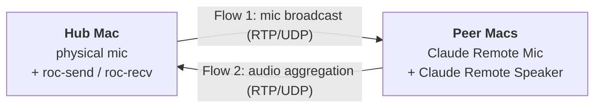

# claude-remote-audio

> Multi-Mac audio topology orchestration over [`roc-vad`](https://github.com/roc-streaming/roc-vad) + [`roc-toolkit`](https://github.com/roc-streaming/roc-toolkit).

A CLI that orchestrates a small hub-and-peer audio mesh across a fleet of Macs. One Mac (the **hub**) broadcasts a physical microphone to every peer's `Claude Remote Mic` virtual device (Flow 1), and aggregates each peer's `Claude Remote Speaker` audio back to a chosen output (Flow 2). All operations are declarative + idempotent — re-running the command converges current state to the declared state. Self-healing is "re-run apply."

---

## Architecture



| Role | Where it lives |
|---|---|
| `claude-remote-audio` CLI | Any Mac in the mesh |
| `roc-send` + `roc-recv` processes | The hub Mac |
| `Claude Remote Mic` + `Claude Remote Speaker` virtual devices | Every Mac in the mesh (provided by `roc-vad`) |

The CLI is stateless and runs only when invoked. Cross-Mac orchestration uses a pre-installed dispatch daemon (see prerequisites below); this package owns no long-lived process of its own.

---

## Installation

```bash
uv tool install --editable ~/claude-workspace/mcp/claude-remote-audio
claude-remote-audio install-completions   # zsh/bash TAB on --hub, --target, --input, --output
```

Prerequisites on each Mac in the mesh:
- `roc-vad` driver — install via the upstream script (`sudo` required, run in a local Terminal):
  ```bash
  sudo /bin/bash -c "$(curl -fsSL https://raw.githubusercontent.com/roc-streaming/roc-vad/HEAD/install.sh)"
  sudo killall coreaudiod
  ```
- `roc-toolkit` CLIs (`roc-send`, `roc-recv`) at `/usr/local/bin/`
- `switchaudio-osx` — `brew install switchaudio-osx`
- `claude-remote-bash-daemon` registered as a launchd service (`claude-remote-bash-daemon install-service` on each Mac)

---

## Quickstart

`--target` accepts a host alias, a comma-separated list, a configured group name (e.g. `mac-mesh`), or a literal `ip:port`. Groups are the most ergonomic form for steady-state operations. `--hub` defaults to the local machine — pass it explicitly only when invoking from a Mac that isn't the intended hub.

Bring the whole topology up — hub broadcast + peer aggregation, end to end:

```bash
claude-remote-audio apply --target mac-mesh --hub M5 \
  --input "DJI MIC MINI" --output "Chris's AirPods Max"
```

Same operation with an explicit host list:

```bash
claude-remote-audio apply --target M5,M2,M3,M4 --hub M5 \
  --input "DJI MIC MINI" --output "Chris's AirPods Max"
```

Recover after the hub's speaker stops working, without changing peers or the mic:

```bash
claude-remote-audio apply --target M5 --hub M5 --output "Chris's AirPods Max"
```

Re-converge mesh scaffolding without changing inputs/outputs — ensures `Claude Remote Mic`/`Claude Remote Speaker` devices exist on every target, peer speaker slots point at the current hub, stale hub processes are torn down on demoted peers. Does NOT change default-routing devices.

```bash
claude-remote-audio apply --target mac-mesh --hub M5
```

> ⚠️ This form still **mutates** mesh state (it kills stale roc-send/roc-recv on demoted peers, recreates roc-vad device slots when they drift, retires hub-side stale speaker entries). For a true read-only inspection, use `claude-coreaudio-volume list` dispatched per host or `roc-vad device list`.

See `claude-remote-audio apply --help` for full flag semantics. `--format json` emits machine-readable output for scripting.

---

## Security model

This package assumes a **trusted LAN** — typically a home/lab network where every connected device is administratively yours.

- **Dispatch channel (claude-remote-bash):** TCP, framed JSON, pre-shared-key authenticated at handshake. **No per-message encryption.** Anyone on the same LAN who can sniff packets can read every dispatched command, including the `SUDO_PASSWORD` env-var ship during `--install-prereqs` (the password is base64-encoded for transport, not encrypted). An active MITM can substitute payloads.
- **Sudo password at rest:** during install-prereqs, the password lands in `/tmp/cra-bootstrap.sh.<random>` on each target host (per-run `mktemp` path, mode 0600). The script self-deletes via `trap` on EXIT/SIGINT/SIGTERM. SIGKILL of the bash process is unsurvivable — the file then persists until next reboot (`/tmp` clears at boot on macOS). Window: typically bootstrap duration; up to next reboot under SIGKILL.
- **mDNS-advertised host aliases** flow into AppleScript dialogs via `osascript` argv (NOT source interpolation) — eliminates the `"name" & (do shell script "...")` injection class.
- **What this means in practice:** use this package on a network you control. Don't run `--install-prereqs` from a coffee-shop Wi-Fi. Don't add hosts to the mesh whose mDNS broadcasts you can't trust.

The ideal-state fix for the cleartext dispatch is channel encryption at the claude-remote-bash protocol level (Noise / TLS-PSK). That's significant CRB work captured as a follow-up task.

---

## Dependency stack + stability

### Current state

```
[ User ]
   │
[ claude-remote-audio orchestrator (Python) ]                          ← our code
   │
   ├─ [ claude-remote-bash (CRB) daemon + client ]                     ← our code
   │
   ├─ [ roc-toolkit master pinned SHA + our patch series ]             ← our patches (R1)
   │     └─ [ sox_ng 14.8.0 (statically linked, active fork) ]
   │           └─ [ macOS Core Audio HAL ]
   │
   ├─ [ roc-vad 0.0.4 (Mar 2025) ]                                     ← HAL plugin, slow but maintained
   │
   ├─ [ sox CLI (Tier 3 HAL-wedge probe only — sox -d -n) ]            ← one-shot diagnostic
   │
   ├─ [ Swift CLIs: claude-coreaudio-volume,                           ← our code
   │     claude-tcc-probe, claude-coreaudio-probe ]
   │
   ├─ [ blueutil, switchaudio-osx, coreutils (gtimeout) ]              ← stable thin wrappers
   │
   └─ [ AppleScript / System Events ]                                  ← used only for the Sound-popover rescue
```

### Stability matrix

| Layer                                             | Version                                         | Maintained                             | Stability         | Evidence / notes                                                                                                                                                   |
|---------------------------------------------------|-------------------------------------------------|----------------------------------------|-------------------|--------------------------------------------------------------------------------------------------------------------------------------------------------------------|
| **libsox 14.4.2** (linked into roc-toolkit)       | 14.4.2 (2014)                                   | **No — abandoned upstream since 2015** | **Deprecated**    | Drives 12-byte truncation (W1), same-name collision (W2). `sox_ng 14.8.0` (released 2026-05-18) fixes both, and patch 0002 already added `--channels=N` to roc-send to retire the mono-upmix band-aid.       |
| **roc-toolkit**                                   | 0.4.0 (Jun 2024 release; master HEAD ~Mar 2026) | Yes (slow)                             | Evolving          | No `-c N` channel flag. No `--bind-source` on `roc-recv`. Next major (`rocd`, Rust daemon) is 12–24 months out — too far to wait.                                  |
| **roc-vad**                                       | 0.0.4 (Mar 2025)                                | Yes (slow)                             | Evolving          | HAL plugin, not kext. No `disconnect` verb → we use `del+add` to retire slots (orchestrator.py `_ensure_peer_speaker`).                                            |
| **switchaudio-osx**, **blueutil**, our Swift CLIs | brew current / source                           | Yes                                    | Stable            | Tiny surface, predictable behavior.                                                                                                                                |
| **macOS Core Audio HAL**                          | macOS 26.4                                      | Apple                                  | Evolving — quirky | Source of the rare "HAL wedge" failure (recovery: reboot). Default-device drift.                                                                                   |
| **macOS TCC**                                     | macOS 26.4                                      | Apple                                  | Hostile-by-design | Attributes to *responsible app* (terminal/iTerm), not immediate caller. Drives `claude-tcc-probe`, the bundle plan (#47), the Automation TCC heuristic complexity. |
| **macOS Continuity / Bluetooth handoff**          | macOS 26.4                                      | Apple                                  | Fragile           | Drives `bluetooth.steal` (cross-Mac exclusive routing). Cannot be controlled programmatically beyond connect/disconnect.                                           |
| **macOS Application Firewall**                    | macOS 26.4                                      | Apple                                  | Stable            | Preflight probe is sufficient.                                                                                                                                     |
| **macOS AppleScript / System Events**             | macOS 26.4                                      | Apple                                  | Fragile           | Used only for the Sound-popover rescue. Brittle row-index clicks. Replaceable with native Swift CLIs once `claude-coreaudio-resolve` ships.                        |

### Ideal-state architecture

Target state we're moving toward — listed deltas annotate the moves.

```
[ User ]
   │
[ Claude Remote Audio.app — signed bundle ]                  ← NEW: one TCC identity
   │
   ├─ [ Python orchestrator ]                                ← split into ~8 focused modules
   │
   ├─ [ Swift CLIs (bundled): coreaudio-*, tcc-*,            ← native API replaces AppleScript
   │     sound-rescue, password-prompt, … ]
   │     └─ [ Apple frameworks: CoreAudio, IOBluetooth,
   │           AppKit, AVFoundation ]                        ← Apple "stable but quirky" — wrapped in adapters
   │
   ├─ [ CRB daemon (signed binary, launchd-managed) ]
   │
   ├─ [ roc-toolkit (rebuilt against sox_ng) ]               ← DROPS the deprecated libsox 14.4.2
   │     └─ [ sox_ng 14.8.0 — modern CoreAudio API ]
   │
   ├─ [ roc-vad (matching version) ]
   │
   └─ [ blueutil, switchaudio-osx ]                          ← unchanged
```

**Key deletions from today:**
- External `sox` CLI pipeline for mono input — `-c N` injection into `roc-send` is the immediate bridge; full deletion lands when sox_ng adoption is complete
- The 12-byte input-device name preflight (W1)
- The same-name device collision preflight (W2)
- The `_diagnose_roc_send_start_failure` tier-2 channel-count fallback
- AppleScript dialog timeouts and Sound-popover rescue (replaced by Swift CLIs)
- The brittle "iTerm as responsible app" TCC chain (signed bundle owns its own consents)

---

## Workaround inventory

Load-bearing band-aids currently in the codebase. **Living document** — entries retire as their underlying limitations get fixed. Owner column tells you where the ideal-state fix lives per CLAUDE.md's "Fix the source" principle.

| #   | Workaround                                                                               | Code location                                                            | Underlying limitation                                                                                     | Owner                                                   | Ideal-state fix                                                                                               |
|-----|------------------------------------------------------------------------------------------|--------------------------------------------------------------------------|-----------------------------------------------------------------------------------------------------------|---------------------------------------------------------|---------------------------------------------------------------------------------------------------------------|
| W1  | 12-byte input-device name preflight refusal                                              | `orchestrator.py` `_SOX_DEVICE_NAME_MAX_BYTES`                           | libsox 14.4.2 deprecated `kAudioDevicePropertyDeviceName` C-string truncation                             | libsox                                                  | sox_ng 14.8.0                                                                                                 |
| W2  | Same-name input/output device collision refusal                                          | `orchestrator.py` `_probe_input_device` match-count check                | libsox `findDevice` walks devices without scope filter                                                    | libsox                                                  | sox_ng 14.8.0                                                                                                 |
| W4  | Microphone TCC preflight + auto-trigger prompt                                           | `orchestrator.py` `_check_microphone_tcc` + `claude-tcc-probe` Swift CLI | macOS TCC responsible-app chain attributes mic to iTerm/Cursor/Terminal                                   | macOS TCC                                               | Signed Mac app bundle (task #47)                                                                              |
| W5  | HAL-wedge diagnostic → "reboot required"                                                 | `orchestrator.py` `_diagnose_roc_send_start_failure` tier 3              | macOS coreaudiod occasional wedge; only reboot clears it                                                  | Apple Core Audio                                        | Cannot fix upstream — detect + tell user to reboot is correct ideal-state                                     |
| W6  | AppleScript Sound-menu rescue                                                            | `bluetooth.py` `engage_via_sound_menu`                                   | Apple gates the "available routes" promotion behind a real Sound-popover click                            | Apple Continuity + HAL                                  | No code fix; AppleScript-into-System-Events is the only path                                                  |
| W7  | Cross-Mac Bluetooth steal                                                                | `bluetooth.py` `steal`                                                   | macOS Continuity lets BT audio appear "connected" on multiple iCloud Macs simultaneously                  | Apple Continuity                                        | Cannot fix — disconnect-then-connect is documented unblock                                                    |
| W8  | `killall` (comm-match) instead of `pkill -f` (argv-regex) for stale-hub teardown + roc-send restart | `orchestrator.py` `_teardown_stale_hub_processes`, `_roc_send_command` (roc-recv's own restart at `_roc_recv_command` still uses `pkill -f` — documented exception) | Dispatch shell's argv contains literal "roc-send" → `pkill -f` self-kills the carrier shell               | Our dispatch shape (shell-script-as-message)            | Long-term: typed RPC dispatch retires this entire bug class                                                   |
| W9  | NFKC + smart-quote/NBSP fold for `--output` matching                                     | `cc_lib/utils/unicode_match.py` (`nfkc_casefold`)                        | Core Audio stores renamed devices with U+2019 (curly apostrophe); keyboards type U+0027                   | Apple                                                   | Folding is the correct fix; shared helper now lives in `cc_lib/utils/unicode_match.py` (R4)                   |
| W10 | Application Firewall preflight for roc-send/roc-recv binding                             | `orchestrator.py` `_check_application_firewall`                          | macOS firewall silently drops UDP from unauthorized binaries; daemon-spawned can't get the prompt clicked | Apple                                                   | Preflight + actionable refusal is correct ideal-state                                                         |
| W11 | roc-vad slot recreation via `del + add`                                                  | `orchestrator.py` `_ensure_peer_speaker`                                 | roc-vad has no `disconnect` verb to clear an occupied slot                                                | roc-vad                                                 | UID-preservation trick is correct given current API                                                           |
| W12 | `claude-coreaudio-volume` Swift CLI for per-device volume                                | `swift/claude-coreaudio-volume.swift`                                    | macOS has no stock CLI that names-then-controls a device's volume scalar                                  | macOS gap                                               | Building our own Swift CLI **is** the first-class fix — not a workaround                                      |
| W13 | AppleScript dialog with dual `with timeout` + `giving up after`                          | `orchestrator.py` `_confirm_install_dialog` + `_prompt_sudo_password_dialog` | AppleScript has two independent timeouts that both default to seconds in non-TTY contexts                 | AppleScript spec                                        | Replace with Swift NSAlert when bundle ships                                                                  |
| W14 | `nohup ... &` detachment + post-launch `pgrep` survival check                            | `orchestrator.py` `_restart_roc_send` (survival check); `_restart_roc_recv` (detach only) | Dispatch expects bounded execution; roc-send is a daemon                                                  | Our dispatch + lack of launchd integration for roc-send | Register roc-send / roc-recv as launchd transient units; lifecycle is OS-managed                              |
| W15 | `claude-coreaudio-probe` Swift CLI for per-device HAL open                               | `swift/claude-coreaudio-probe.swift` + `orchestrator.py` Tier 1.5        | SoX/sox_ng collapses every CoreAudio input-open failure into one generic message; OSStatus is discarded   | libsox + sox_ng                                         | Building our own Swift CLI **is** the first-class fix — composable with patching sox_ng if/when needed        |
| W16 | Input-device sample-liveness preflight (`input-device-no-samples`)                       | `orchestrator.py` `_verify_input_produces_samples`                       | USB-audio endpoint stalls after sleep/wake: device enumerates + opens (control transfers OK, `claude-coreaudio-probe` verdict=ok) but its isochronous stream delivers no samples → roc-send stays `pgrep`-alive broadcasting silence | Apple USB/Thunderbolt — per-port xHCI controller's isochronous bandwidth not freed across reset-on-resume | Cannot fix upstream. SIGKILL-bounded capture detects it; remedy ladder = replug a different port (fresh controller, instant) → power-cycle hub → re-sleep → reboot (deterministic). Per-controller reset is SIP-blocked on Apple Silicon |

**Concentration by owner:**
- **libsox (deprecated)**: W1, W2 — retire under sox_ng adoption
- **Apple (closed, evolving)**: W4 (partial), W5, W6, W7, W9, W10, W13, W16 — these are *correct* ideal-state for unfixable upstream
- **roc-vad / roc-toolkit (active, slow)**: W11, W14 — minor
- **Our dispatch shape**: W8, W14 — long-term typed RPC retires both
- **Gap-fillers (Swift CLIs we own)**: W12, W15 — first-class adapters at the lowest layer we own when upstream has no CLI / no symbolic-error surface
- **Us (self-inflicted, already healed)**: removed/healed entries get retired from this table; we don't keep historic band-aids around

---

## Empirical health probes

Apple-provided foundations we can't change but **can test** continuously. Each is detect-and-recover or detect-and-warn; together they form the orchestrator's preflight + post-apply assertion layer.

| Apple quirk                                                  | Probe (where + how)                                                                   | Recovery                                                                                   |
|--------------------------------------------------------------|---------------------------------------------------------------------------------------|--------------------------------------------------------------------------------------------|
| AirPods Pro BT codec drops to 24 kHz duplex                  | **(deferred — Tier 2)** Read `kAudioDevicePropertyNominalSampleRate` on the active output id; alert if 24 kHz | Re-assert default input ≠ AirPods Pro; restart roc-recv; BT renegotiates A2DP within ~1 s  |
| Default-device drift (input → AirPods auto-flip)             | **(deferred — Tier 2)** Poll `SwitchAudioSource -c -t input` periodically             | Re-assert intended input. Long-term: roc-vad registers higher-priority default eligibility |
| TCC consent revoked between applies                          | Each Swift CLI probes its own framework before action; structured error if denied     | Surface `ResolvableApplyError` with explicit Settings path                                 |
| BT device disconnected silently                              | `blueutil --is-connected <MAC>`                                                       | Reconnect via `blueutil --connect` or AppleScript Sound-popover engagement                 |
| HAL wedge (rare, unrecoverable in-process)                   | `sox -d -n trim 0 0.1` returns 0 when HAL is healthy                                  | Tell user to reboot (only known recovery)                                                  |
| Application Firewall blocks bind                             | `socketfilterfw --getappblocked` per binary at preflight                              | Surface `ResolvableApplyError` with click-through Settings instructions                    |
| Dual Wi-Fi+Ethernet on same subnet causes packet duplication | Detect via interface enumeration on hub                                               | roc-recv binds `-s rtp://<specific-hub-IP>:<port>` instead of `0.0.0.0` — orchestrator-layer fix |
| USB-audio endpoint stall after sleep/wake (enumerates + opens, isochronous stream dead) | `gtimeout -s KILL 4 sox -t coreaudio "<input>" -n trim 0 1.5 stat` at preflight — SIGKILL/blocked or `Maximum amplitude 0.000000` = no samples (live mic shows noise-floor RMS > 0); `_verify_input_produces_samples` | Replug into a different USB/TB port (fresh controller) — instant. Reboot resets the wedged controller (deterministic). Per-port; survives replug into the same port. |

---

## Roadmap to ideal state

Lives here so we don't lose track of the layered move. Each item is independently shippable; ordering is by leverage (impact ÷ effort), not by dependency chain.

### Tier 1 — landed in this PR

1. **R1 — Patch series against roc-toolkit master + sox_ng.** The lever. Since we validate every change empirically on the full mesh, "tracking upstream" buys nothing while costing features we could add ourselves. Fork-via-patches: pin to a tested roc-toolkit master SHA, apply our patches at build time, install our binaries.
   - **Bootstrap pulls roc-toolkit master pinned to a specific SHA** (not 0.4.0 release, not a moving target).
   - **Swap bundled libsox for sox_ng 14.8.0** in roc-toolkit's scons 3rdparty config (patch 0001). Deletes W1, W2.
   - **`--channels=N` flag added to `roc-send`** (patch 0002). Retired the sox upmix pipe (deleted entirely).
   - **`roc-recv` binds to specific hub-IP** instead of `0.0.0.0` (orchestrator-layer change using stock `-s` flag, not a roc-toolkit patch). Fixes task #29 dual-interface chipmunk.
   - **OSStatus surfacing for input-open failures** is handled out-of-tree via `claude-coreaudio-probe` (W15) — Swift CLI at the lowest layer we own. Composable with a future sox_ng patch if one ships; we don't block on upstream cadence.
   - **Patches live at** `mcp/claude-remote-audio/patches/*.patch`. Reviewable diffs in our PRs. Self-pruning when upstream lands the same fix (patch starts conflicting → drop it).
2. **R2 — `--channels=N` injection in `_roc_send_command`.** Closes the mono channel-count case via the patch-0002 flag.
3. **R4 — `_nfkc_casefold` extracted to `cc_lib/utils/unicode_match.py`.** Shared helper for orchestrator + bluetooth.
4. **R5 — Journey-residue stripped from user-facing error prose.** No commit SHAs, no internal task numbers, no apologetic "this is regressed" language in user-visible strings.
5. **Audit-driven polish lap** (commit `ebc40042` + this lap): #41 BluetoothError migration to exceptions module + codes; #43 [TIMEOUT] marker in error messages; #53 fail-fast on unknown TCC + firewall states; #55 HAL-enumeration-race poll; #57 Accessibility vs Automation TCC disambiguation; #61 hub-side stale-speaker retirement; #64 HAL-wedge preflight.

### Tier 2 — follow-up PRs

5. **R3 — Split `orchestrator.py` into 8 focused modules**: `plan.py`, `prereqs.py`, `hub.py`, `peer.py`, `rocvad.py`, `roc_cli.py`, `tcc.py`, `diagnose.py`. Pure refactor; cleaner after sox_ng deletes the dead preflights.
6. **Sign daemon as Mac app bundle (#47)**. Collapses TCC complexity. Drops the "iTerm as responsible app" chain. Persistent consent across rebuilds.
7. **Swift CLIs replace remaining AppleScript** (#34 sound-popover rescue, password dialog, claude-coreaudio-resolve #51). Once last AppleScript use is gone, drop Automation TCC handling entirely.
8. **Apply absorbs recovery primitives** (#35 AirPods Continuity drift, #60 input drift, #62 BT-duplex recovery) — no separate `recover` subcommand.

### Tier 3 — CRB roadmap (separate package, separate PRs)

9. #19 (interface-change reaction), #23 (mid-flight IP flux), #30 (DiscoveredAddress in errors), #31 (auto-refresh hosts-cache), #36 (dispatch timeout propagation), #37/#38 (cancel protocol), #59 (launchd auto-start).

### Perhaps Never

- **Wait for `rocd`** (the Rust roc-toolkit successor). 12–24 months out per upstream. We unblock ourselves.
- **Fork SoX (the original)**. sox_ng exists and is maintained.
- **Build our own RTP stack**. Massively negative ROI.
- **Try to control Apple's BT codec mode programmatically**. Opaque by design.
- **Maintain workaround duplication** ("if a third caller emerges"). Move to shared module on second caller per CLAUDE.md DRY.
- **Document-as-workaround** for code-fixable issues. Per CLAUDE.md "Ideal State": fix the source.
