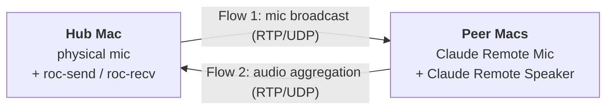

# claude-remote-audio

> Multi-Mac audio topology orchestration over [`roc-vad`](https://github.com/roc-streaming/roc-vad) + [`roc-toolkit`](https://github.com/roc-streaming/roc-toolkit).

A CLI that orchestrates a small hub-and-peer audio mesh across a fleet of Macs. One Mac (the **hub**) broadcasts a physical microphone to every peer's `Claude Remote Mic` virtual device (Flow 1), and aggregates each peer's `Claude Remote Speaker` audio back to a chosen output (Flow 2). All operations are declarative + idempotent — re-running the command converges current state to the declared state. Self-healing is "re-run apply."

---

## Architecture



| Role | Where it lives |
|---|---|
| `claude-remote-audio` CLI | Any Mac in the mesh |
| `roc-send` + `roc-recv` processes | The hub Mac |
| `Claude Remote Mic` + `Claude Remote Speaker` virtual devices | Every Mac in the mesh (provided by `roc-vad`) |

The CLI is stateless and runs only when invoked. Cross-Mac orchestration uses a pre-installed dispatch daemon (see prerequisites below); this package owns no long-lived process of its own.

---

## Installation

```bash
uv tool install --editable ~/claude-workspace/mcp/claude-remote-audio
claude-remote-audio install-completions   # zsh/bash TAB on --hub, --target, --input, --output
```

Prerequisites on each Mac in the mesh:
- `roc-vad` driver — install via the upstream script (`sudo` required, run in a local Terminal):
  ```bash
  sudo /bin/bash -c "$(curl -fsSL https://raw.githubusercontent.com/roc-streaming/roc-vad/HEAD/install.sh)"
  sudo killall coreaudiod
  ```
- `roc-toolkit` CLIs (`roc-send`, `roc-recv`) at `/usr/local/bin/`
- `switchaudio-osx` — `brew install switchaudio-osx`
- `claude-remote-bash-daemon` registered as a launchd service (`claude-remote-bash-daemon install-service` on each Mac)

---

## Quickstart

`--target` accepts a host alias, a comma-separated list, a configured group name (e.g. `mac-mesh`), or a literal `ip:port`. Groups are the most ergonomic form for steady-state operations. `--hub` defaults to the local machine — pass it explicitly only when invoking from a Mac that isn't the intended hub.

Bring the whole topology up — hub broadcast + peer aggregation, end to end:

```bash
claude-remote-audio apply --target mac-mesh --hub M5 \
  --input "DJI MIC MINI" --output "Chris's AirPods Max"
```

Same operation with an explicit host list:

```bash
claude-remote-audio apply --target M5,M2,M3,M4 --hub M5 \
  --input "DJI MIC MINI" --output "Chris's AirPods Max"
```

Recover after the hub's speaker stops working, without changing peers or the mic:

```bash
claude-remote-audio apply --target M5 --hub M5 --output "Chris's AirPods Max"
```

Read-only probe of current state (no `--input` / `--output` → no mutations):

```bash
claude-remote-audio apply --target mac-mesh --hub M5
```

See `claude-remote-audio apply --help` for full flag semantics. `--format json` emits machine-readable output for scripting.