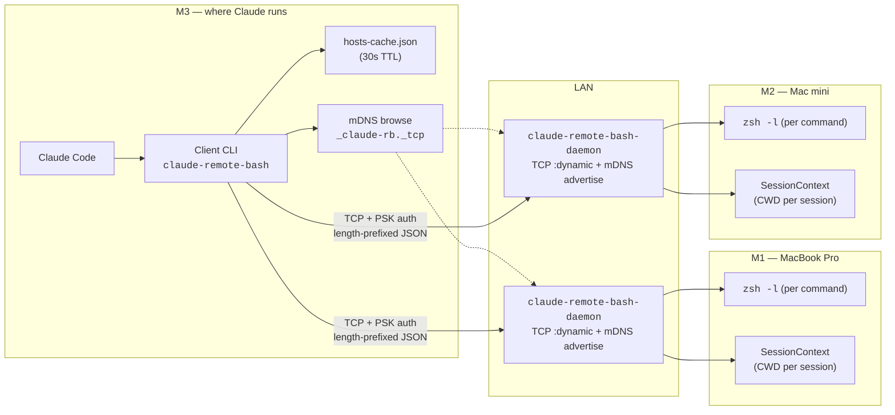
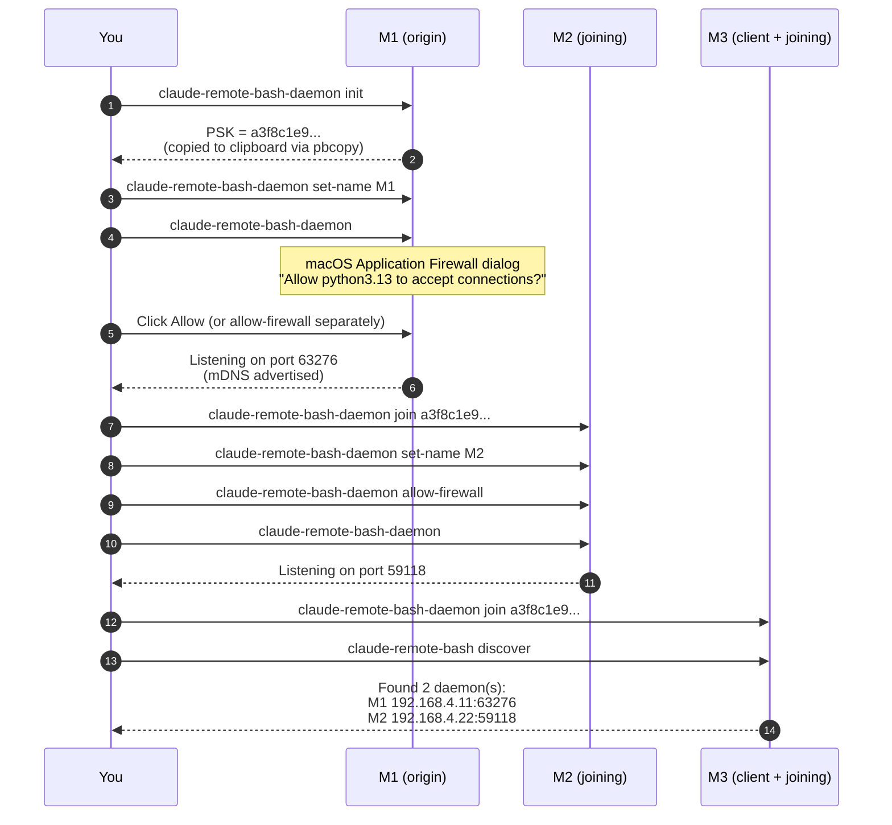
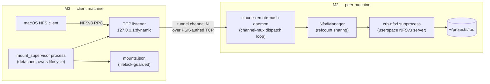

# claude-remote-bash

> Cross-machine shell execution for Claude Code via mDNS-discovered daemons on a home LAN.

Each machine in the mesh runs a lightweight daemon that registers itself via mDNS and accepts authenticated shell commands over TCP. A client CLI discovers daemons by alias (e.g. `--target M2`) and executes commands on them. Use this when you want Claude Code on one MacBook to install software on another, read a remote config, or orchestrate work across your personal machines — without SSH key juggling or static `hosts` entries.

> [!NOTE]
> **Status:** Phase 1 (daemon), Phase 2 (client CLI), and Phase 4 (filesystem mount) ship. Phase 3 (MCP server) is deferred pending an empirical need — the CLI's `Bash()` permission integration covers the current use cases cleanly.

---

## Architecture



| Role | Binary | Where it runs |
|---|---|---|
| Daemon | `claude-remote-bash-daemon` | Every machine in the mesh (target of remote commands) |
| Client | `claude-remote-bash` | Machine running Claude Code (invokes remote commands) |

Each command spawns a fresh `zsh -l` on the target — there is no persistent shell. The daemon tracks one piece of state per `(CLAUDE_CODE_SESSION_ID, CLAUDE_CODE_AGENT_ID)` pair: the working directory. This matches Claude Code's local Bash tool behavior and makes sub-agent parallelism trivial.

---

## Installation

```bash
uv tool install --editable ~/claude-workspace/mcp/claude-remote-bash
```

This installs two binaries on `$PATH`:

| Binary | Purpose |
|---|---|
| `claude-remote-bash` | Client CLI — invoked by Claude Code's Bash tool |
| `claude-remote-bash-daemon` | Server — runs on every target machine |

> [!TIP]
> For development install from a local checkout, use `uv tool install --editable /path/to/claude-workspace/mcp/claude-remote-bash`. Source edits take effect on the next invocation with no reinstall.

---

## First-time mesh setup

A "mesh" here means a set of machines that share one pre-shared key (PSK). Pick one machine as the origin (`M1` below), generate the PSK there, and join every other machine to it.



### Numbered walkthrough

**On the first machine (M1 — the PSK origin):**

```bash
claude-remote-bash-daemon init                # generates 256-bit PSK, copies to clipboard
claude-remote-bash-daemon set-name M1             # aliases this daemon
claude-remote-bash-daemon                       # starts the daemon; keep terminal open
```

The first start on macOS triggers an **Application Firewall dialog** ("Allow python3.13 to accept incoming connections"). Click Allow. If you dismissed the dialog or run headless, use the `allow-firewall` branch below.

**On every other machine (M2, M3, …):**

```bash
claude-remote-bash-daemon join a3f8c1e9...    # paste the PSK from M1
claude-remote-bash-daemon set-name M2
claude-remote-bash-daemon allow-firewall      # optional: approve without a dialog (sudo)
claude-remote-bash-daemon                       # start
```

**From the client machine (the one running Claude Code):**

```bash
claude-remote-bash discover                      # should list M1 and M2
claude-remote-bash execute --target M1 'hostname'  # smoke test
```

> [!IMPORTANT]
> `init`, `join <key>`, and `set-name <alias>` are **config-only** subcommands — they save state and exit. Starting the daemon is always the bare invocation `claude-remote-bash-daemon` (no subcommand). This makes each config step a distinct, auditable action.

---

## Daemon reference

| Subcommand | Effect |
|---|---|
| *(bare invocation)* | Start the daemon. Requires `auth_key` and `name` already configured. |
| `init` | Generate a new 256-bit PSK, write it to config with `0600` perms, copy to clipboard. |
| `join <key>` | Save a PSK shared from another machine. |
| `set-name <alias>` | Set this daemon's mDNS alias (e.g. `M2`). Save-and-exit. |
| `allow-firewall` | Approve this daemon's Python binary in the macOS Application Firewall (requires sudo). |
| `install-service` | Install a launchd `LaunchAgent` so the daemon runs at login and auto-restarts. |
| `uninstall-service` | Remove the `LaunchAgent` plist and unload it from launchd. |
| `--help`, `-h` | Print usage. |

Config file: `~/.claude-workspace/mcp/claude-remote-bash/daemon_config.json` (mode `0600`). Optional groups for the CLI client live alongside it at `client_config.json`.

---

## Client reference

| Subcommand | Purpose |
|---|---|
| `execute --target <selector> <cmd>` | Run a command on one or more remote hosts. `<selector>` is a host alias (`M2`), a comma-list (`M2,M3,M4`), a group name from `client_config.json` (e.g. `fleet`), a literal `ip:port`, or any mix. Supports heredoc on stdin when `<cmd>` is omitted. |
| `discover` | Browse mDNS for 3s and print every daemon found. Refreshes the cache. |
| `mount <peer>:<path> [mountpoint]` | Mount a remote directory over NFSv3. Detaches a supervisor by default; `--foreground` blocks until ^C. See [Filesystem mount](#filesystem-mount). |
| `umount <mountpoint>` | Tear down a mount established via `mount`. SIGTERMs the supervisor; supervisor unmounts and removes its registry entry. |
| `mounts` | List active mounts with live/orphan status. `--format json` for machine-readable output. |
| `install-completions` | Install shell tab completion (zsh/bash) — inherited from `cc_lib.cli`. |
| `uninstall-completions` | Remove shell tab completion. |

`execute --target` (`-t`) accepts:

- a single host alias (`M2`) — single-host mode: stream raw stdout/stderr; exit with the host's exit code
- a comma-separated list (`M2,M3,M4`) — multi-host mode: parallel via `asyncio.gather`, per-line `[<atom>] ` prefix, summary table at end, aggregated exit code
- a group name from `client_config.json` (see below) — replaced inline with its member list
- a literal `ip:port` (`192.168.4.22:51648`) — direct address; bypasses mDNS discovery
- any mix of the above

Grammar: whitespace per-atom stripped; empty atoms, trailing commas, and pre-expansion duplicates rejected before any RPC. Matching is case-insensitive.

**Groups** are local-only personal shortcuts at `~/.claude-workspace/mcp/claude-remote-bash/client_config.json`:

```json
{
  "groups": {
    "fleet": ["M2", "M3", "M4"],
    "workers": ["M3", "M4"]
  }
}
```

Then: `claude-remote-bash execute -t fleet 'uptime'` runs on M2, M3, M4 in parallel.

### Example invocations

```bash
# Single command
claude-remote-bash execute --target M2 'ls -la ~/.claude'

# Heredoc (the shape Claude Code's Bash tool uses)
claude-remote-bash execute --target M2 <<'BASH'
cd ~/projects
cat .env
echo "CWD: $(pwd)"
BASH

# Discovery
claude-remote-bash discover
```

<details><summary>Permission integration with Claude Code</summary>

The CLI participates in Claude Code's existing `Bash(...)` permission system via literal prefix matching. Add to `.claude/settings.json`:

```json
{
  "permissions": {
    "allow": [
      "Bash(claude-remote-bash execute --target M2:*)",
      "Bash(claude-remote-bash discover:*)"
    ]
  }
}
```

| Pattern | Effect |
|---|---|
| `Bash(claude-remote-bash:*)` | Allow every subcommand on every host. |
| `Bash(claude-remote-bash execute --target M2:*)` | Allow `execute` on M2 only. |
| `Bash(claude-remote-bash discover:*)` | Allow `discover` only. |

No custom permission code. No new config surface. The CLI's shape gives per-host and per-command granularity on Claude Code's existing infrastructure.

</details>

---

## Filesystem mount

`crb mount m2:~/projects/foo` makes the M2 host's `~/projects/foo` directory readable and writable on M3 as a regular filesystem path at `~/.crb/host/m2/foo/`. Edit-tool semantics work: Claude can `read_file`, `edit`, and `cat` across machines without an SSH/rsync round-trip per operation.

The transport reuses the existing PSK-authed daemon connection. There is no second protocol, no NFS-over-the-LAN, and no second port that needs firewall approval.

### Quick example

```bash
crb mount m2:~/projects/foo
# → mounted m2:~/projects/foo at /Users/chris/.crb/host/m2/foo
# → supervisor pid=70614 mount_id=bf3da046

cat ~/.crb/host/m2/foo/README.md      # reads through the mount
echo "from M3" > ~/.crb/host/m2/foo/note.md  # write-through to M2

crb mounts                            # list active mounts
crb umount ~/.crb/host/m2/foo         # tear it down (~0.5s)
```

### Architecture



### Components

| Piece | Where it lives | What it does |
|---|---|---|
| `crb mount` CLI | M3 client | Spawns the supervisor, waits for its `READY` line, returns. |
| `mount_supervisor.py` | M3 (detached subprocess) | Owns the mount lifecycle. SIGTERM unwinds → `UnmountRequest` → `umount` → registry cleanup. |
| `mount.py:crb_mount_blocking` | M3 supervisor | Discover peer → auth → `MountRequest` → start local TCP listener → invoke `mount_nfs` → block on signal. |
| `mounts_registry.py` | M3 (filelock JSON) | One entry per live mount: `peer_alias`, `remote_path`, `mountpoint`, `supervisor_pid`, `mount_id`. |
| `NfsdManager` | Peer daemon | Spawns/refcount-shares `crb-nfsd` subprocesses by `(canonical(root), readonly)` key. |
| `crb-nfsd` | Peer daemon child | Maturin-built Rust binary serving NFSv3 on `127.0.0.1:dynamic`. Built on [nfsserve](https://github.com/xetdata/nfsserve). |
| Channel mux | Daemon ↔ supervisor | Channel 0 = control JSON (`MountRequest` etc.); channel N>0 = opaque NFS bytes routed by `channel_id`. One peer TCP conn per kernel NFS conn. |

### Mountpoint convention

`crb mount m2:~/projects/foo` mounts at `~/.crb/host/m2/foo/`:

- Root: `~/.crb/host/` (constant — `MOUNTS_ROOT`)
- Per-peer directory: `<peer_alias>/`
- Per-mount basename: `<basename of remote path>`

Override with the second CLI argument: `crb mount m2:~/projects/foo /tmp/mnt`. The CLI resolves the path (`.resolve()`) before writing to the registry, so symlink chains like macOS's `/tmp → /private/tmp` don't break the umount lookup.

### Read-after-write coherence

The mount runs `mount_nfs` with `actimeo=0,noac` — the NFS client revalidates attributes on every operation rather than caching. This is what makes Claude's Edit tool work correctly:

```
write a.txt (round trip to peer)
read a.txt (revalidates → sees just-written bytes, not stale cache)
```

Without `actimeo=0` the NFS client caches attributes for ~30s by default and read-after-write reads stale data. The trade-off is one extra GETATTR per operation; for Edit-tool workloads that's invisible.

### Lifecycle

```mermaid
sequenceDiagram
    autonumber
    participant U as User
    participant CLI as crb mount<br/>(parent process)
    participant Sup as mount_supervisor<br/>(detached child)
    participant D as Peer daemon
    participant K as macOS NFS client

    U->>CLI: crb mount m2:~/projects/foo
    CLI->>Sup: spawn (subprocess.Popen, start_new_session=True)
    CLI->>Sup: wait for stdout "READY <mount_id>"
    Sup->>D: connect + auth (channel 0)
    Sup->>D: MountRequest{root, readonly}
    D-->>Sup: MountResponse{mount_id}
    Sup->>K: mount_nfs 127.0.0.1:0 → /Users/chris/.crb/host/m2/foo
    Sup-->>CLI: "READY <mount_id>" via stdout
    CLI->>U: "mounted at ...; pid=N"
    CLI-->>U: returns (supervisor stays detached)

    Note over K,D: NFS RPCs flow through tunnel channels<br/>(one per kernel-NFS connection)

    U->>Sup: crb umount → SIGTERM (via registry pid)
    Sup->>K: umount -f
    Sup->>D: UnmountRequest{mount_id}
    D-->>Sup: UnmountResponse{child_terminated}
    Sup->>Sup: registry remove_entry
    Sup-->>U: process exits
```

### Multi-tab share (refcount)

Two Claude tabs on the same machine mounting the same `(root, readonly)` key share one `crb-nfsd` subprocess. The `NfsdManager` returns a fresh `mount_id` for each acquire and increments the share's `refcount`. `UnmountRequest` decrements; the subprocess is SIGTERMed only when the last holder releases. This makes the multi-tab workflow free of "tab A's umount kills tab B's mount" surprises.

### Cleanup on abnormal exit

The supervisor's `try/finally` removes its registry entry and runs `umount -f` on every exit path, including signal-driven teardown. If the supervisor itself is SIGKILLed (skipping `finally`), the daemon's dispatch loop tracks per-connection mount holds and releases them when the control TCP connection closes — the peer-side `crb-nfsd` doesn't leak even if M3 crashes or partitions away.

If the supervisor is killed but the kernel mount remains, running `crb umount <mountpoint>` against the stale registry entry reaps it: the supervisor PID is no longer alive, `terminate_supervisor` removes the entry and surfaces a clear "stale registry entry" message.

### Mountpoint registry

| Path | Purpose |
|---|---|
| `~/.claude-workspace/mcp/claude-remote-bash/mounts.json` | List of `MountEntry` records, one per live mount. |
| `~/.claude-workspace/mcp/claude-remote-bash/mounts.lock` | `FileLock` guard for concurrent `mount`/`umount`. |

Each entry: `mount_id`, `peer_alias`, `remote_path`, `mountpoint`, `supervisor_pid`, `readonly`, `established_at`.

### Logs

| Path | What's there |
|---|---|
| `~/.crb/log/supervisor-<pid>.log` | Supervisor's INFO-level lifecycle log. |
| `~/.crb/log/crb-nfsd-<uuid8>.log` | The peer-side `crb-nfsd` subprocess's stderr (whatever `tracing`/panic output it emits). |
| `/tmp/crb-daemon.log` | Daemon log if running headless. |

### `crb-nfsd` discovery

The daemon finds `crb-nfsd` via `Path(sys.executable).parent / 'crb-nfsd'` first — maturin's `bindings = "bin"` mode installs the Rust binary into the same venv `bin/` directory as `claude-remote-bash-daemon`. `PATH` lookup is the fallback. This means a clean `uv tool install --reinstall claude-remote-bash` populates everything the daemon needs without any `~/.local/bin` symlinking.

> [!NOTE]
> **No peer-side mount allowlist yet.** Any client with a valid PSK can request a mount of any path the peer's user can read. Appropriate for the same LAN-trust model as `execute`; not appropriate for environments where the PSK is shared with parties who shouldn't see all of `$HOME`. Tracked as a follow-up.

> [!TIP]
> **Spotlight and Time Machine are excluded automatically.** On mount, the supervisor runs `mdutil -i off <mountpoint>` and `tmutil addexclusion <mountpoint>` so the indexer doesn't walk the tree and Time Machine doesn't try to back up the peer's filesystem. Without these the mount feels unresponsive on first Finder open.

---

## Multi-IP advertisement

A machine on a home LAN often has more than one IPv4 address — Wi-Fi, ethernet, a VPN tunnel, a Docker bridge. The daemon advertises **all** of them via mDNS; the client tries each in order with a short per-attempt timeout. This means a VPN interface that happens to be in an advertising but unreachable state fails over quickly to the LAN address.

### What `publishable_ipv4s()` returns

`publishable_ipv4s()` walks every network adapter via `ifaddr`, filters out loopback (`127.*`) and link-local (`169.254.*`), and returns the remaining IPv4 addresses sorted by the rank table below.

### IPv4 rank order

| Rank | CIDR | Typical source | Rationale |
|:---:|---|---|---|
| 0 | `192.168.0.0/16` | Consumer LAN (Wi-Fi, home router) | Preferred: same subnet, lowest latency, always reachable if daemon is running. |
| 1 | `172.16.0.0/12` | Enterprise LAN / Docker | Common corporate LAN; also Docker's default bridge. |
| 2 | `10.0.0.0/8` | Corporate VPN, large LAN | May require tunnel to be active and client-to-client enabled. |
| 3 | `100.64.0.0/10` | CGNAT / Tailscale | Reachable only with a Tailscale (or similar) client running. |
| 4 | everything else | Public IPv4, unusual ranges | Last resort. |

The daemon sorts before advertising and the client re-sorts on receive — zeroconf does not preserve order across the wire.

### Connect attempt

```
CONNECT_TIMEOUT_SECONDS = 2.0  # per IP
```

The client iterates `ips` in rank order with `asyncio.wait_for(open_connection(...), timeout=2.0)`. If every address fails, `HostUnreachableError` is raised with all attempts listed and a hint derived from the failure signatures.

<details><summary>Why 2 seconds, not 5 or 30?</summary>

A dead VPN address typically fails with `TimeoutError` (no listener responded), which blocks the event loop. On gigabit LAN a legitimate handshake completes in &lt;10ms. 2 seconds is long enough to tolerate brief Wi-Fi hiccups and short enough that a bad address doesn't turn into a multi-second wait before falling through to the working IP.

</details>

---

## Firewall approval on macOS

macOS's Application Firewall has a behavior that's subtle enough to deserve its own section: by default it **accepts the TCP handshake but silently drops subsequent data** until the user approves the binary. That's why the daemon's mere startup doesn't trigger a connection refusal — the client sees a successful `connect()` and then a hang.

### Two paths to approval

| Path | When to use | Mechanism |
|---|---|---|
| **GUI dialog** | First daemon run on a machine you're sitting in front of. | macOS pops up "Allow python3.13 to accept incoming network connections?" Click Allow. |
| **`allow-firewall` flag** | Headless install, dismissed dialog, or scripted setup. | Wraps `socketfilterfw --add` and `--unblockapp` against `sys.executable`. Requires sudo. |

```bash
claude-remote-bash-daemon allow-firewall
# → sudo prompt
# → Approving binary in Application Firewall: /opt/homebrew/.../python3.13
# → Approved. Restart of the daemon is NOT required — existing socket is unblocked.
```

> [!WARNING]
> The approval targets `sys.executable` — the actual Python binary the daemon runs under, **not** whatever `python3` resolves to in `$PATH`. If you later `uv tool upgrade` and the binary path changes, you'll see the approval prompt again. This is correct behavior — it's a different binary.

### Empirical signature of a pending approval

```
$ claude-remote-bash execute --target M2 'ls'
TCP connected but the daemon did not respond to auth within 5s.

This is the signature of a pending macOS Application Firewall prompt
on the target: the kernel accepts the TCP handshake, but the firewall
silently blocks the daemon process from receiving the data.
...
```

The client's `AuthError` explicitly names this failure mode so the first-time user doesn't waste debugging time on a config misread.

---

## Troubleshooting: diagnostic signatures

Each failure mode has a distinct shape. This table maps what you observe to what went wrong.

| Symptom | Error raised | Meaning |
|---|---|---|
| Immediate "Host not found: M2" | `HostNotFoundError` | mDNS browse returned zero daemons (or no alias match). Daemon not running, wrong LAN segment, or alias typo. |
| Fast "ConnectionRefusedError" on every address | `HostUnreachableError` (all `ConnectionRefusedError`) | TCP reached the host but nothing is listening on that port. Daemon crashed, or cache is stale (daemon restarted on a different port). |
| ~2s "TimeoutError" on every address | `HostUnreachableError` (all `TimeoutError`) | Packets never reached a listener. Target offline, different network, or packet filtering. Reachability hint in the error suggests `discover` to refresh. |
| TCP connects, then hangs 5s, then fails | `AuthError` ("did not respond to auth within 5s") | macOS Application Firewall silently dropping data until the user clicks Allow or `allow-firewall` is run on the target. |
| "Authentication failed: invalid key" | `AuthError` | PSK mismatch. The target was initialized with `init` on a different origin, or `join` was run with a bad key. |
| "No auth key configured" | `AuthError` (client) or `ConfigError` (daemon) | Config file is missing or has an empty `auth_key`. Run `init` (origin) or `join <key>` (joiner). |

> [!TIP]
> **Stale cache is a common gotcha.** `hosts-cache.json` has a 30-second TTL. After a daemon restart, the cached port is stale until the next `discover` or TTL expiry. If `execute` fails with `ConnectionRefusedError` right after you restarted a daemon, run `claude-remote-bash discover` and retry.

### Manual verification on the target

```bash
pgrep -f claude-remote-bash-daemon       # is the daemon running?
tail -f ~/Library/Logs/claude-remote-bash-daemon.log   # what did it log?
ping <target-hostname>.local             # basic mDNS reachability
```

---

## launchd persistence

Running `claude-remote-bash-daemon` manually in a terminal is fine for a test run, but for day-to-day use you want it to start at login and survive crashes. `install-service` writes a per-user `LaunchAgent` plist.

```bash
claude-remote-bash-daemon install-service
# → Installed: ~/Library/LaunchAgents/com.claude-remote-bash.daemon.plist
# → Binary:    /Users/chris/.local/bin/claude-remote-bash-daemon
# → Logs:      ~/Library/Logs/claude-remote-bash-daemon.log
# → Status:    launchctl list | grep com.claude-remote-bash.daemon

claude-remote-bash-daemon uninstall-service
# → Uninstalled: ~/Library/LaunchAgents/com.claude-remote-bash.daemon.plist
```

| Artifact | Path |
|---|---|
| Plist | `~/Library/LaunchAgents/com.claude-remote-bash.daemon.plist` |
| Combined stdout+stderr log | `~/Library/Logs/claude-remote-bash-daemon.log` |
| launchd label | `com.claude-remote-bash.daemon` |

<details><summary>Generated plist format</summary>

```xml
<?xml version="1.0" encoding="UTF-8"?>
<!DOCTYPE plist PUBLIC "-//Apple//DTD PLIST 1.0//EN" "http://www.apple.com/DTDs/PropertyList-1.0.dtd">
<plist version="1.0">
<dict>
    <key>Label</key>
    <string>com.claude-remote-bash.daemon</string>
    <key>ProgramArguments</key>
    <array>
        <string>/Users/chris/.local/bin/claude-remote-bash-daemon</string>
    </array>
    <key>RunAtLoad</key>
    <true/>
    <key>KeepAlive</key>
    <true/>
    <key>StandardOutPath</key>
    <string>/Users/chris/Library/Logs/claude-remote-bash-daemon.log</string>
    <key>StandardErrorPath</key>
    <string>/Users/chris/Library/Logs/claude-remote-bash-daemon.log</string>
</dict>
</plist>
```

- `KeepAlive=true` → launchd restarts on crash or kill.
- `RunAtLoad=true` → starts at login and on plist load.
- `ProgramArguments` uses the absolute path resolved via `shutil.which('claude-remote-bash-daemon')` — launchd runs with a minimal `$PATH`, so relative lookups would fail.
- stdout and stderr both go to one file; the daemon prints its banner to stdout and its `logging` output to stderr, and keeping them together in one log matches the terminal-running UX.

Re-running `install-service` calls `launchctl unload` before rewriting — config changes (e.g., a new alias) propagate cleanly without manual unload/load.

</details>

---

## Security

| Property | Value |
|---|---|
| Authentication | Pre-shared key (PSK), 256-bit, generated via `secrets.token_hex(32)` |
| Key storage | `~/.claude-workspace/mcp/claude-remote-bash/daemon_config.json`, mode `0600` |
| Key distribution | Out-of-band (user copies PSK from `init` output to `join` on each target) |
| Key comparison | `secrets.compare_digest` (constant-time) |
| Transport | Plaintext TCP. No TLS. |
| Network scope | LAN trust model — any device on the same mDNS subnet can attempt to connect; only the PSK gates execution. |

> [!CAUTION]
> **This is a LAN-trust model, not zero-trust.** The PSK is stored in plaintext on every machine in the mesh. Anyone who reads `daemon_config.json` (or sniffs the TCP bytes on an unencrypted LAN) and guesses a target hostname can execute arbitrary shell as your user on your machines. Appropriate for a home network with trusted devices. **Not** appropriate for shared Wi-Fi, coworking spaces, or any environment where you don't physically control every machine on the subnet.

> [!WARNING]
> If the PSK leaks, rotate it immediately: run `init` on one machine and `join <new-key>` on every other. There is no "revoke" — the old key will keep working until it's overwritten everywhere.

---

## Exception hierarchy

Every error raised by this package descends from `RemoteBashError`. The CLI's error boundary dispatches on `RemoteBashError` for expected errors (just print the message) and on `Exception` for unexpected ones (prepend the class name for diagnostic clarity).

```
Exception
└── RemoteBashError              # library root
    ├── ProtocolError            # wire-format errors (framing, size limits, malformed JSON, schema validation)
    ├── AuthError                # no PSK, or authentication rejected
    ├── HostNotFoundError        # mDNS found no matching alias
    ├── HostUnreachableError     # every advertised IP failed to connect
    ├── DaemonError              # daemon returned an ErrorResponse
    ├── MountError               # mount/umount flow failed (mount_nfs, supervisor handshake, stale registry)
    ├── ConfigError              # daemon config missing or incomplete
    ├── FirewallApprovalError    # allow-firewall subcommand could not complete
    └── LaunchdError             # install-service / uninstall-service failed
```

Source: [`claude_remote_bash/exceptions.py`](claude_remote_bash/exceptions.py).

Some subclasses set a `prefix` class attribute to prepend a label in `__str__` (e.g. "Daemon error: …"); classes without a prefix print the bare message. Handlers stay formatting-free — they just print the exception.

---

## Wire protocol

<details><summary>Framing and message types (click to expand)</summary>

The protocol is channel-multiplexed length-prefixed framing over TCP.

```
┌──────────────┬──────────────┬──────────────┬──────────────────────────────┐
│ 4 bytes      │ 1 byte       │ 4 bytes      │ N bytes                      │
│ uint32 BE    │ flags (0x00) │ uint32 BE    │ payload                      │
│ (length = N) │              │ channel_id   │                              │
└──────────────┴──────────────┴──────────────┴──────────────────────────────┘
```

- `MAX_PAYLOAD_SIZE = 10 MB` — enforced on read; oversize payloads raise `ProtocolError`.
- `flags` is reserved for compression. `0x00` is the only currently-valid value.
- `channel_id = 0` (the `CONTROL_CHANNEL`) carries framed JSON `Message` payloads validated as Pydantic `ClosedModel` subclasses via a discriminated union on `type`.
- `channel_id > 0` carries opaque tunnel bytes (NFS RPCs for the filesystem mount feature), routed by `channel_id` without JSON interpretation.

### Message types (channel 0)

| Direction | `type` | Purpose |
|---|---|---|
| C → D | `auth` | Submit PSK for verification. |
| D → C | `auth_ok` | Auth succeeded; includes alias, hostname, os, user, shell, version. |
| D → C | `auth_fail` | Auth rejected; includes reason. |
| C → D | `execute` | Run a command with `id`, `session_id`, optional `agent_id`, `timeout`. |
| D → C | `result` | Command finished; includes `stdout`, `stderr`, `exit_code`, `cwd`. |
| C → D | `read_config` | Request remote Claude Code config files. |
| D → C | `config` | `~/.claude.json` + `~/.claude/settings.json` as parsed JSON. |
| C → D | `mount_request` | Spawn (or share) a `crb-nfsd` serving `root`; returns a `mount_id`. |
| D → C | `mount_response` | Result of `mount_request`. Includes `mount_id`. |
| C → D | `tunnel_open` | Allocate a new tunnel channel against a `mount_id`. |
| D → C | `tunnel_ok` | Tunnel allocated; includes `channel_id` to use for subsequent tunnel frames. |
| C → D | `unmount_request` | Drop one hold on `mount_id`; SIGTERMs the `crb-nfsd` if refcount hits zero. |
| D → C | `unmount_response` | Result of `unmount_request`. Includes `child_terminated`. |
| D → C | `error` | Any error the daemon wants to surface to the client. |

### Wrapping shell commands

The daemon wraps the user's command with an EXIT trap that emits a unique marker carrying exit code and post-command CWD:

```bash
trap 'echo "__CRBD_<uuid>__$?_$(pwd -P)"' EXIT; cd <session-cwd> && <command>
```

The client parses the marker from the last line of output, so the daemon can capture CWD changes from `cd` without a follow-up round-trip.

</details>

---

## Contributing

```bash
cd /path/to/claude-workspace
uv sync                                         # install workspace dependencies
uv run pre-commit run --all-files || uv run pre-commit run --all-files
```

Pre-commit runs `ruff`, `ruff-format`, `isort`, and `mypy` across the whole workspace. The `||` retry pattern absorbs auto-fixers that modify files on the first pass — the second run verifies clean. A second-run failure is a real error.

When you bump behavior that affects installed users, update `version` in `pyproject.toml` (see [`CLAUDE.md`](../../CLAUDE.md) § "Version Management") and users upgrade with `uv tool upgrade claude-remote-bash`.

---

## Related documents

| Document | Purpose |
|---|---|
| [`CLAUDE.md`](../../CLAUDE.md) | Workspace-wide conventions (naming, entry points, MCP server patterns). |
| [`cc-lib/`](../../cc-lib/) | Shared library used for error boundary, CLI scaffolding, base Pydantic models. |