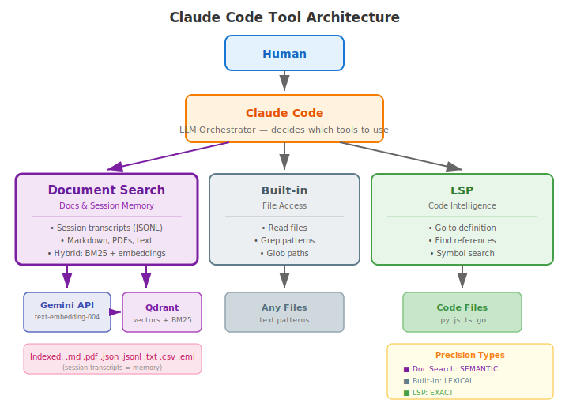

# Document Search MCP Server

Semantic search over local documents using hybrid vector search (Gemini embeddings + BM25) and Qdrant.

## Prerequisites

**Qdrant** (vector database):

```bash
docker run -d --name qdrant -p 6333:6333 -v qdrant-data:/qdrant/storage qdrant/qdrant:v1.16.2
```

**Gemini API key** ([Google AI Studio](https://aistudio.google.com/app/apikey)):

```bash
mkdir -p ~/.claude-workspace/secrets
echo "your-key" > ~/.claude-workspace/secrets/document_search_api_key
```

> **Rate Limits**: Free tier is limited to **100 requests/day**. For production use,
> [enable billing](https://ai.google.dev/gemini-api/docs/rate-limits) to unlock Tier 1
> (1,000 RPD, 300 RPM). See [Rate Limits](#gemini-api-rate-limits) below.

**MCP timeout** (default 2min is too short for large directories):

```bash
# Add to ~/.claude/settings.json under "env":
"MCP_TOOL_TIMEOUT": "1800000"  # 30 minutes (in ms)
```

**Tesseract** (optional, for OCR on scanned PDFs):

```bash
brew install tesseract
```

## Installation

For users installing from GitHub:

```bash
uv tool install git+https://github.com/chrisguillory/claude-workspace.git#subdirectory=mcp/document-search
claude mcp add --scope user document-search -- mcp-document-search
```

To upgrade to the latest version:

```bash
uv tool upgrade document-search-mcp
```

For local development with editable install, see the [workspace README](../../README.md).

## Architecture

Document Search extends Claude Code with semantic retrieval, forming a distributed RAG system:



**The RAG pattern emerges naturally:**

- **R**etrieval: Document Search finds relevant chunks
- **A**ugmented: Chunks flow back to Claude's context
- **G**eneration: Claude synthesizes the answer

**Two use cases, one pattern:**

| Use Case       | What's Indexed               | What You Get                               |
|----------------|------------------------------|--------------------------------------------|
| Project search | Code, docs, configs          | Semantic understanding of your codebase    |
| Session memory | `~/.claude/projects/*.jsonl` | Past decisions and context across sessions |

**Search type tradeoffs:**

| Type      | Path                | Best For                                |
|-----------|---------------------|-----------------------------------------|
| hybrid    | Gemini API + Qdrant | Most queries (semantic + keyword)       |
| lexical   | Qdrant only         | Exact terms, identifiers, works offline |
| embedding | Gemini API + Qdrant | Pure semantic similarity                |

## BM25 Sparse Embedding (bm25-rs)

Hybrid search uses both dense embeddings (Gemini) and sparse BM25 vectors for keyword matching. The BM25 component is a
Rust extension (`bm25-rs/`) using PyO3 and rayon, producing sparse vectors compatible with Qdrant's `Qdrant/bm25` model.

### Why Rust

BM25 computation is CPU-bound (tokenization, stemming, hashing). The Rust extension runs in-process, releases Python's
GIL, and distributes work across all CPU cores via rayon's thread pool. This eliminates the subprocess overhead of the
previous ProcessPoolExecutor approach while maintaining identical output.

### Architecture

```
Python event loop
  -> asyncio.to_thread(model.embed_batch, texts)
    -> Rust (GIL released)
      -> rayon par_iter across CPU cores
        -> thread-local stemmer + buffers (zero contention)
      -> returns sparse vectors to Python
```

A single `BM25Model` instance is shared across all async workers. Thread safety comes from immutable model parameters (
`&self`) plus rayon's thread-local mutable state for stemmers and string buffers.

### Prerequisites

**Rust toolchain** (for building the extension):

```bash
curl --proto '=https' --tlsv1.2 -sSf https://sh.rustup.rs | sh
```

maturin is installed automatically by `uv sync` as a build dependency.

### Building

For local development, `uv sync` builds bm25-rs automatically via the editable source reference in `pyproject.toml`:

```bash
cd "$(git rev-parse --show-toplevel)/mcp/document-search"
uv sync
```

For iterating on the Rust code without a full sync:

```bash
cd "$(git rev-parse --show-toplevel)/mcp/document-search/bm25-rs"
maturin develop --release
```

### Testing

The bm25-rs test suite validates output equivalence against fastembed's `Qdrant/bm25` model:

```bash
cd "$(git rev-parse --show-toplevel)/mcp/document-search/bm25-rs"
uv run --with ".[test]" pytest tests/ -v
```

Tests cover end-to-end equivalence (22 input patterns), component-level validation (tokenizer, stemmer, hasher against
10K-word vocabulary), and batch/concurrency correctness.

### Performance

On Apple Silicon (16 cores):

| Batch Size  | Latency | Throughput |
|-------------|---------|------------|
| 5 texts     | 0.15ms  | 32K/sec    |
| 100 texts   | 2ms     | 41K/sec    |
| 500 texts   | 7ms     | 70K/sec    |
| 2,000 texts | 10ms    | 210K/sec   |

The pipeline's typical batch size (500 texts) completes in ~7ms, making sparse embedding negligible compared to dense
embedding API latency (~200-500ms per batch).

## Supported File Types

markdown, text, pdf, json, jsonl, csv, email (.eml), images (placeholder for future multimodal)

## Tools

| Tool               | Description                                                |
|--------------------|------------------------------------------------------------|
| `index_documents`  | Index file or directory (incremental, respects .gitignore) |
| `clear_documents`  | Remove documents from the index                            |
| `search_documents` | Search with configurable strategy and filters              |
| `list_documents`   | List indexed documents with optional filtering             |
| `get_info`         | Index health and statistics                                |

## Search Types

- **hybrid** (default): Combines semantic + keyword matching. Best for most queries.
- **lexical**: BM25 keyword search. Best for exact terms, identifiers, symbols.
- **embedding**: Dense vectors only. Useful for comparison/debugging.

## State

- Index state: `~/.claude-workspace/cache/document_search_index_state.json`
- Embedding config: `~/.claude-workspace/config/document_search.json`
- Qdrant collection: `document_chunks` on `localhost:6333`

## Gemini API Rate Limits

**Before January 2026**: `text-embedding-004` had no explicit daily request cap—only RPM limits (~10-20 RPM free tier).
High-volume batch indexing worked without issues.

**After January 2026**: Google shutdown `text-embedding-004` and enforced strict daily caps on `gemini-embedding-001`
due to fraud/abuse.

| Tier                          | Requests/Day | Requests/Min | Cost            |
|-------------------------------|--------------|--------------|-----------------|
| Free                          | **100**      | ~100         | $0              |
| Tier 1 (billing enabled)      | 1,000        | 300          | $0.15/1M tokens |
| Tier 2 ($250+ spend, 30 days) | 10,000+      | 1,000+       | $0.15/1M tokens |

**For RAG/indexing workloads**: Free tier (100 RPD) is insufficient for indexing more than ~100 documents. Enable
billing to unlock Tier 1.
