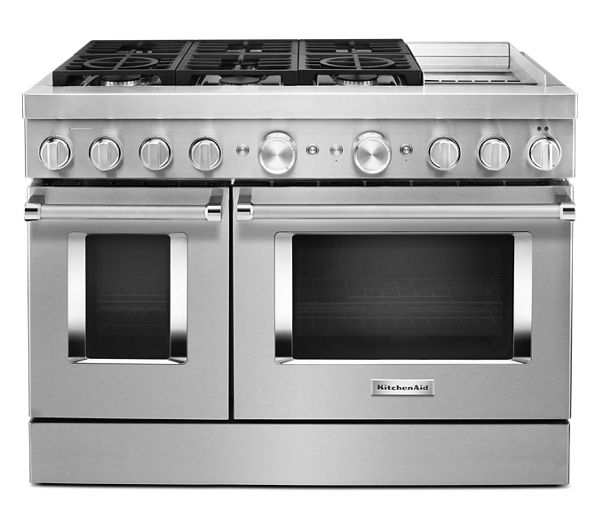
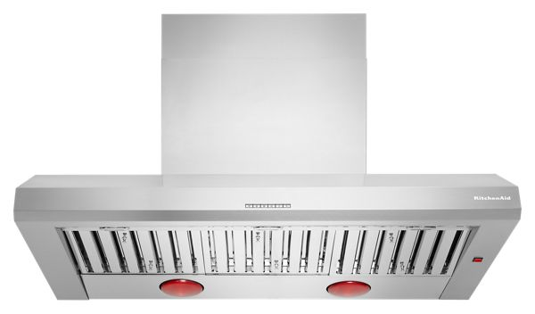
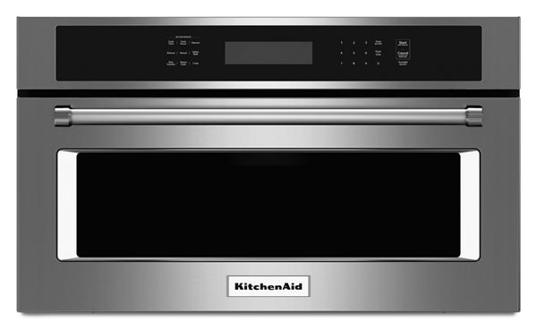
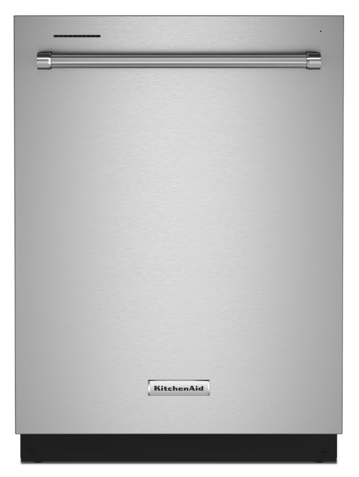
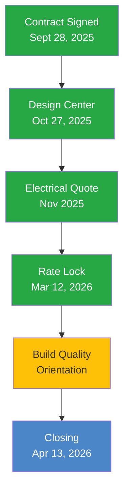
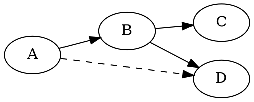
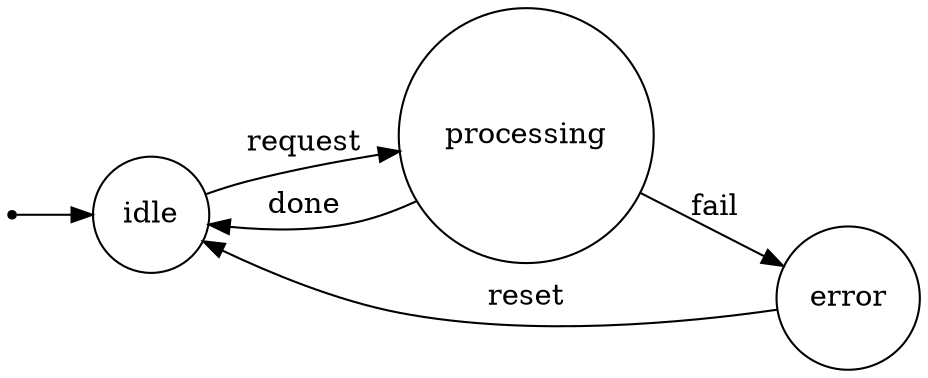

# Markdown Rendering Comparison Test


**Purpose:** Compare md-to-pdf (headless Chromium + adapted CSS) against Typora's native export to determine visual fidelity. Every markdown feature is exercised below.

**Date:** March 21, 2026

---

## 1. Headings

# Heading Level 1

## Heading Level 2

### Heading Level 3

#### Heading Level 4

##### Heading Level 5

###### Heading Level 6

---

## 2. Inline Formatting

This paragraph contains **bold text**, *italic text*, ***bold and italic***, ~~strikethrough~~, and `inline code`. It also has a [hyperlink to KitchenAid](https://www.kitchenaid.com) and an automatic URL: https://www.google.com.

Here is a paragraph with **multiple bold segments** in the same line, plus *various italic words* scattered throughout, and some `code snippets` mixed with regular text to test **inline rendering fidelity**.

Superscript and subscript aren't standard markdown, but here's a test of special characters: ™ © ® € £ ¥ § ¶ † ‡ • … — – « » " " ' '

Unicode: 你好世界 • こんにちは • مرحبا • Привет • 🏠 🔧 ⚡ 💰 ✅ ❌ ⚠️

---

## 3. Paragraphs and Line Breaks

This is a normal paragraph. It should wrap naturally at the container width. The quick brown fox jumps over the lazy dog. Pack my box with five dozen liquor jugs. How vexingly quick daft zebras jump. The five boxing wizards jump quickly.

This is a second paragraph with a forced
line break using two trailing spaces. The text after the break should appear on the next line without starting a new paragraph.

This is a third paragraph. Short and sweet.

---

## 4. Lists

### Unordered Lists

- First item
- Second item with **bold text**
- Third item with `inline code`
  - Nested item A
  - Nested item B
    - Deep nested item
    - Another deep item
  - Back to second level
- Fourth item

### Ordered Lists

1. First ordered item
2. Second ordered item
3. Third with a [link](https://example.com)
   1. Nested numbered item
   2. Another nested
      1. Deep nested numbered
      2. Another deep
   3. Back to second level
4. Fourth item

### Mixed Lists

1. Ordered first
   - Unordered nested
   - Another unordered
2. Ordered second
   - Bullet with sub-bullets:
     - Sub-bullet A
     - Sub-bullet B
3. Ordered third

### Task Lists

- [x] Completed task
- [x] Another completed task
- [ ] Incomplete task
- [ ] Another incomplete task
  - [x] Nested completed subtask
  - [ ] Nested incomplete subtask

---

## 5. Code Blocks

### Python

```python
import json
from dataclasses import dataclass
from typing import Optional, List

@dataclass
class Appliance:
    """Represents a kitchen appliance in a builder package."""
    name: str
    model: str
    retail_price: float
    package_price: Optional[float] = None

    @property
    def savings(self) -> float:
        if self.package_price is None:
            return 0.0
        return self.retail_price - self.package_price

    def __repr__(self) -> str:
        return f"Appliance({self.name}, ${self.retail_price:,.2f})"


def analyze_package(appliances: List[Appliance]) -> dict:
    """Analyze value of an appliance package vs retail."""
    total_retail = sum(a.retail_price for a in appliances)
    total_package = sum(a.package_price or a.retail_price for a in appliances)

    return {
        "total_retail": total_retail,
        "total_package": total_package,
        "savings": total_retail - total_package,
        "savings_pct": (total_retail - total_package) / total_retail * 100,
    }


if __name__ == "__main__":
    kitchen = [
        Appliance("48\" Pro Range", "KFDC558JSS", 11878.99),
        Appliance("48\" Hood", "KVWC958KSS", 2266.99),
        Appliance("1170 CFM Blower", "UXB1170KYS", 808.99),
        Appliance("30\" Microwave", "KMBP100ESS", 2473.99),
        Appliance("24\" Dishwasher", "KDTM405PPS", 799.00),
    ]

    result = analyze_package(kitchen)
    print(json.dumps(result, indent=2))
```

### JavaScript / TypeScript

```javascript
// Mortgage payment calculator
const calculatePayment = (principal, annualRate, years) => {
  const monthlyRate = annualRate / 100 / 12;
  const numPayments = years * 12;

  if (monthlyRate === 0) return principal / numPayments;

  const payment =
    (principal * monthlyRate * Math.pow(1 + monthlyRate, numPayments)) /
    (Math.pow(1 + monthlyRate, numPayments) - 1);

  return Math.round(payment * 100) / 100;
};

// Example: $706,076 at 5.75% for 30 years
const monthly = calculatePayment(706076, 5.75, 30);
console.log(`Monthly P&I: $${monthly.toLocaleString()}`);
// Output: Monthly P&I: $4,120.47
```

### Go

```go
package main

import (
    "encoding/json"
    "fmt"
    "log"
    "net/http"
)

type PropertyRecord struct {
    Address    string  `json:"address"`
    Owner      string  `json:"owner"`
    SalePrice  float64 `json:"sale_price"`
    SqFt       int     `json:"sqft"`
    LotNumber  string  `json:"lot_number"`
}

func fetchProperty(address string) (*PropertyRecord, error) {
    resp, err := http.Get(fmt.Sprintf("https://api.melissa.com/v3/property?addr=%s", address))
    if err != nil {
        return nil, fmt.Errorf("API request failed: %w", err)
    }
    defer resp.Body.Close()

    var record PropertyRecord
    if err := json.NewDecoder(resp.Body).Decode(&record); err != nil {
        return nil, fmt.Errorf("decode error: %w", err)
    }
    return &record, nil
}

func main() {
    record, err := fetchProperty("8693 Indigo Spring Road, Las Vegas, NV")
    if err != nil {
        log.Fatal(err)
    }
    fmt.Printf("Property: %s\nOwner: %s\nPrice: $%.2f\n",
        record.Address, record.Owner, record.SalePrice)
}
```

### Shell / Bash

```bash
#!/bin/bash
# Fetch property data for Rainbow Crossing neighborhood
set -euo pipefail

API_KEY="${MELISSA_API_KEY:?Must set MELISSA_API_KEY}"
OUTPUT_DIR="./melissa/rainbow_crossing_properties"

mkdir -p "$OUTPUT_DIR"

for lot in $(seq 1 50); do
    address="$(printf '86%02d Indigo Spring Road' $lot)"
    echo "Fetching: $address"

    curl -s "https://api.melissa.com/v3/property" \
        --data-urlencode "addr=$address" \
        --data-urlencode "key=$API_KEY" \
        -o "$OUTPUT_DIR/lot_${lot}.json"

    sleep 0.5  # rate limit
done

echo "Done. Fetched $lot properties."
```

### JSON

```json
{
  "contract": {
    "number": "PHD0201950",
    "property": "8693 Indigo Spring Road",
    "city": "Las Vegas",
    "state": "NV",
    "zip": "89139",
    "builder": "PN II, Inc. (Pulte Homes)",
    "plan": "2213 - The Ella",
    "lot": "02511",
    "price": 767596,
    "pool_allowance": 115000,
    "total": 882596
  },
  "loan": {
    "number": "78-499173A",
    "amount": 706076,
    "rate": 5.750,
    "term_years": 30,
    "down_payment": 176520,
    "monthly_pi": 4120.47
  }
}
```

### CSS

```css
/* Typora GitHub theme excerpt */
body {
    font-family: "Open Sans", "Clear Sans", "Helvetica Neue", sans-serif;
    color: rgb(51, 51, 51);
    line-height: 1.6;
}

table tr:nth-child(2n), thead {
    background-color: #f8f8f8;
}

blockquote {
    border-left: 4px solid #dfe2e5;
    padding: 0 15px;
    color: #777777;
}
```

### Plain (no language specified)

```
This is a plain code block with no syntax highlighting.
It should still have the monospace font and background color.
Line 3 of the plain block.
```

---

## 6. Tables

### Simple Table

| Item | Value |
|------|-------|
| Name | Chris Guillory |
| Location | Las Vegas, NV 89178 |
| Property | 8693 Indigo Spring Road |

### Financial Table (Right-Aligned Numbers)

| Appliance | Model | KitchenAid Price |
|-----------|-------|------------------:|
| 48" Dual Fuel Range | KFDC558JSS | $11,878.99 |
| 48" Pro Canopy Hood | KVWC958KSS | $2,266.99 |
| 1170 CFM Blower | UXB1170KYS | $808.99 |
| 30" Convection Microwave | KMBP100ESS | $2,473.99 |
| 24" Dishwasher | KDTM405PPS | $799.00 |
| **Total** | | **$18,227.96** |

### Wide Table

| Contact | Role | Company | Phone | Email |
|---------|------|---------|-------|-------|
| Carol O'Connell | Sales Rep | Pulte Homes | 702-338-7348 | Carol.OConnell@pulte.com |
| Danielle Suhr | Loan Consultant | Pulte Mortgage | 303-493-2360 x2360 | Danielle.Suhr@pulte.com |
| Allan Bonk | Electrician | Republic Electric | N/A | allan@nvrepublic.com |
| Geoff Christoph | Pool Builder | Blue Haven Pools | 702-498-5306 | geoffchristoph@aol.com |
| Kevin Proctor | Inspector | Apollo Inspections | 702-575-0767 | info@apolloinspections.com |

### Comparison Table with Mixed Content

| Feature | Internal Blower (UXB1170KYS) | In-Line Remote (UXI1200DYS) |
|---------|:---:|:---:|
| CFM Rating | 1,170 | 1,200 |
| HVI-Certified (Vertical) | 950 CFM | N/A |
| Sone Level (High Speed) | 12.5 | Lower at hood |
| Mount Location | Inside hood canopy | In attic ductwork |
| Street Price | $870-900 | $1,000-1,150 |
| Las Vegas Attic Heat | **Not affected** | ⚠️ 150°F+ summers |
| Serviceability | Easy (kitchen access) | Hard (attic access) |
| **Verdict** | ✅ **Best for Las Vegas** | ❌ Not recommended |

---

## 7. Blockquotes

> This is a simple blockquote. It should have a left border and muted text color.

> This is a blockquote with **bold**, *italic*, and `code` formatting inside it.
>
> It also has multiple paragraphs within the same blockquote block.

> Nested blockquote:
>
> > This is the inner blockquote.
> >
> > > And this is even deeper — triple nested.
>
> Back to the outer level.

---

## 8. Horizontal Rules

Content above the rule.

---

Content between rules.

***

Content between different rule styles.

___

Content below the last rule.

---

## 9. Images

### Local Product Images (Real)









### Remote Placeholder Image


---

## 10. Complex Formatting Scenarios

### Mixed Inline Styles in One Line

This line has **bold then *bold-italic*** followed by `code` and a [link](https://example.com) and ~~deleted text~~ all in one paragraph.

### Long Paragraph for Wrapping Test

Lorem ipsum dolor sit amet, consectetur adipiscing elit. Sed do eiusmod tempor incididunt ut labore et dolore magna aliqua. Ut enim ad minim veniam, quis nostrud exercitation ullamco laboris nisi ut aliquip ex ea commodo consequat. Duis aute irure dolor in reprehenderit in voluptate velit esse cillum dolore eu fugiat nulla pariatur. Excepteur sint occaecat cupidatat non proident, sunt in culpa qui officia deserunt mollit anim id est laborum. This is additional text to ensure the paragraph wraps across multiple lines in the PDF output, testing whether line heights, letter spacing, and word wrapping behave identically between Typora and md-to-pdf. The goal is pixel-level comparison across the full width of the content area.

### Table Inside a Section with Surrounding Text

Here is a paragraph before a table, followed by the table, followed by another paragraph. The spacing above and below the table should match Typora exactly.

| Before | After |
|--------|-------|
| Old price | New price |
| $12,799 | $11,878.99 |

And here is the paragraph after the table. The margin between the table and this text is a key comparison point.

### Code Inline Mixed with Bold

The model number is **`KFDC558JSS`** and it retails for **$11,878.99** on [KitchenAid.com](https://www.kitchenaid.com). The blower model `UXB1170KYS` was confirmed from the shipping label.

### Bulleted List with Varied Content Types

- **Bold item** — with a dash and explanation
- *Italic item* — with emphasis
- `Code item` — with monospace
- Regular item with a [link to Google](https://www.google.com)
- Item with multiple formats: **bold**, *italic*, `code`, and ~~strikethrough~~

---

## 11. Definition-Style Content

**Term 1: Dual Fuel Range**
A range that uses gas burners on the cooktop and an electric convection oven below. Provides the precise heat control of gas with the even baking of electric.

**Term 2: CFM (Cubic Feet per Minute)**
The volume of air moved by a range hood blower. For a 48" professional range with 105,000 BTU, a minimum of 1,050 CFM is recommended (rule of thumb: 1 CFM per 100 BTU).

**Term 3: Sone**
A unit of perceived loudness. 1 sone ≈ quiet refrigerator. 12.5 sones ≈ between a garbage disposal and vacuum cleaner.

---

## 12. Footnote-Style References

This analysis uses live pricing from KitchenAid.com as of March 21, 2026. The range [1], hood [2], and blower [3] prices were verified via Selenium browser automation against the actual product pages.

[1]: https://www.kitchenaid.com/major-appliances/ranges/freestanding-ranges/p.kitchenaid-48-smart-commercial-style-dual-fuel-range-with-griddle.kfdc558jss.html
[2]: https://www.kitchenaid.com/major-appliances/hoods-and-vents/commercial-style-vent-hood/p.48-585-or-1170-cfm-motor-class-commercial-style-wall-mount-canopy-range-hood.kvwc958kss.html
[3]: https://www.kitchenaid.com/major-appliances/cooktops/accessories/installation-kits/p.1170-cfm-internal-blower.uxb1170kys.html

---

## 13. Page Break / Length Test

The following content ensures the document spans multiple pages, testing page break behavior, header continuation, and table splitting across pages.

### Kitchen Upgrade Timeline

| Date | Milestone | Status |
|------|-----------|--------|
| Sept 28, 2025 | Contract signed | ✅ Complete |
| Oct 27, 2025 | Design Center appointment | ✅ Complete |
| Oct 28, 2025 | Appliance package analysis | ✅ Complete |
| Nov 2025 | Change Order 3 finalized | ✅ Complete |
| Feb 24, 2026 | Appliances delivered to site | ✅ Confirmed |
| Mar 12, 2026 | Rate lock signed (5.750%) | ✅ Complete |
| Mar 2026 | Build Quality Orientation | 🔄 Upcoming |
| Apr 13, 2026 | Closing / Signing | 📋 Scheduled |
| Apr 24, 2026 | Rate lock expires | ⏰ Deadline |

### Key Financial Summary

| Category | Amount |
|----------|--------|
| Contract Price | $767,596 |
| Pool/Upgrade Allowance | $115,000 |
| Total Sale Price | $882,596 |
| Down Payment (20%) | $176,520 |
| Loan Amount | $706,076 |
| Interest Rate | 5.750% |
| Monthly P&I | $4,120.47 |
| Discount Points | $21,182.28 |
| Seller Credits | $37,800 |
| Borrower Cost for Points | $0 |

### Appliance Package Value Analysis

Our Pulte package at **$20,780** includes professional installation, delivery coordination, and warranty — comparing favorably to the **$18,227.96** retail-only price that excludes all services.

When factoring in the realistic cost of self-sourcing ($19,728–$21,828 including installation), **we are squarely in the competitive range** and avoided all coordination risk.

---

## 14. Setext Headings (Alternate Syntax)

Setext Heading Level 1
======================

Setext Heading Level 2
----------------------

Both ATX (`# Heading`) and Setext (underline) styles should render identically. If they differ, the CSS is targeting heading tags differently based on how they were generated.

---

## 15. Indented Code Blocks

Standard markdown supports code blocks via 4-space indentation (no fence). This tests whether both renderers handle indented code identically to fenced code:

    def hello():
        print("This is an indented code block")
        return True

    # No language hint — pure indentation
    for i in range(10):
        print(i)

Compare the above to a fenced block with no language:

```
def hello():
    print("This is a fenced code block with no language")
    return True
```

---

## 16. Links — All Variants

### Inline Links

- Basic: [Example](https://example.com)
- With title: [Example with title](https://example.com "Hover to see this title")
- Empty text: [](https://example.com)

### Reference Links

This paragraph uses [reference-style links][ref1]. They can also use [implicit references][] or even just [implicit references]. Numbers work too: see [this link][1].

[ref1]: https://example.com "Reference 1 Title"
[implicit references]: https://example.com/implicit
[1]: https://example.com/numbered

### Autolinks

- Angle-bracket autolink: <https://www.google.com>
- Angle-bracket email: <chris@example.com>
- Bare URL (GFM extension): https://www.google.com
- Bare email (GFM extension): chris@example.com
- URL in parentheses: (visit https://example.com for details)

---

## 17. Images — Extended Tests

### Image with Title Attribute


### Image Inside a Link (Clickable Image)

[](https://example.com)

### Image with Emphasis in Alt Text


---

## 18. HTML Inline Elements

Markdown allows raw HTML inline. These test whether both renderers pass HTML through correctly:

- Underline: <u>This text is underlined</u>
- Keyboard: Press <kbd>Ctrl</kbd> + <kbd>C</kbd> to copy, then <kbd>Ctrl</kbd> + <kbd>V</kbd> to paste
- Abbreviation: <abbr title="HyperText Markup Language">HTML</abbr> is the standard markup language
- Mark/Highlight: <mark>This text is highlighted</mark>
- Superscript: E = mc<sup>2</sup>
- Subscript: H<sub>2</sub>O is water, CO<sub>2</sub> is carbon dioxide
- Small: <small>This is small text for fine print or disclaimers</small>
- Inserted: <ins>This text was inserted</ins>
- Deleted: <del>This text was deleted</del> (compare to ~~strikethrough~~)
- Details/Summary:

<details>
<summary>Click to expand this collapsible section</summary>

This content is hidden by default. It contains **markdown formatting** and should render correctly when expanded.

- Item one
- Item two
- Item three

| Column A | Column B |
|----------|----------|
| Data 1   | Data 2   |

</details>

---

## 19. HTML Block Elements

### Custom Div with Styling

<div style="background-color: #f0f7ff; border: 1px solid #4a86c8; border-radius: 4px; padding: 12px 16px; margin: 16px 0;">
<strong>Note:</strong> This is an HTML block element styled inline. Both renderers should handle CSS properties identically since they both use Chromium for final rendering.
</div>

### Definition List (HTML, since neither Typora nor Marked supports MD definition lists)

<dl>
<dt><strong>Dual Fuel Range</strong></dt>
<dd>A range using gas burners on the cooktop and an electric convection oven below.</dd>

<dt><strong>CFM (Cubic Feet per Minute)</strong></dt>
<dd>The volume of air moved by a range hood blower. For a 48" pro range, minimum 1,050 CFM recommended.</dd>

<dt><strong>Sone</strong></dt>
<dd>A unit of perceived loudness. 1 sone is approximately a quiet refrigerator.</dd>
</dl>

---

## 20. Footnotes (Typora Extension)

This section tests proper footnotes[^1] using the caret syntax. Footnotes should appear at the bottom of the rendered document[^2]. Typora renders these natively; Marked requires an extension[^longnote].

[^1]: This is the first footnote. It supports **formatting** and `code`.
[^2]: Second footnote with a [link](https://example.com).
[^longnote]: Footnotes can have arbitrary labels, not just numbers.

    They can also contain multiple paragraphs if indented.

---

## 21. Math (KaTeX Rendering)

### Inline Math

The quadratic formula is $x = \frac{-b \pm \sqrt{b^2 - 4ac}}{2a}$ and Euler's identity is $e^{i\pi} + 1 = 0$.

Monthly mortgage payment: $M = P \frac{r(1+r)^n}{(1+r)^n - 1}$ where $P = \$706{,}076$, $r = 0.004792$, $n = 360$.

Inline mixed with text: The derivative $\frac{dy}{dx}$ of $f(x) = x^2$ is $f'(x) = 2x$.

### Block Math

$$
\text{Total Cost} = \underbrace{P_{\text{contract}}}_{\$767{,}596} + \underbrace{P_{\text{pool}}}_{\$115{,}000} = \$882{,}596
$$

$$
\text{Monthly P\&I} = 706076 \times \frac{0.004792 \times (1.004792)^{360}}{(1.004792)^{360} - 1} = \$4{,}120.47
$$

### Euler's Formula and Related

$$
e^{ix} = \cos(x) + i\sin(x)
$$

$$
\int_{-\infty}^{\infty} e^{-x^2} dx = \sqrt{\pi}
$$

### Matrix

$$
\mathbf{A} = \begin{bmatrix} a_{11} & a_{12} & a_{13} \\ a_{21} & a_{22} & a_{23} \\ a_{31} & a_{32} & a_{33} \end{bmatrix}
$$

### Summation and Product

$$
\sum_{n=1}^{\infty} \frac{1}{n^2} = \frac{\pi^2}{6} \qquad \prod_{p \text{ prime}} \frac{1}{1-p^{-s}} = \sum_{n=1}^{\infty} \frac{1}{n^s}
$$

---

## 22. Typora Extended Inline Syntax

These features require Typora's preferences to be enabled. They will render as raw syntax in Marked/md-to-pdf unless extensions are added.

### Highlight

==This text should be highlighted== in Typora (rendered with `<mark>` tag).

### Subscript and Superscript (Tilde/Caret Syntax)

- Water is H~2~O
- The area of a circle is A = πr^2^
- Carbon dioxide: CO~2~

### Emoji Shortcodes

Typora auto-completes these: :smile: :thumbsup: :warning: :house: :rocket:

Compare to raw Unicode emoji (always works): 😄 👍 ⚠️ 🏠 🚀

---

## 23. YAML Front Matter

The following block demonstrates YAML front matter syntax. In a real document this would be at the very top. Both Typora and md-to-pdf (via gray-matter) parse this, but they may render or hide it differently.

Note: We cannot place a second YAML block mid-document — it only works at position 0. This test verifies that our actual front-matter-containing documents would be handled. Test with a separate file if needed:

```yaml
---
title: "Rendering Comparison Test"
author: "Chris Guillory"
date: 2026-03-21
tags: [markdown, typora, pdf]
---
```

---

## 24. Table of Contents

Typora renders `[toc]` as a clickable table of contents. Marked ignores it as plain text.

[toc]

---

## 25. Backslash Escapes

All ASCII punctuation can be backslash-escaped to prevent markdown interpretation:

- \*not italic\* — asterisks escaped
- \*\*not bold\*\* — double asterisks escaped
- \# not a heading — hash escaped
- \[not a link\](url) — brackets escaped
- \`not code\` — backticks escaped
- \~~not strikethrough\~~ — tildes escaped
- \| not | a | table | — pipes escaped
- \> not a blockquote — greater-than escaped
- \- not a list item — hyphen escaped

Without escaping for comparison: *italic*, **bold**, `code`, ~~strikethrough~~

---

## 26. Entity and Character References

### Named HTML Entities

- &copy; &reg; &trade; &amp; &lt; &gt; &quot; &apos;
- &mdash; &ndash; &hellip; &laquo; &raquo;
- &frac12; &frac14; &frac34; &plusmn; &times; &divide;
- &nbsp; (non-breaking space — invisible but affects layout)

### Numeric Character References

- Decimal: &#169; &#174; &#8212; &#8594;
- Hexadecimal: &#x00A9; &#x00AE; &#x2014; &#x2192;

---

## 27. Edge Cases — Lists

### Loose vs Tight Lists

Tight list (no blank lines between items):

- Alpha
- Beta
- Gamma

Loose list (blank lines between items — should render with `<p>` tags inside `<li>`):

- Alpha

- Beta

- Gamma

### List Starting at Non-1 Number

3. This list starts at 3
4. Continues to 4
5. And 5

### List with Multi-Paragraph Items

1. First item with a second paragraph below.

   This is the continuation paragraph of item 1. It should be indented to align with the list content, not the marker.

2. Second item, also with a continuation.

   Continuation of item 2. Plus a code block:

       indented code inside a list item

3. Third item, back to normal.

### List with Blockquote Inside

- Item with a blockquote:

  > This blockquote is nested inside a list item.
  > It should be indented relative to the list.

- Next item after the blockquote.

### List with Code Block Inside

- Item with a fenced code block:

  ```python
  # This code block is inside a list item
  x = 42
  print(f"The answer is {x}")
  ```

- Next item after the code block.

---

## 28. Edge Cases — Tables

### Single-Column Table

| Status |
|--------|
| Active |
| Pending |
| Closed |

### Table with All Alignments

| Left | Center | Right | Default |
|:-----|:------:|------:|---------|
| L1 | C1 | R1 | D1 |
| L2 | C2 | R2 | D2 |
| Left-aligned text | Centered text | Right-aligned text | Default-aligned text |

### Table with Empty Cells

| A | B | C |
|---|---|---|
| 1 |   | 3 |
|   | 2 |   |
| 1 | 2 | 3 |

### Table with Inline Formatting

| Format | Example |
|--------|---------|
| Bold | **bold text** |
| Italic | *italic text* |
| Code | `inline code` |
| Link | [click here](https://example.com) |
| Strikethrough | ~~deleted~~ |
| Image |  |
| Combined | **`bold code`** with *emphasis* |

---

## 29. Edge Cases — Code

### Code Span with Backticks Inside

To display a literal backtick inside code, use double backticks: `` `code` `` or even triple: ``` `` nested `` ```.

Use `code with  multiple   spaces` to test whitespace preservation.

### Very Long Code Line (Horizontal Overflow)

```python
very_long_variable_name = some_function(argument_one="first value", argument_two="second value", argument_three="third value", argument_four="fourth value", argument_five="fifth value with extra text to force horizontal overflow in the code block")
```

### Code Block with Blank Lines

```python
def function_with_gaps():
    first_block = True

    # There is a blank line above this comment

    second_block = True


    # Two blank lines above

    return first_block and second_block
```

### Diff Syntax Highlighting

```diff
--- a/config.json
+++ b/config.json
@@ -1,5 +1,5 @@
 {
-  "rate": 6.875,
+  "rate": 5.750,
   "points": 3.0,
-  "seller_credits": 0,
+  "seller_credits": 37800,
 }
```

### YAML Code Block

```yaml
contract:
  number: PHD0201950
  property: 8693 Indigo Spring Road
  city: Las Vegas
  state: NV
  builder: "PN II, Inc. (Pulte Homes)"
  price: 767596
  closing_date: 2026-04-13
```

### SQL Code Block

```sql
SELECT
    p.address,
    p.owner_name,
    p.sale_price,
    p.sqft,
    p.lot_number
FROM properties p
WHERE p.community = 'Rainbow Crossing'
  AND p.sale_price > 700000
ORDER BY p.sale_price DESC
LIMIT 10;
```

### Markdown Inside a Code Block (Should NOT Render)

```markdown
# This heading should NOT render
**This bold should NOT render**
- This list should NOT render
| This | table | should | NOT | render |
```

---

## 30. Edge Cases — Blockquotes

### Blockquote with List Inside

> Items to verify before closing:
>
> 1. Rate lock confirmation
> 2. Wire transfer instructions
> 3. Insurance binder
>
> - Also check: title commitment
> - And: final walkthrough

### Blockquote with Code Inside

> Example configuration:
>
> ```json
> {
>   "rate": 5.750,
>   "locked": true
> }
> ```
>
> Apply this before the deadline.

### Blockquote with Table Inside

> | Item | Status |
> |------|--------|
> | Appraisal | Done |
> | Inspection | Done |
> | Closing | Pending |

---

## 31. Deeply Nested Content

### 4-Level Nested List

- Level 1
  - Level 2
    - Level 3
      - Level 4 — this is the deepest typical nesting
        - Level 5 — some renderers may not indent further
      - Back to Level 4
    - Back to Level 3
  - Back to Level 2
- Back to Level 1

### Blockquote in List in Blockquote

> Outer blockquote:
>
> - List inside blockquote
>   > Blockquote inside list inside blockquote
>   >
>   > Second paragraph of inner blockquote.
>
> Back to outer blockquote.

---

## 32. Special Characters in Context

### Pipes and Bars in Code and Tables

The regex pattern `|foo|bar|` uses pipe characters. In a table cell, pipes must be escaped: use `\|` to show a literal pipe.

| Expression | Result |
|------------|--------|
| `a \| b` | Logical OR |
| `[a-z]{3}` | Three lowercase letters |
| `price > $100` | Price comparison |

### Angle Brackets and HTML-like Content

In markdown, `<div>` is raw HTML but `<not-a-real-tag>` behaves differently across parsers. Testing: <notreal>, `<notreal>`, and escaped: \<notreal\>.

### Ampersands

- AT&T should render as AT&T
- &copy; should render as the copyright symbol
- `&copy;` in code should render literally as `&copy;`

---

## 33. Consecutive Block Elements (Spacing Test)

This section tests vertical spacing between different block types in sequence. The spacing between each element is a critical rendering comparison point.

### Paragraph then Heading

This paragraph comes immediately before a heading.

#### The Heading After a Paragraph

This paragraph comes after the heading.

### Paragraph then Table then List

Here is introductory text.

| A | B |
|---|---|
| 1 | 2 |

- First bullet
- Second bullet

Then a paragraph after the list.

### Paragraph then Code then Blockquote

Some introductory context.

```
code block here
```

> Blockquote immediately after code.

Final paragraph.

### Heading then Code (No Intervening Text)

#### Direct Code After Heading

```python
x = 42
```

---

## 34. Forced Page Break (HTML Method)

Content before the page break marker. In paged mode, a `page-break-after: always` div would force a new page here. In pageless mode, it is stripped and content flows continuously.

<!-- page-break-after: always removed for pageless comparison testing -->

Content after where the page break would be. In pageless mode, this flows directly below.

---

## 35. Long Unbreakable Content

### Long URL in Text

Visit https://www.kitchenaid.com/major-appliances/ranges/freestanding-ranges/p.kitchenaid-48-smart-commercial-style-dual-fuel-range-with-griddle.kfdc558jss.html for the full product page. This tests whether long URLs cause horizontal overflow or wrap correctly.

### Long Word (No Natural Break Points)

Supercalifragilisticexpialidociousandpneumonoultramicroscopicsilicovolcanoconiosisandantidisestablishmentarianism — this tests CSS word-break behavior for unbreakable strings.

### Long Code Inline

Check the value of `this_is_an_extremely_long_variable_name_that_tests_whether_inline_code_wraps_or_overflows_the_container_width` in the output.

---

## 36. Multiple Emphasis Delimiter Styles

Testing underscore vs asterisk emphasis (should render identically):

- *asterisk italic* vs _underscore italic_
- **asterisk bold** vs __underscore bold__
- ***asterisk bold-italic*** vs ___underscore bold-italic___
- **_mixed: bold asterisk, italic underscore_**
- *__mixed: italic asterisk, bold underscore__*

Intra-word emphasis (GFM disables underscore intra-word):

- This is in*tra*word asterisk emphasis
- This is in_tra_word underscore emphasis (should NOT render as emphasis in GFM)
- file_name_with_underscores should stay as-is
- CamelCase__with__underscores should stay as-is

---

## 37. Adjacent and Nested Formatting

### Adjacent Emphasis

***bold-italic immediately***adjacent to plain text.

**bold***then italic* with no space.

### Empty Emphasis (Edge Case)

These should render as literal characters, not empty tags: ** ** * * ~~  ~~

### Emphasis Across Lines

This is a **bold phrase that
spans two lines** in the source.

---

## 38. Mermaid Diagrams (Typora Extension)

Typora renders Mermaid diagrams natively. Marked/md-to-pdf will show the raw code unless a Mermaid plugin is added. This tests the divergence.



---

## 39. GFM Alerts (GitHub Admonitions)

GitHub-Flavored Markdown supports callout blocks using `> [!TYPE]` syntax. These render as styled boxes with colored left borders and icons.

> [!NOTE]
> This is a note with useful information. Notes are used for supplementary details that readers should be aware of.

> [!TIP]
> This is a helpful tip. Tips provide practical advice or shortcuts that can improve workflow.

> [!WARNING]
> This is a warning about potential issues. Warnings alert readers to pitfalls or common mistakes.

> [!CAUTION]
> This is a caution about dangerous actions. Cautions flag operations that could cause data loss or irreversible changes.

> [!IMPORTANT]
> This is important information. Important callouts highlight critical details that must not be overlooked.

### Alerts with Rich Content

> [!NOTE]
> Alerts can contain **bold**, *italic*, `code`, and [links](https://example.com).
>
> They can also have multiple paragraphs, lists, and other block elements:
>
> - Item one
> - Item two
> - Item three

---

## 40. Chemical Formulas (mhchem)

KaTeX's mhchem extension renders chemical formulas using `\ce{}` notation:

### Inline Chemical Formulas

Water is $\ce{H2O}$, carbon dioxide is $\ce{CO2}$, and ethanol is $\ce{CH3CH2OH}$.

### Chemical Reactions

$$\ce{2H2 + O2 -> 2H2O}$$

$$\ce{CO2 + C -> 2CO}$$

$$\ce{CH4 + 2O2 -> CO2 + 2H2O}$$

### Complex Notation

$$\ce{SO4^2- + Ba^2+ -> BaSO4 v}$$

$$\ce{^{227}_{90}Th+}$$

---

## 41. Graphviz/DOT Diagrams

Directed and undirected graphs using DOT language:

### Simple Directed Graph



### State Machine



---

## 42. Vega-Lite Charts

Data visualization using Vega-Lite JSON specifications:

### Bar Chart

```vega-lite
{
  "$schema": "https://vega.github.io/schema/vega-lite/v5.json",
  "width": 400,
  "height": 200,
  "data": {
    "values": [
      {"category": "Range", "value": 11879},
      {"category": "Hood", "value": 2267},
      {"category": "Blower", "value": 809},
      {"category": "Microwave", "value": 2474},
      {"category": "Dishwasher", "value": 799}
    ]
  },
  "mark": "bar",
  "encoding": {
    "x": {"field": "category", "type": "nominal", "sort": "-y"},
    "y": {"field": "value", "type": "quantitative", "title": "Price ($)"},
    "color": {"field": "category", "type": "nominal", "legend": null}
  }
}
```

---

## 43. Custom Containers

Extended callout blocks using `:::type` syntax:

:::info
This is an **info** container with some useful context.
:::

:::success
Operation completed successfully!
:::

:::danger
This action cannot be undone. Proceed with caution.
:::

---

## 44. Variable Substitution

Front matter values can be referenced in the document using `{{key}}` syntax:

When a document has front matter like:
```yaml
---
title: My Document
author: Chris Guillory
version: 2.0
---
```

Then `{{title}}` becomes the title value, `{{author}}` becomes the author, etc.

Note: This test section uses literal `{{` syntax. Test variable substitution with a separate document that has YAML front matter at position 0.

---

## 45. End-of-Document Test

This final section verifies that:

1. The document terminates cleanly with no trailing rendering artifacts
2. The last element's bottom margin matches between renderers
3. Footer/page-number placement (if any) is consistent

**Final line of the document — everything above this should be exercised and compared.**

---

*Generated by Claude Code — March 21, 2026*
*Rendering comparison test document for Typora vs md-to-pdf pipeline evaluation*
